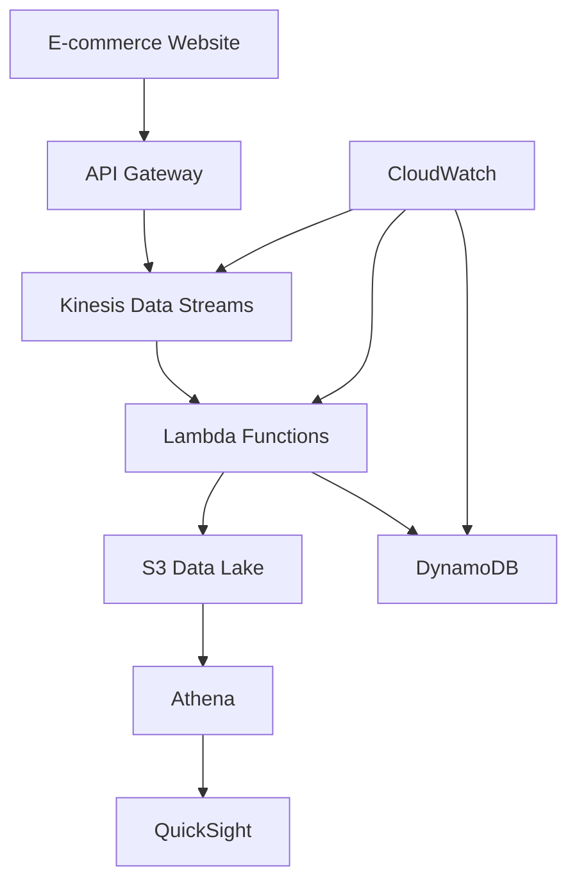

# Introduction & Architecture Design

## Workshop Overview

Welcome to this comprehensive workshop on building an **ETL Data Pipeline for E-commerce** using AWS services! This hands-on session will guide you through creating a modern, serverless data processing system that can handle real-world e-commerce scenarios.

### What is ETL?

**ETL** stands for **Extract, Transform, Load** - a fundamental data integration process:

- **Extract**: Collect data from various sources (websites, databases, APIs)
- **Transform**: Clean, validate, and restructure data for analysis
- **Load**: Store processed data in target systems for analytics

In e-commerce, ETL pipelines are crucial for:

- Processing customer orders in real-time
- Analyzing user behavior and website interactions
- Managing inventory and supply chain data
- Generating business intelligence reports

### Why AWS for ETL?

AWS provides powerful, cost-effective services for building modern data pipelines:

**Serverless Architecture** - No server management, automatic scaling
**Pay-as-you-go** - Only pay for what you use
**Managed Services** - Focus on business logic, not infrastructure
**Real-time Processing** - Handle streaming data efficiently
**Integration** - Services work seamlessly together

## Architecture Overview

Our ETL pipeline will implement a **modern data architecture** with the following components:


### 1. Data Sources (E-commerce Events)

We'll simulate typical e-commerce events:

- **Customer Orders**: Purchase transactions, order items, payment info
- **Website Interactions**: Page views, product clicks, search queries
- **Product Reviews**: Customer feedback and ratings
- **Inventory Updates**: Stock changes, new products

### 2. Data Ingestion Layer

**Amazon Kinesis Data Streams** will capture real-time events:

- Handle high-throughput data streams
- Provide durable, scalable data ingestion
- Enable real-time processing capabilities

**Amazon API Gateway** will provide REST endpoints:

- Secure API access for data submission
- Rate limiting and authentication
- Integration with downstream services

### 3. Data Processing Layer

**AWS Lambda** functions will transform data:

- Serverless, auto-scaling compute
- Event-driven processing
- Data validation and enrichment
- Format conversions (JSON to Parquet)

### 4. Data Storage Layer

**Amazon S3** as our Data Lake:

- Scalable, durable object storage
- Multiple storage classes for cost optimization
- Foundation for analytics workloads

**Amazon DynamoDB** for operational data:

- Fast NoSQL database for real-time applications
- Auto-scaling capabilities
- Low-latency data access

### 5. Analytics Layer

**Amazon Athena** for SQL queries:

- Serverless query service
- Query data directly in S3
- Standard SQL interface

**Amazon QuickSight** for visualization:

- Business intelligence service
- Interactive dashboards
- Mobile-friendly reports

### 6. Monitoring & Management

**Amazon CloudWatch**:

- Monitor system health and performance
- Set up alerts and notifications
- Track costs and resource usage

## Data Flow Architecture



### Real-time Flow:

1. **Customer actions** generate events on e-commerce website
2. **API Gateway** receives and validates incoming requests
3. **Kinesis** streams capture events in real-time
4. **Lambda** processes and transforms data
5. **S3** stores processed data for analytics
6. **DynamoDB** maintains operational data
7. **Athena** queries historical data
8. **QuickSight** creates visual dashboards

## Sample Data Schema

Our pipeline will process various e-commerce events. Here are example schemas:

### Order Event

```json
{
  "event_type": "order_created",
  "timestamp": "2025-01-15T10:30:00Z",
  "order_id": "ord_123456",
  "customer_id": "cust_789",
  "items": [
    {
      "product_id": "prod_001",
      "quantity": 2,
      "price": 29.99
    }
  ],
  "total_amount": 59.98,
  "payment_method": "credit_card",
  "shipping_address": {
    "city": "Ho Chi Minh City",
    "country": "Vietnam"
  }
}
```

### Click Event

```json
{
  "event_type": "product_view",
  "timestamp": "2025-01-15T10:25:00Z",
  "session_id": "sess_abc123",
  "customer_id": "cust_789",
  "product_id": "prod_001",
  "category": "Electronics",
  "page_url": "/products/laptop-gaming",
  "referrer": "google.com"
}
```

### Review Event

```json
{
  "event_type": "review_submitted",
  "timestamp": "2025-01-15T11:00:00Z",
  "review_id": "rev_456",
  "customer_id": "cust_789",
  "product_id": "prod_001",
  "rating": 5,
  "review_text": "Excellent laptop!",
  "verified_purchase": true
}
```

## Expected Outcomes

By the end of this workshop, you'll have built:

🎯 **A complete ETL pipeline** handling real-time e-commerce data
📊 **Interactive dashboards** showing business metrics
🔧 **Serverless architecture** that scales automatically
💰 **Cost-optimized solution** using AWS Free Tier
📈 **Real-time analytics** capabilities for business insights

## Prerequisites Check

Before we start building, ensure you have:

- ✅ **AWS Account** with administrative access
- ✅ **AWS CLI** installed and configured (optional)
- ✅ **Basic understanding** of JSON data format
- ✅ **Text editor** for code editing
- ✅ **Web browser** for AWS Console access

{}
**Cost Management**: While this workshop uses AWS Free Tier services, always monitor your usage and set up billing alerts to avoid unexpected charges.
{}

## Workshop Structure

This workshop is divided into 8 hands-on modules:

1. **[Current]** Introduction & Architecture Design
2. **[Next]** Setting up Data Ingestion with Kinesis
3. Building Serverless Data Processing with Lambda
4. Implementing Data Storage Solutions
5. Creating Analytics and Visualization
6. Monitoring and Optimization
7. Testing and Validation
8. Cleanup and Next Steps

---

**Ready to start building?** Let's move to the next module where we'll set up our data ingestion layer with Amazon Kinesis!

{}
**Estimated Time**: This module took approximately 15 minutes to complete. The next module will involve hands-on AWS service configuration.
{}
