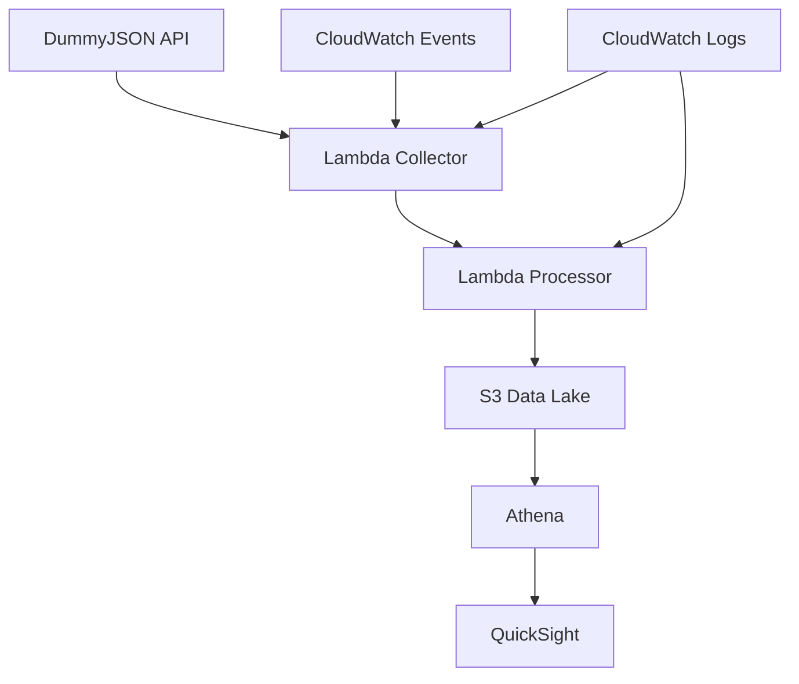

## Workshop Overview

Welcome to this comprehensive workshop on building an **ETL Data Pipeline for E-commerce** using AWS services! This hands-on session will guide you through creating a modern, serverless data processing system that can handle real-world e-commerce scenarios.

### What is ETL?

**ETL** stands for **Extract, Transform, Load** - a fundamental data integration process:

- **Extract**: Collect data from various sources (websites, databases, APIs)
- **Transform**: Clean, validate, and restructure data for analysis
- **Load**: Store processed data in target systems for analytics

In e-commerce, ETL pipelines are crucial for:

- Processing customer orders in real-time
- Analyzing user behavior and website interactions
- Managing inventory and supply chain data
- Generating business intelligence reports

### Why AWS for ETL?

AWS provides powerful, cost-effective services for building modern data pipelines:

**Serverless Architecture** - No server management, automatic scaling
**Pay-as-you-go** - Only pay for what you use
**Managed Services** - Focus on business logic, not infrastructure
**Real-time Processing** - Handle streaming data efficiently
**Integration** - Services work seamlessly together

## Architecture Overview

Our ETL pipeline will implement a **modern data architecture** with the following components:


### 1. Data Sources (Real E-commerce API)

We'll use **DummyJSON API** to get realistic e-commerce data:

- **Products**: 100+ real product catalog from DummyJSON `/products` endpoint
- **Users**: 30 customer profiles from `/users` endpoint
- **Carts**: 20 shopping cart transactions from `/carts` endpoint
- **Posts & Comments**: User-generated content for reviews simulation
- **Batch Processing**: Daily data collection and analysis

### 2. Data Collection Layer

**AWS Lambda (Scheduled)** will collect data from DummyJSON:

- Serverless, cost-effective data collection
- Scheduled execution using CloudWatch Events
- No infrastructure management required
- Built-in retry and error handling

### 3. Data Processing Layer

**AWS Lambda** functions will transform and store data:

- Clean and normalize DummyJSON data
- Transform JSON to Parquet format
- Partition data by date for efficient querying
- Generate analytics-ready datasets

### 4. Data Storage Layer

**Amazon S3** as our Data Lake:

- Scalable, durable object storage
- Partitioned by date for efficient queries
- Multiple formats: Raw JSON and Parquet
- Cost-optimized with S3 Intelligent Tiering

### 5. Analytics Layer

**Amazon Athena** for SQL queries:

- Serverless query service
- Query data directly in S3
- Standard SQL interface

**Amazon QuickSight** for visualization:

- Business intelligence service
- Interactive dashboards
- Mobile-friendly reports

### 6. Monitoring & Management

**Amazon CloudWatch**:

- Monitor system health and performance
- Set up alerts and notifications
- Track costs and resource usage

## Data Flow Architecture



### ETL Data Flow:

1. **CloudWatch Events** triggers Lambda on schedule (daily)
2. **Lambda Collector** fetches data from DummyJSON API endpoints
3. **Lambda Processor** transforms and validates data
4. **S3 Data Lake** stores both raw and processed data
5. **Athena** queries data using standard SQL
6. **QuickSight** creates interactive dashboards and reports

## Sample Data Schema

Our pipeline will process real data from **DummyJSON API**. Here are the actual data structures:

### DummyJSON Product Data

```json
{
  "id": 1,
  "title": "iPhone 9",
  "description": "An apple mobile which is nothing like apple",
  "price": 549,
  "discountPercentage": 12.96,
  "rating": 4.69,
  "stock": 94,
  "brand": "Apple",
  "category": "smartphones",
  "thumbnail": "https://dummyjson.com/image/i/products/1/thumbnail.jpg",
  "images": ["https://dummyjson.com/image/i/products/1/1.jpg"]
}
```

### DummyJSON User Data

```json
{
  "id": 1,
  "firstName": "Emily",
  "lastName": "Johnson",
  "maidenName": "Smith",
  "age": 28,
  "gender": "female",
  "email": "emily.johnson@x.dummyjson.com",
  "phone": "+81 965-431-3024",
  "address": {
    "address": "626 Main Street",
    "city": "Phoenix",
    "coordinates": { "lat": 33.4484, "lng": -112.074 },
    "postalCode": "85001",
    "state": "Arizona"
  }
}
```

### Transformed E-commerce Event

```json
{
  "event_type": "product_purchase",
  "timestamp": "2025-01-15T10:30:00Z",
  "transaction_id": "txn_123456",
  "user_id": 1,
  "product": {
    "id": 1,
    "title": "iPhone 9",
    "price": 549,
    "category": "smartphones",
    "brand": "Apple"
  },
  "quantity": 1,
  "total_amount": 549,
  "user_location": {
    "city": "Phoenix",
    "state": "Arizona",
    "country": "USA"
  }
}
```

## Expected Outcomes

By the end of this workshop, you'll have built:

🎯 **A complete ETL pipeline** processing real e-commerce data from DummyJSON
📊 **Interactive dashboards** showing product, user, and sales analytics
🔧 **Serverless architecture** with minimal infrastructure management
💰 **Cost-optimized solution** under $3/month using AWS Free Tier
📈 **Batch analytics** capabilities for business insights and reporting

## Prerequisites Check

Before we start building, ensure you have:

- ✅ **AWS Account** with administrative access
- ✅ **AWS CLI** installed and configured (optional)
- ✅ **Basic understanding** of JSON data format and REST APIs
- ✅ **Internet connection** to access DummyJSON API (https://dummyjson.com)
- ✅ **Text editor** for code editing
- ✅ **Web browser** for AWS Console access

### DummyJSON API Endpoints We'll Use:

- 🛍️ **Products**: `https://dummyjson.com/products` (100 realistic products)
- 👥 **Users**: `https://dummyjson.com/users` (30 sample users)
- 🛒 **Carts**: `https://dummyjson.com/carts` (20 shopping carts)
- 📝 **Posts**: `https://dummyjson.com/posts` (150 posts for review simulation)
- 💬 **Comments**: `https://dummyjson.com/comments` (340 comments)

{}
**Cost Management**: While this workshop uses AWS Free Tier services, always monitor your usage and set up billing alerts to avoid unexpected charges.
{}

## Workshop Structure

This workshop is divided into 8 hands-on modules:

1. **[Current]** Introduction & Architecture Design
2. **[Next]** Data Collection with Lambda
3. Data Processing and Transformation
4. Setting up S3 Data Lake
5. Analytics with Amazon Athena
6. Visualization with QuickSight
7. Monitoring and Optimization
8. Cleanup and Next Steps

---

**Ready to start building?** Let's move to the next module where we'll create our Lambda function to collect data from DummyJSON!

{}
**Estimated Time**: This module took approximately 15 minutes to complete. The next module will involve hands-on Lambda function creation and DummyJSON integration.
{}
