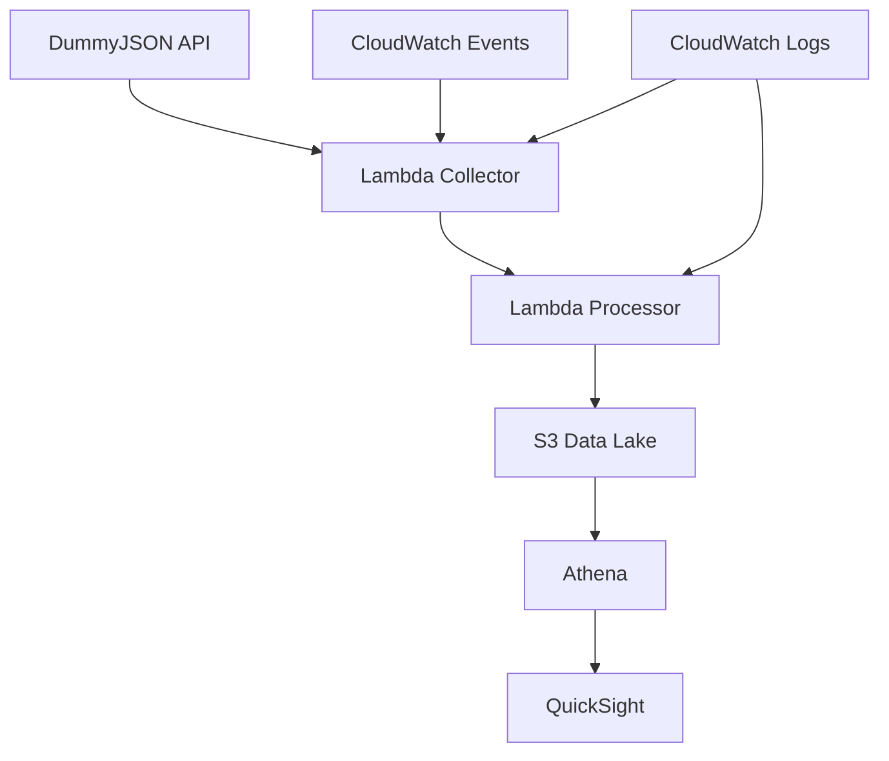

## Tổng quan Workshop

Chào mừng bạn đến với workshop toàn diện về xây dựng **Pipeline ETL xử lý dữ liệu E-commerce** sử dụng các dịch vụ AWS! Buổi học thực hành này sẽ hướng dẫn bạn tạo ra một hệ thống xử lý dữ liệu serverless hiện đại có thể xử lý các tình huống thương mại điện tử thực tế.

### ETL là gì?

**ETL** viết tắt của **Extract, Transform, Load** - một quy trình tích hợp dữ liệu cơ bản:

- **Extract (Trích xuất)**: Thu thập dữ liệu từ nhiều nguồn khác nhau (website, cơ sở dữ liệu, API)
- **Transform (Biến đổi)**: Làm sạch, xác thực và tái cấu trúc dữ liệu để phân tích
- **Load (Tải)**: Lưu trữ dữ liệu đã xử lý trong các hệ thống đích để phân tích

Trong thương mại điện tử, pipeline ETL rất quan trọng cho:

- Xử lý đơn hàng khách hàng theo thời gian thực
- Phân tích hành vi người dùng và tương tác trên website
- Quản lý hàng tồn kho và dữ liệu chuỗi cung ứng
- Tạo ra các báo cáo business intelligence

### Tại sao chọn AWS cho ETL?

AWS cung cấp các dịch vụ mạnh mẽ và hiệu quả về chi phí để xây dựng pipeline dữ liệu hiện đại:

**Kiến trúc Serverless** - Không cần quản lý server, tự động mở rộng
**Trả theo sử dụng** - Chỉ trả tiền cho những gì bạn sử dụng
**Dịch vụ được quản lý** - Tập trung vào logic business, không phải hạ tầng
**Xử lý thời gian thực** - Xử lý streaming data hiệu quả
**Tích hợp** - Các dịch vụ hoạt động liền mạch với nhau

## Tổng quan Kiến trúc

Pipeline ETL của chúng ta sẽ triển khai **kiến trúc dữ liệu hiện đại** với các thành phần sau:


### 1. Nguồn Dữ liệu (API E-commerce Thực tế)

Chúng ta sẽ sử dụng **DummyJSON API** để lấy dữ liệu e-commerce thực tế:

- **Sản phẩm**: 100+ catalog sản phẩm thực từ endpoint DummyJSON `/products`
- **Người dùng**: 30 hồ sơ khách hàng từ endpoint `/users`
- **Giỏ hàng**: 20 giao dịch giỏ hàng từ endpoint `/carts`
- **Bài viết & Bình luận**: Nội dung do người dùng tạo để mô phỏng đánh giá
- **Xử lý Batch**: Thu thập và phân tích dữ liệu hàng ngày

### 2. Lớp Thu thập Dữ liệu

**AWS Lambda (Scheduled)** sẽ thu thập dữ liệu từ DummyJSON:

- Thu thập dữ liệu serverless, hiệu quả chi phí
- Thực thi theo lịch trình sử dụng CloudWatch Events
- Không cần quản lý hạ tầng
- Tích hợp sẵn retry và xử lý lỗi

### 3. Lớp Xử lý Dữ liệu

**AWS Lambda** functions sẽ biến đổi và lưu trữ dữ liệu:

- Làm sạch và chuẩn hóa dữ liệu DummyJSON
- Chuyển đổi JSON sang định dạng Parquet
- Phân vùng dữ liệu theo ngày để truy vấn hiệu quả
- Tạo datasets sẵn sàng cho phân tích

### 4. Lớp Lưu trữ Dữ liệu

**Amazon S3** làm Data Lake:

- Lưu trữ object có thể mở rộng, bền vững
- Phân vùng theo ngày để truy vấn hiệu quả
- Nhiều định dạng: JSON thô và Parquet
- Tối ưu chi phí với S3 Intelligent Tiering

### 5. Lớp Phân tích

**Amazon Athena** cho truy vấn SQL:

- Dịch vụ truy vấn serverless
- Truy vấn dữ liệu trực tiếp trong S3
- Giao diện SQL tiêu chuẩn

**Amazon QuickSight** cho visualization:

- Dịch vụ business intelligence
- Dashboard tương tác
- Báo cáo thân thiện với mobile

### 6. Giám sát & Quản lý

**Amazon CloudWatch**:

- Giám sát sức khỏe và hiệu suất hệ thống
- Thiết lập cảnh báo và thông báo
- Theo dõi chi phí và sử dụng tài nguyên

## Kiến trúc Luồng Dữ liệu



### Luồng Dữ liệu ETL:

1. **CloudWatch Events** kích hoạt Lambda theo lịch trình (hàng ngày)
2. **Lambda Collector** lấy dữ liệu từ các endpoint DummyJSON API
3. **Lambda Processor** biến đổi và xác thực dữ liệu
4. **S3 Data Lake** lưu trữ cả dữ liệu thô và đã xử lý
5. **Athena** truy vấn dữ liệu sử dụng SQL tiêu chuẩn
6. **QuickSight** tạo dashboard và báo cáo tương tác

## Schema Dữ liệu Mẫu

Pipeline của chúng ta sẽ xử lý dữ liệu thực từ **DummyJSON API**. Dưới đây là cấu trúc dữ liệu thực tế:

### Dữ liệu Sản phẩm DummyJSON

```json
{
  "id": 1,
  "title": "iPhone 9",
  "description": "An apple mobile which is nothing like apple",
  "price": 549,
  "discountPercentage": 12.96,
  "rating": 4.69,
  "stock": 94,
  "brand": "Apple",
  "category": "smartphones",
  "thumbnail": "https://dummyjson.com/image/i/products/1/thumbnail.jpg",
  "images": ["https://dummyjson.com/image/i/products/1/1.jpg"]
}
```

### Dữ liệu Người dùng DummyJSON

```json
{
  "id": 1,
  "firstName": "Emily",
  "lastName": "Johnson",
  "maidenName": "Smith",
  "age": 28,
  "gender": "female",
  "email": "emily.johnson@x.dummyjson.com",
  "phone": "+81 965-431-3024",
  "address": {
    "address": "626 Main Street",
    "city": "Phoenix",
    "coordinates": { "lat": 33.4484, "lng": -112.074 },
    "postalCode": "85001",
    "state": "Arizona"
  }
}
```

### Sự kiện E-commerce Đã Biến đổi

```json
{
  "event_type": "product_purchase",
  "timestamp": "2025-01-15T10:30:00Z",
  "transaction_id": "txn_123456",
  "user_id": 1,
  "product": {
    "id": 1,
    "title": "iPhone 9",
    "price": 549,
    "category": "smartphones",
    "brand": "Apple"
  },
  "quantity": 1,
  "total_amount": 549,
  "user_location": {
    "city": "Phoenix",
    "state": "Arizona",
    "country": "USA"
  }
}
```

## Kết quả Mong đợi

Khi kết thúc workshop này, bạn sẽ đã xây dựng được:

🎯 **Pipeline ETL hoàn chỉnh** xử lý dữ liệu e-commerce thực tế từ DummyJSON
📊 **Dashboard tương tác** hiển thị phân tích sản phẩm, người dùng và bán hàng
🔧 **Kiến trúc serverless** với quản lý hạ tầng tối thiểu
💰 **Giải pháp tối ưu chi phí** dưới $3/tháng sử dụng AWS Free Tier
📈 **Khả năng phân tích batch** để có insight business và báo cáo

## Kiểm tra Điều kiện tiên quyết

Trước khi chúng ta bắt đầu xây dựng, hãy đảm bảo bạn có:

- ✅ **Tài khoản AWS** với quyền quản trị
- ✅ **AWS CLI** đã cài đặt và cấu hình (tùy chọn)
- ✅ **Hiểu biết cơ bản** về định dạng dữ liệu JSON và REST APIs
- ✅ **Kết nối Internet** để truy cập DummyJSON API (https://dummyjson.com)
- ✅ **Text editor** để chỉnh sửa code
- ✅ **Web browser** để truy cập AWS Console

### Các Endpoint DummyJSON API Chúng Ta Sẽ Sử Dụng:

- 🛍️ **Sản phẩm**: `https://dummyjson.com/products` (100 sản phẩm thực tế)
- 👥 **Người dùng**: `https://dummyjson.com/users` (30 người dùng mẫu)
- 🛒 **Giỏ hàng**: `https://dummyjson.com/carts` (20 giỏ hàng)
- 📝 **Bài viết**: `https://dummyjson.com/posts` (150 bài viết để mô phỏng đánh giá)
- 💬 **Bình luận**: `https://dummyjson.com/comments` (340 bình luận)

{}
**Quản lý Chi phí**: Mặc dù workshop này sử dụng các dịch vụ AWS Free Tier, hãy luôn giám sát việc sử dụng của bạn và thiết lập cảnh báo billing để tránh các khoản phí không mong muốn.
{}

## Cấu trúc Workshop

Workshop này được chia thành 8 module thực hành:

1. **[Hiện tại]** Giới thiệu & Thiết kế Kiến trúc
2. **[Tiếp theo]** Thu thập Dữ liệu với Lambda
3. Xử lý và Biến đổi Dữ liệu
4. Thiết lập S3 Data Lake
5. Phân tích với Amazon Athena
6. Visualization với QuickSight
7. Giám sát và Tối ưu hóa
8. Cleanup và Các bước tiếp theo

---

**Sẵn sàng bắt đầu xây dựng?** Hãy chuyển sang module tiếp theo nơi chúng ta sẽ tạo Lambda function để thu thập dữ liệu từ DummyJSON!

{}
**Thời gian ước tính**: Module này mất khoảng 15 phút để hoàn thành. Module tiếp theo sẽ bao gồm tạo Lambda function thực hành và tích hợp DummyJSON.
{}
