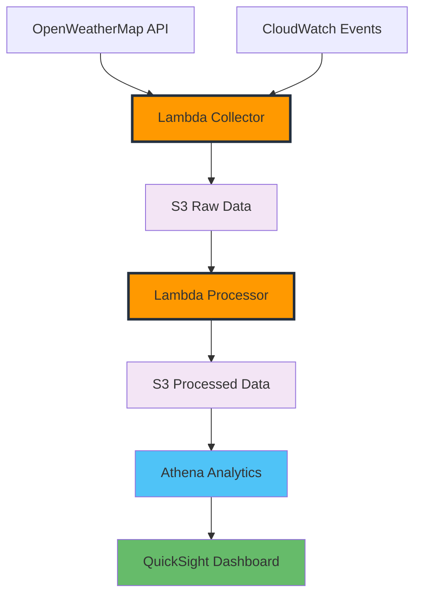

+++
title = "Introduction & Architecture Design"
date = 2025-01-03T08:00:00+07:00
weight = 1
chapter = true
pre = "<b>1. </b>"
+++

# Introduction & Architecture Design

Welcome to the **Simplified Weather ETL Pipeline Workshop**! In this streamlined workshop, you'll build a basic serverless data pipeline using AWS services to collect, process, and analyze weather data.

## Workshop Overview

This workshop demonstrates a simplified ETL (Extract, Transform, Load) pipeline that:

- **Collects** weather data from OpenWeatherMap API
- **Processes** data using serverless Lambda functions
- **Stores** data in S3
- **Analyzes** data using Athena
- **Visualizes** insights with QuickSight

## What You'll Build

## Simplified Architecture

This streamlined workshop focuses on the core components:

1. **Data Collection**: Lambda function to collect weather data
2. **Data Processing**: Lambda function to transform raw data
3. **Data Storage**: S3 buckets for storing raw and processed data
4. **Data Analysis**: Basic Athena queries
5. **Visualization**: Simple QuickSight dashboard

## Workshop Learning Objectives

By completing this workshop, you will learn how to:

1. **Set up** OpenWeatherMap API for data collection
2. **Create** Lambda functions to collect and process weather data
3. **Store** data in S3 with basic organization
4. **Transform** raw weather data into a more usable format
5. **Query** data using Amazon Athena
6. **Visualize** weather patterns with Amazon QuickSight

## Prerequisites

Before starting this workshop, you should have:

- AWS account with administrative access
- Basic knowledge of AWS services
- Familiarity with Python (for Lambda functions)

## Cost Estimates

This simplified workshop minimizes costs:

- **Lambda**: Free tier covers most usage
- **S3**: Minimal storage (~1MB) - essentially free
- **CloudWatch**: Basic monitoring included in free tier
- **Athena**: ~$0.05 (minimal queries)
- **QuickSight**: Free trial or ~$9.00 (author license for 30 days)

**Total Estimated Cost**: Less than $10.00 for the entire workshop

## Workshop Structure

This streamlined workshop consists of 5 core modules:

### Module 1: Introduction & Architecture

- Workshop overview and simplified architecture
- AWS services overview

### Module 2: Weather Data Collection

- OpenWeatherMap API setup (simplified)
- Basic Lambda function for data collection
- Simple scheduling with CloudWatch Events

### Module 3: Data Processing and Transformation

- Data transformation patterns
- Lambda processing functions
- Converting raw weather data to analytics-ready format

### Module 4: Data Analysis with Athena

- Basic S3 data organization
- Simple Athena queries for weather analysis

### Module 5: Visualization & Cleanup

- Basic QuickSight dashboard
- Resource cleanup procedures

## Getting Started

Ready to build your simplified weather data pipeline? Let's start with Module 2 where we'll set up basic weather data collection.

{}
**Estimated Time**: 2-3 hours total
{}

{}
This workshop has been simplified to focus on core concepts. For a more comprehensive experience, advanced features are available as optional extensions.
{}
