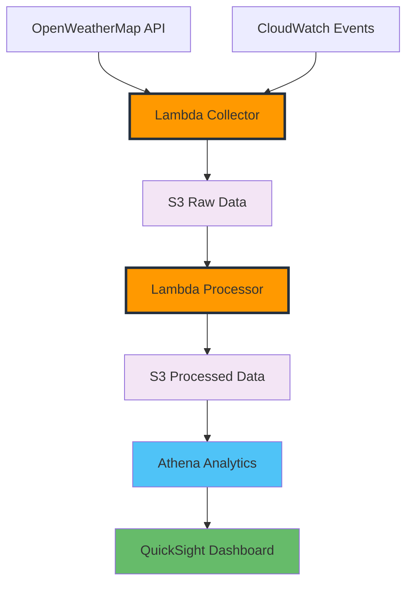

+++
title = "Giới thiệu"
date = 2025-06-23
weight = 1
chapter = false
pre = " <b> 1. </b> "
+++

## Tổng quan Workshop

Workshop này thực hiện xây dựng **Pipeline ETL đơn giản cho Phân tích Thời tiết** sử dụng các dịch vụ AWS để tạo ra một hệ thống xử lý dữ liệu serverless cơ bản.

### ETL là gì?

**ETL** viết tắt của **Extract, Transform, Load** - một quy trình tích hợp dữ liệu cơ bản:

- **Extract (Trích xuất)**: Thu thập dữ liệu từ nhiều nguồn khác nhau
- **Transform (Biến đổi)**: Làm sạch, xác thực và tái cấu trúc dữ liệu để phân tích
- **Load (Tải)**: Lưu trữ dữ liệu đã xử lý trong các hệ thống đích để phân tích

## Những gì bạn sẽ xây dựng

## Kiến trúc đơn giản hóa

Workshop đơn giản hóa này tập trung vào các thành phần cốt lõi:

1. **Thu thập dữ liệu**: Hàm Lambda để thu thập dữ liệu thời tiết
2. **Xử lý dữ liệu**: Hàm Lambda để biến đổi dữ liệu thô
3. **Lưu trữ dữ liệu**: Bucket S3 để lưu trữ dữ liệu thô và đã xử lý
4. **Phân tích dữ liệu**: Truy vấn Athena cơ bản
5. **Trực quan hóa**: Dashboard QuickSight đơn giản

## Mục tiêu học tập

Sau khi hoàn thành workshop này, bạn sẽ biết cách:

1. **Thiết lập** OpenWeatherMap API để thu thập dữ liệu
2. **Tạo** các hàm Lambda để thu thập và xử lý dữ liệu thời tiết
3. **Lưu trữ** dữ liệu trong S3 với tổ chức cơ bản
4. **Biến đổi** dữ liệu thời tiết thô thành định dạng dễ sử dụng hơn
5. **Truy vấn** dữ liệu bằng Amazon Athena
6. **Trực quan hóa** các mẫu thời tiết với Amazon QuickSight

## Điều kiện tiên quyết

Trước khi bắt đầu workshop này, bạn nên có:

- Tài khoản AWS với quyền truy cập quản trị
- Kiến thức cơ bản về các dịch vụ AWS
- Quen thuộc với Python (cho các hàm Lambda)

## Ước tính chi phí

Workshop đơn giản hóa này giảm thiểu chi phí:

- **Lambda**: Free tier đủ cho hầu hết các trường hợp sử dụng
- **S3**: Lưu trữ tối thiểu (~1MB) - về cơ bản là miễn phí
- **CloudWatch**: Giám sát cơ bản nằm trong free tier
- **Athena**: ~$0.05 (truy vấn tối thiểu)
- **QuickSight**: Dùng thử miễn phí hoặc ~$9.00 (giấy phép author cho 30 ngày)

**Tổng chi phí ước tính**: Dưới $10.00 cho toàn bộ workshop

## Cấu trúc Workshop

Workshop đơn giản hóa này bao gồm 5 module cốt lõi:

### Module 1: Giới thiệu & Kiến trúc

- Tổng quan workshop và kiến trúc đơn giản hóa
- Tổng quan về các dịch vụ AWS

### Module 2: Thu thập dữ liệu thời tiết

- Thiết lập OpenWeatherMap API (đơn giản hóa)
- Hàm Lambda cơ bản để thu thập dữ liệu
- Lập lịch đơn giản với CloudWatch Events

### Module 3: Xử lý và biến đổi dữ liệu

- Các mẫu biến đổi dữ liệu
- Các hàm xử lý Lambda
- Chuyển đổi dữ liệu thời tiết thô thành định dạng sẵn sàng cho phân tích

### Module 4: Phân tích dữ liệu với Athena

- Tổ chức dữ liệu S3 cơ bản
- Truy vấn Athena đơn giản cho phân tích thời tiết

### Module 5: Trực quan hóa & Dọn dẹp

- Dashboard QuickSight cơ bản
- Quy trình dọn dẹp tài nguyên

## Bắt đầu

Sẵn sàng xây dựng pipeline dữ liệu thời tiết đơn giản hóa của bạn? Hãy bắt đầu với Module 2, nơi chúng ta sẽ thiết lập thu thập dữ liệu thời tiết cơ bản.

{}
**Thời gian ước tính**: 2-3 giờ tổng cộng
{}

{}
Workshop này đã được đơn giản hóa để tập trung vào các khái niệm cốt lõi. Để có trải nghiệm toàn diện hơn, các tính năng nâng cao có sẵn dưới dạng phần mở rộng tùy chọn.
{}
