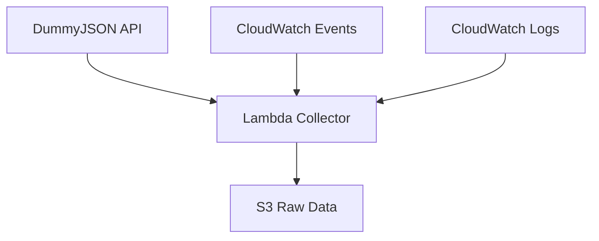

## Module Overview

In this module, we'll create an AWS Lambda function to collect data from the DummyJSON API. This serverless approach is perfect for our use case since DummyJSON provides static data that doesn't require real-time streaming.

### What You'll Learn

- 🔧 **Create AWS Lambda functions** for data collection
- 📅 **Schedule Lambda execution** using CloudWatch Events
- 🌐 **Integrate with external APIs** (DummyJSON)
- 💾 **Store data in S3** for further processing
- 🔍 **Monitor and troubleshoot** Lambda functions

### Architecture Overview

### Expected Outcomes

By the end of this module:

- ✅ Lambda function collecting data from DummyJSON
- ✅ Scheduled execution every 6 hours
- ✅ Raw data stored in S3 buckets
- ✅ Proper error handling and logging

---

Let's start building our data collection pipeline!

{}
**Estimated Time**: 45-60 minutes to complete this module
{}
