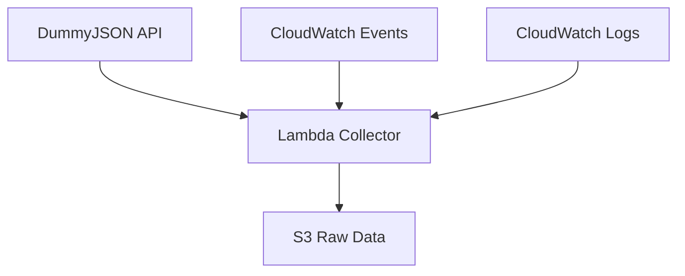

## Tổng quan Module

Trong module này, chúng ta sẽ tạo một AWS Lambda function để thu thập dữ liệu từ DummyJSON API. Cách tiếp cận serverless này hoàn hảo cho use case của chúng ta vì DummyJSON cung cấp dữ liệu tĩnh không yêu cầu streaming thời gian thực.

### Bạn sẽ học được

- 🔧 **Tạo AWS Lambda functions** để thu thập dữ liệu
- 📅 **Lên lịch thực thi Lambda** sử dụng CloudWatch Events
- 🌐 **Tích hợp với external APIs** (DummyJSON)
- 💾 **Lưu trữ dữ liệu trong S3** để xử lý tiếp
- 🔍 **Giám sát và troubleshoot** Lambda functions

### Tổng quan Kiến trúc

### Kết quả Mong đợi

Kết thúc module này:

- ✅ Lambda function thu thập dữ liệu từ DummyJSON
- ✅ Thực thi theo lịch trình mỗi 6 giờ
- ✅ Dữ liệu thô được lưu trong S3 buckets
- ✅ Xử lý lỗi và logging phù hợp

---

Hãy bắt đầu xây dựng pipeline thu thập dữ liệu!

{}
**Thời gian ước tính**: 45-60 phút để hoàn thành module này
{}
