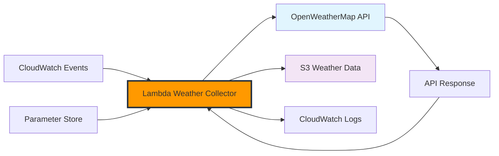

+++
title = "Building Lambda Weather Collector"
date = 2025-01-03T08:30:00+07:00
weight = 2
+++

# Building Lambda Weather Collector

In this section, we'll create AWS Lambda functions to automatically collect weather data from OpenWeatherMap API and store it in S3. These functions will be the core of our weather data collection system.

## Architecture Overview



## Step 1: Create IAM Role for Lambda

### 1.1 Create Lambda Execution Role

1. **Navigate to IAM Console**

   - AWS Console → IAM → Roles
   - Click "Create role"

2. **Select Trusted Entity**

   - **Service**: Lambda
   - Click "Next"

3. **Role Configuration**
   - **Role Name**: `WeatherCollectorLambdaRole`
   - **Description**: `Execution role for weather data collection Lambda functions`

### 1.2 Create Custom Policy

**Policy Name**: `WeatherCollectorPolicy`

```json
{
  "Version": "2012-10-17",
  "Statement": [
    {
      "Sid": "S3WeatherDataAccess",
      "Effect": "Allow",
      "Action": [
        "s3:PutObject",
        "s3:PutObjectAcl",
        "s3:GetObject",
        "s3:ListBucket"
      ],
      "Resource": [
        "arn:aws:s3:::weather-data-lake-*",
        "arn:aws:s3:::weather-data-lake-*/*"
      ]
    },
    {
      "Sid": "ParameterStoreAccess",
      "Effect": "Allow",
      "Action": ["ssm:GetParameter", "ssm:GetParameters"],
      "Resource": ["arn:aws:ssm:*:*:parameter/weather-etl/*"]
    },
    {
      "Sid": "CloudWatchLogsAccess",
      "Effect": "Allow",
      "Action": [
        "logs:CreateLogGroup",
        "logs:CreateLogStream",
        "logs:PutLogEvents"
      ],
      "Resource": "arn:aws:logs:*:*:log-group:/aws/lambda/weather-*"
    },
    {
      "Sid": "CloudWatchMetricsAccess",
      "Effect": "Allow",
      "Action": ["cloudwatch:PutMetricData"],
      "Resource": "*",
      "Condition": {
        "StringEquals": {
          "cloudwatch:namespace": "Weather/ETL"
        }
      }
    }
  ]
}
```

### 1.3 Attach AWS Managed Policies

Also attach this AWS managed policy:

- **AWSLambdaBasicExecutionRole**: `arn:aws:iam::aws:policy/service-role/AWSLambdaBasicExecutionRole`

## Step 2: Create S3 Bucket for Weather Data

### 2.1 Create Weather Data Bucket

1. **Navigate to S3 Console**

   - AWS Console → S3 → Create bucket

2. **Bucket Configuration**

   - **Bucket Name**: `weather-data-lake-{your-account-id}` (replace with your AWS account ID)
   - **Region**: us-east-1 (or your preferred region)
   - **Block Public Access**: Keep all settings enabled (recommended)

3. **Bucket Structure**
   ```
   weather-data-lake-123456789012/
   ├── raw/
   │   ├── current-weather/
   │   │   └── year=2025/month=01/day=03/hour=10/
   │   └── forecast/
   │       └── year=2025/month=01/day=03/
   └── processed/
       ├── current-weather/
       └── forecast/
   ```

## Step 3: Lambda Function for Current Weather

### 3.1 Create Current Weather Function

1. **Navigate to Lambda Console**

   - AWS Console → Lambda → Create function

2. **Function Configuration**
   - **Function Name**: `weather-current-collector`
   - **Runtime**: Python 3.11
   - **Architecture**: x86_64
   - **Execution Role**: Use existing role → `WeatherCollectorLambdaRole`

### 3.2 Function Code

**File**: `lambda_function.py`

```python
import json
import boto3
import requests
import os
from datetime import datetime, timezone
from typing import Dict, List, Optional
import logging

# Configure logging
logger = logging.getLogger()
logger.setLevel(logging.INFO)

# AWS clients
s3_client = boto3.client('s3')
ssm_client = boto3.client('ssm')
cloudwatch = boto3.client('cloudwatch')

# Configuration
BUCKET_NAME = os.environ.get('WEATHER_BUCKET_NAME')
API_KEY_PARAMETER = '/weather-etl/openweathermap/api-key'

# Target cities for weather collection
CITIES = [
    {'name': 'Ho Chi Minh City', 'country': 'VN', 'lat': 10.8231, 'lon': 106.6297},
    {'name': 'Hanoi', 'country': 'VN', 'lat': 21.0285, 'lon': 105.8542},
    {'name': 'Singapore', 'country': 'SG', 'lat': 1.3521, 'lon': 103.8198},
    {'name': 'Bangkok', 'country': 'TH', 'lat': 13.7563, 'lon': 100.5018},
    {'name': 'Jakarta', 'country': 'ID', 'lat': -6.2088, 'lon': 106.8456},
    {'name': 'Kuala Lumpur', 'country': 'MY', 'lat': 3.1390, 'lon': 101.6869}
]

def get_api_key() -> str:
    """Retrieve OpenWeatherMap API key from Parameter Store."""
    try:
        response = ssm_client.get_parameter(
            Name=API_KEY_PARAMETER,
            WithDecryption=True
        )
        return response['Parameter']['Value']
    except Exception as e:
        logger.error(f"Failed to retrieve API key: {e}")
        raise

def fetch_current_weather(city: Dict, api_key: str) -> Optional[Dict]:
    """Fetch current weather data for a city."""
    base_url = "https://api.openweathermap.org/data/2.5/weather"

    params = {
        'lat': city['lat'],
        'lon': city['lon'],
        'appid': api_key,
        'units': 'metric'
    }

    try:
        response = requests.get(base_url, params=params, timeout=10)
        response.raise_for_status()

        weather_data = response.json()

        # Add metadata
        weather_data['collection_metadata'] = {
            'collection_time': datetime.now(timezone.utc).isoformat(),
            'data_source': 'openweathermap',
            'api_version': '2.5',
            'collection_type': 'current_weather'
        }

        return weather_data

    except requests.exceptions.RequestException as e:
        logger.error(f"Failed to fetch weather for {city['name']}: {e}")
        return None

def store_weather_data(weather_data: Dict, city: Dict) -> bool:
    """Store weather data in S3 with partitioned structure."""
    try:
        now = datetime.now(timezone.utc)

        # Create S3 key with partitioning
        s3_key = (
            f"raw/current-weather/"
            f"year={now.year}/"
            f"month={now.month:02d}/"
            f"day={now.day:02d}/"
            f"hour={now.hour:02d}/"
            f"{city['name'].lower().replace(' ', '_')}_{now.strftime('%Y%m%d_%H%M%S')}.json"
        )

        # Upload to S3
        s3_client.put_object(
            Bucket=BUCKET_NAME,
            Key=s3_key,
            Body=json.dumps(weather_data, indent=2),
            ContentType='application/json',
            Metadata={
                'city': city['name'],
                'country': city['country'],
                'collection_time': now.isoformat(),
                'data_type': 'current_weather'
            }
        )

        logger.info(f"Stored weather data for {city['name']} at s3://{BUCKET_NAME}/{s3_key}")
        return True

    except Exception as e:
        logger.error(f"Failed to store weather data for {city['name']}: {e}")
        return False

def send_custom_metrics(successful_collections: int, failed_collections: int):
    """Send custom metrics to CloudWatch."""
    try:
        cloudwatch.put_metric_data(
            Namespace='Weather/ETL',
            MetricData=[
                {
                    'MetricName': 'SuccessfulCollections',
                    'Value': successful_collections,
                    'Unit': 'Count',
                    'Dimensions': [
                        {
                            'Name': 'DataType',
                            'Value': 'CurrentWeather'
                        }
                    ]
                },
                {
                    'MetricName': 'FailedCollections',
                    'Value': failed_collections,
                    'Unit': 'Count',
                    'Dimensions': [
                        {
                            'Name': 'DataType',
                            'Value': 'CurrentWeather'
                        }
                    ]
                }
            ]
        )
    except Exception as e:
        logger.error(f"Failed to send metrics: {e}")

def lambda_handler(event, context):
    """Main Lambda handler for current weather collection."""
    logger.info("Starting current weather collection")

    try:
        # Get API key
        api_key = get_api_key()

        successful_collections = 0
        failed_collections = 0
        results = []

        # Collect weather data for each city
        for city in CITIES:
            logger.info(f"Collecting weather data for {city['name']}")

            # Fetch weather data
            weather_data = fetch_current_weather(city, api_key)

            if weather_data:
                # Store in S3
                if store_weather_data(weather_data, city):
                    successful_collections += 1
                    results.append({
                        'city': city['name'],
                        'status': 'success',
                        'temperature': weather_data.get('main', {}).get('temp'),
                        'weather': weather_data.get('weather', [{}])[0].get('description')
                    })
                else:
                    failed_collections += 1
                    results.append({
                        'city': city['name'],
                        'status': 'storage_failed'
                    })
            else:
                failed_collections += 1
                results.append({
                    'city': city['name'],
                    'status': 'api_failed'
                })

        # Send metrics to CloudWatch
        send_custom_metrics(successful_collections, failed_collections)

        # Return results
        return {
            'statusCode': 200,
            'body': json.dumps({
                'message': 'Weather collection completed',
                'successful_collections': successful_collections,
                'failed_collections': failed_collections,
                'results': results
            })
        }

    except Exception as e:
        logger.error(f"Lambda execution failed: {e}")
        return {
            'statusCode': 500,
            'body': json.dumps({
                'error': str(e)
            })
        }
```

### 3.3 Environment Variables

Set these environment variables for the Lambda function:

| Variable              | Value                                 |
| --------------------- | ------------------------------------- |
| `WEATHER_BUCKET_NAME` | `weather-data-lake-{your-account-id}` |

### 3.4 Function Configuration

- **Timeout**: 5 minutes
- **Memory**: 256 MB
- **Dead Letter Queue**: Create SQS queue `weather-collection-dlq`

## Step 4: Lambda Function for Weather Forecasts

### 4.1 Create Forecast Function

1. **Function Name**: `weather-forecast-collector`
2. **Runtime**: Python 3.11
3. **Execution Role**: `WeatherCollectorLambdaRole`

### 4.2 Forecast Function Code

**File**: `lambda_function.py`

```python
import json
import boto3
import requests
import os
from datetime import datetime, timezone
from typing import Dict, List, Optional
import logging

# Configure logging
logger = logging.getLogger()
logger.setLevel(logging.INFO)

# AWS clients
s3_client = boto3.client('s3')
ssm_client = boto3.client('ssm')
cloudwatch = boto3.client('cloudwatch')

# Configuration
BUCKET_NAME = os.environ.get('WEATHER_BUCKET_NAME')
API_KEY_PARAMETER = '/weather-etl/openweathermap/api-key'

# Target cities (same as current weather)
CITIES = [
    {'name': 'Ho Chi Minh City', 'country': 'VN', 'lat': 10.8231, 'lon': 106.6297},
    {'name': 'Hanoi', 'country': 'VN', 'lat': 21.0285, 'lon': 105.8542},
    {'name': 'Singapore', 'country': 'SG', 'lat': 1.3521, 'lon': 103.8198},
    {'name': 'Bangkok', 'country': 'TH', 'lat': 13.7563, 'lon': 100.5018},
    {'name': 'Jakarta', 'country': 'ID', 'lat': -6.2088, 'lon': 106.8456},
    {'name': 'Kuala Lumpur', 'country': 'MY', 'lat': 3.1390, 'lon': 101.6869}
]

def get_api_key() -> str:
    """Retrieve OpenWeatherMap API key from Parameter Store."""
    try:
        response = ssm_client.get_parameter(
            Name=API_KEY_PARAMETER,
            WithDecryption=True
        )
        return response['Parameter']['Value']
    except Exception as e:
        logger.error(f"Failed to retrieve API key: {e}")
        raise

def fetch_weather_forecast(city: Dict, api_key: str) -> Optional[Dict]:
    """Fetch 5-day weather forecast for a city."""
    base_url = "https://api.openweathermap.org/data/2.5/forecast"

    params = {
        'lat': city['lat'],
        'lon': city['lon'],
        'appid': api_key,
        'units': 'metric'
    }

    try:
        response = requests.get(base_url, params=params, timeout=15)
        response.raise_for_status()

        forecast_data = response.json()

        # Add metadata
        forecast_data['collection_metadata'] = {
            'collection_time': datetime.now(timezone.utc).isoformat(),
            'data_source': 'openweathermap',
            'api_version': '2.5',
            'collection_type': 'forecast',
            'forecast_periods': len(forecast_data.get('list', []))
        }

        return forecast_data

    except requests.exceptions.RequestException as e:
        logger.error(f"Failed to fetch forecast for {city['name']}: {e}")
        return None

def store_forecast_data(forecast_data: Dict, city: Dict) -> bool:
    """Store forecast data in S3 with partitioned structure."""
    try:
        now = datetime.now(timezone.utc)

        # Create S3 key with partitioning
        s3_key = (
            f"raw/forecast/"
            f"year={now.year}/"
            f"month={now.month:02d}/"
            f"day={now.day:02d}/"
            f"{city['name'].lower().replace(' ', '_')}_{now.strftime('%Y%m%d_%H%M%S')}.json"
        )

        # Upload to S3
        s3_client.put_object(
            Bucket=BUCKET_NAME,
            Key=s3_key,
            Body=json.dumps(forecast_data, indent=2),
            ContentType='application/json',
            Metadata={
                'city': city['name'],
                'country': city['country'],
                'collection_time': now.isoformat(),
                'data_type': 'forecast',
                'forecast_periods': str(len(forecast_data.get('list', [])))
            }
        )

        logger.info(f"Stored forecast data for {city['name']} at s3://{BUCKET_NAME}/{s3_key}")
        return True

    except Exception as e:
        logger.error(f"Failed to store forecast data for {city['name']}: {e}")
        return False

def lambda_handler(event, context):
    """Main Lambda handler for weather forecast collection."""
    logger.info("Starting weather forecast collection")

    try:
        # Get API key
        api_key = get_api_key()

        successful_collections = 0
        failed_collections = 0
        results = []

        # Collect forecast data for each city
        for city in CITIES:
            logger.info(f"Collecting forecast data for {city['name']}")

            # Fetch forecast data
            forecast_data = fetch_weather_forecast(city, api_key)

            if forecast_data:
                # Store in S3
                if store_forecast_data(forecast_data, city):
                    successful_collections += 1
                    forecast_count = len(forecast_data.get('list', []))
                    results.append({
                        'city': city['name'],
                        'status': 'success',
                        'forecast_periods': forecast_count
                    })
                else:
                    failed_collections += 1
                    results.append({
                        'city': city['name'],
                        'status': 'storage_failed'
                    })
            else:
                failed_collections += 1
                results.append({
                    'city': city['name'],
                    'status': 'api_failed'
                })

        # Send metrics to CloudWatch
        cloudwatch.put_metric_data(
            Namespace='Weather/ETL',
            MetricData=[
                {
                    'MetricName': 'SuccessfulCollections',
                    'Value': successful_collections,
                    'Unit': 'Count',
                    'Dimensions': [
                        {
                            'Name': 'DataType',
                            'Value': 'Forecast'
                        }
                    ]
                }
            ]
        )

        # Return results
        return {
            'statusCode': 200,
            'body': json.dumps({
                'message': 'Forecast collection completed',
                'successful_collections': successful_collections,
                'failed_collections': failed_collections,
                'results': results
            })
        }

    except Exception as e:
        logger.error(f"Lambda execution failed: {e}")
        return {
            'statusCode': 500,
            'body': json.dumps({
                'error': str(e)
            })
        }
```

## Step 5: Test Lambda Functions

### 5.1 Test Current Weather Function

1. **Create Test Event**

   ```json
   {
     "test": true,
     "cities": ["Ho Chi Minh City"]
   }
   ```

2. **Run Test**
   - Click "Test" in Lambda console
   - Check execution logs
   - Verify S3 object creation

### 5.2 Expected Test Results

**Successful Response**:

```json
{
  "statusCode": 200,
  "body": "{\"message\": \"Weather collection completed\", \"successful_collections\": 6, \"failed_collections\": 0, \"results\": [...]}"
}
```

**S3 Structure After Test**:

```
weather-data-lake-123456789012/
└── raw/
    ├── current-weather/
    │   └── year=2025/month=01/day=03/hour=14/
    │       ├── ho_chi_minh_city_20250103_140532.json
    │       ├── hanoi_20250103_140534.json
    │       └── ...
    └── forecast/
        └── year=2025/month=01/day=03/
            ├── ho_chi_minh_city_20250103_140612.json
            └── ...
```

## Step 6: Monitor Function Performance

### 6.1 CloudWatch Metrics

Key metrics to monitor:

- **Duration**: Function execution time
- **Errors**: Failed executions
- **Throttles**: Concurrent execution limits
- **Custom Metrics**: Successful/failed collections

### 6.2 Set Up Alarms

**High Error Rate Alarm**:

```json
{
  "AlarmName": "WeatherCollector-HighErrorRate",
  "MetricName": "Errors",
  "Namespace": "AWS/Lambda",
  "Statistic": "Sum",
  "Period": 300,
  "EvaluationPeriods": 2,
  "Threshold": 3,
  "ComparisonOperator": "GreaterThanThreshold"
}
```

## Next Steps

Excellent! You now have Lambda functions that can collect weather data from OpenWeatherMap API. In the next section, we'll set up automated scheduling using CloudWatch Events to run these functions on a regular schedule.

{}
**What You've Built:**

- Lambda execution role with proper permissions
- S3 bucket with partitioned structure
- Current weather collection function
- Weather forecast collection function
- Error handling and monitoring
  {}

{}
**Performance Tips:**

- Monitor API response times and adjust timeout accordingly
- Use CloudWatch Logs Insights to analyze function performance
- Consider increasing memory for faster execution
- Set up Dead Letter Queues for failed executions
  {}
