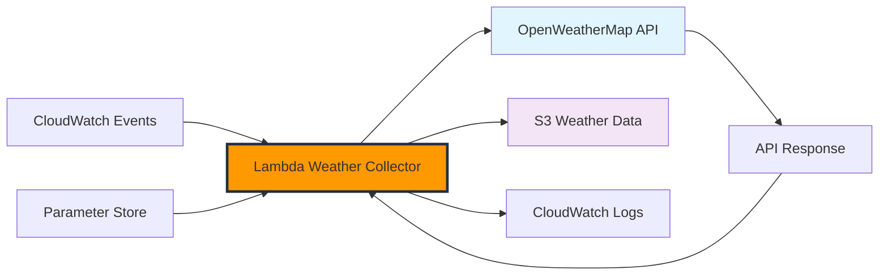

# Xây dựng Lambda Weather Collector

Trong phần này, chúng ta sẽ tạo các hàm AWS Lambda để tự động thu thập dữ liệu thời tiết từ OpenWeatherMap API và lưu trữ vào S3. Những hàm này sẽ là lõi của hệ thống thu thập dữ liệu thời tiết.

## Tổng quan Kiến trúc



## Bước 1: Tạo IAM Role cho Lambda

### 1.1 Tạo Lambda Execution Role

1. **Điều hướng đến IAM Console**

   - AWS Console → IAM → Roles
   - Click "Create role"

2. **Chọn Trusted Entity**

   - **Service**: Lambda
   - Click "Next"

3. **Cấu hình Role**
   - **Role Name**: `WeatherCollectorLambdaRole`
   - **Description**: `Execution role for weather data collection Lambda functions`

### 1.2 Tạo Custom Policy

**Policy Name**: `WeatherCollectorPolicy`

```json
{
  "Version": "2012-10-17",
  "Statement": [
    {
      "Sid": "S3WeatherDataAccess",
      "Effect": "Allow",
      "Action": [
        "s3:PutObject",
        "s3:PutObjectAcl",
        "s3:GetObject",
        "s3:ListBucket"
      ],
      "Resource": [
        "arn:aws:s3:::weather-data-lake-*",
        "arn:aws:s3:::weather-data-lake-*/*"
      ]
    },
    {
      "Sid": "ParameterStoreAccess",
      "Effect": "Allow",
      "Action": ["ssm:GetParameter", "ssm:GetParameters"],
      "Resource": ["arn:aws:ssm:*:*:parameter/weather-etl/*"]
    },
    {
      "Sid": "CloudWatchLogsAccess",
      "Effect": "Allow",
      "Action": [
        "logs:CreateLogGroup",
        "logs:CreateLogStream",
        "logs:PutLogEvents"
      ],
      "Resource": "arn:aws:logs:*:*:log-group:/aws/lambda/weather-*"
    },
    {
      "Sid": "CloudWatchMetricsAccess",
      "Effect": "Allow",
      "Action": ["cloudwatch:PutMetricData"],
      "Resource": "*",
      "Condition": {
        "StringEquals": {
          "cloudwatch:namespace": "Weather/ETL"
        }
      }
    }
  ]
}
```

### 1.3 Gắn AWS Managed Policies

Cũng gắn AWS managed policy này:

- **AWSLambdaBasicExecutionRole**: `arn:aws:iam::aws:policy/service-role/AWSLambdaBasicExecutionRole`

## Bước 2: Tạo S3 Bucket cho Dữ liệu Thời tiết

### 2.1 Tạo Weather Data Bucket

1. **Điều hướng đến S3 Console**

   - AWS Console → S3 → Create bucket

2. **Cấu hình Bucket**

   - **Bucket Name**: `weather-data-lake-{your-account-id}` (thay thế bằng AWS account ID của bạn)
   - **Region**: us-east-1 (hoặc region ưa thích của bạn)
   - **Block Public Access**: Giữ tất cả cài đặt được bật (khuyến nghị)

3. **Cấu trúc Bucket**
   ```
   weather-data-lake-123456789012/
   ├── raw/
   │   ├── current-weather/
   │   │   └── year=2025/month=01/day=03/hour=10/
   │   └── forecast/
   │       └── year=2025/month=01/day=03/
   └── processed/
       ├── current-weather/
       └── forecast/
   ```

## Bước 3: Lambda Function cho Current Weather

### 3.1 Tạo Current Weather Function

1. **Điều hướng đến Lambda Console**

   - AWS Console → Lambda → Create function

2. **Cấu hình Function**
   - **Function Name**: `weather-current-collector`
   - **Runtime**: Python 3.11
   - **Architecture**: x86_64
   - **Execution Role**: Use existing role → `WeatherCollectorLambdaRole`

### 3.2 Function Code

**File**: `lambda_function.py`

```python
import json
import boto3
import requests
import os
from datetime import datetime, timezone
from typing import Dict, List, Optional
import logging

# Cấu hình logging
logger = logging.getLogger()
logger.setLevel(logging.INFO)

# AWS clients
s3_client = boto3.client('s3')
ssm_client = boto3.client('ssm')
cloudwatch = boto3.client('cloudwatch')

# Cấu hình
BUCKET_NAME = os.environ.get('WEATHER_BUCKET_NAME')
API_KEY_PARAMETER = '/weather-etl/openweathermap/api-key'

# Các thành phố mục tiêu để thu thập thời tiết
CITIES = [
    {'name': 'Ho Chi Minh City', 'country': 'VN', 'lat': 10.8231, 'lon': 106.6297},
    {'name': 'Hanoi', 'country': 'VN', 'lat': 21.0285, 'lon': 105.8542},
    {'name': 'Singapore', 'country': 'SG', 'lat': 1.3521, 'lon': 103.8198},
    {'name': 'Bangkok', 'country': 'TH', 'lat': 13.7563, 'lon': 100.5018},
    {'name': 'Jakarta', 'country': 'ID', 'lat': -6.2088, 'lon': 106.8456},
    {'name': 'Kuala Lumpur', 'country': 'MY', 'lat': 3.1390, 'lon': 101.6869}
]

def get_api_key() -> str:
    """Lấy OpenWeatherMap API key từ Parameter Store."""
    try:
        response = ssm_client.get_parameter(
            Name=API_KEY_PARAMETER,
            WithDecryption=True
        )
        return response['Parameter']['Value']
    except Exception as e:
        logger.error(f"Không thể lấy API key: {e}")
        raise

def fetch_current_weather(city: Dict, api_key: str) -> Optional[Dict]:
    """Lấy dữ liệu thời tiết hiện tại cho một thành phố."""
    base_url = "https://api.openweathermap.org/data/2.5/weather"

    params = {
        'lat': city['lat'],
        'lon': city['lon'],
        'appid': api_key,
        'units': 'metric',
        'lang': 'vi'
    }

    try:
        response = requests.get(base_url, params=params, timeout=30)
        response.raise_for_status()

        data = response.json()

        # Thêm metadata
        data['collection_timestamp'] = datetime.now(timezone.utc).isoformat()
        data['city_metadata'] = city

        return data

    except requests.exceptions.RequestException as e:
        logger.error(f"Lỗi API cho {city['name']}: {e}")
        return None
    except json.JSONDecodeError as e:
        logger.error(f"Lỗi JSON decode cho {city['name']}: {e}")
        return None

def save_to_s3(data: Dict, city_name: str) -> bool:
    """Lưu dữ liệu thời tiết vào S3."""
    try:
        now = datetime.now(timezone.utc)

        # Tạo S3 key với partition theo thời gian
        city_safe = city_name.lower().replace(' ', '_').replace('.', '')
        key = f"raw/current-weather/year={now.year}/month={now.month:02d}/day={now.day:02d}/hour={now.hour:02d}/{city_safe}_{now.strftime('%Y%m%d_%H%M%S')}.json"

        # Upload file
        s3_client.put_object(
            Bucket=BUCKET_NAME,
            Key=key,
            Body=json.dumps(data, ensure_ascii=False, indent=2),
            ContentType='application/json',
            Metadata={
                'city': city_name,
                'collection_time': now.isoformat(),
                'data_type': 'current_weather'
            }
        )

        logger.info(f"Đã lưu dữ liệu cho {city_name} tại {key}")
        return True

    except Exception as e:
        logger.error(f"Lỗi lưu S3 cho {city_name}: {e}")
        return False

def send_metrics(metric_name: str, value: float, unit: str = 'Count'):
    """Gửi metrics tùy chỉnh tới CloudWatch."""
    try:
        cloudwatch.put_metric_data(
            Namespace='Weather/ETL',
            MetricData=[
                {
                    'MetricName': metric_name,
                    'Value': value,
                    'Unit': unit,
                    'Timestamp': datetime.now(timezone.utc)
                }
            ]
        )
    except Exception as e:
        logger.error(f"Lỗi gửi metric {metric_name}: {e}")

def lambda_handler(event, context):
    """Handler chính cho Lambda function."""
    logger.info(f"Bắt đầu thu thập thời tiết: {json.dumps(event)}")

    successful_collections = 0
    failed_collections = 0
    results = []

    try:
        # Lấy API key
        api_key = get_api_key()

        # Thu thập dữ liệu cho từng thành phố
        for city in CITIES:
            logger.info(f"Thu thập dữ liệu cho {city['name']}")

            # Fetch weather data
            weather_data = fetch_current_weather(city, api_key)

            if weather_data:
                # Lưu vào S3
                if save_to_s3(weather_data, city['name']):
                    successful_collections += 1
                    results.append({
                        'city': city['name'],
                        'status': 'success',
                        'temperature': weather_data.get('main', {}).get('temp'),
                        'description': weather_data.get('weather', [{}])[0].get('description')
                    })
                else:
                    failed_collections += 1
                    results.append({
                        'city': city['name'],
                        'status': 'failed',
                        'error': 'S3 save failed'
                    })
            else:
                failed_collections += 1
                results.append({
                    'city': city['name'],
                    'status': 'failed',
                    'error': 'API fetch failed'
                })

        # Gửi metrics
        send_metrics('SuccessfulCollections', successful_collections)
        send_metrics('FailedCollections', failed_collections)
        send_metrics('TotalCollections', successful_collections + failed_collections)

        # Log kết quả
        logger.info(f"Thu thập hoàn tất - Thành công: {successful_collections}, Thất bại: {failed_collections}")

        return {
            'statusCode': 200,
            'body': json.dumps({
                'message': 'Thu thập thời tiết hoàn tất',
                'successful_collections': successful_collections,
                'failed_collections': failed_collections,
                'results': results
            }, ensure_ascii=False)
        }

    except Exception as e:
        logger.error(f"Lỗi trong lambda handler: {e}")
        send_metrics('LambdaErrors', 1)

        return {
            'statusCode': 500,
            'body': json.dumps({
                'error': 'Lỗi nội bộ',
                'message': str(e)
            }, ensure_ascii=False)
        }
```

### 3.3 Biến Môi trường

Trong Lambda Console, thêm biến môi trường:

- **WEATHER_BUCKET_NAME**: `weather-data-lake-{your-account-id}`

### 3.4 Cấu hình Function

- **Memory**: 256 MB
- **Timeout**: 5 minutes
- **Reserved Concurrency**: 2

## Bước 4: Lambda Function cho Weather Forecast

### 4.1 Tạo Forecast Function

1. **Tạo function mới**
   - **Function Name**: `weather-forecast-collector`
   - **Runtime**: Python 3.11
   - **Execution Role**: `WeatherCollectorLambdaRole`

### 4.2 Forecast Function Code

```python
import json
import boto3
import requests
import os
from datetime import datetime, timezone
from typing import Dict, List, Optional
import logging

logger = logging.getLogger()
logger.setLevel(logging.INFO)

s3_client = boto3.client('s3')
ssm_client = boto3.client('ssm')
cloudwatch = boto3.client('cloudwatch')

BUCKET_NAME = os.environ.get('WEATHER_BUCKET_NAME')
API_KEY_PARAMETER = '/weather-etl/openweathermap/api-key'

CITIES = [
    {'name': 'Ho Chi Minh City', 'country': 'VN', 'lat': 10.8231, 'lon': 106.6297},
    {'name': 'Hanoi', 'country': 'VN', 'lat': 21.0285, 'lon': 105.8542},
    {'name': 'Singapore', 'country': 'SG', 'lat': 1.3521, 'lon': 103.8198},
    {'name': 'Bangkok', 'country': 'TH', 'lat': 13.7563, 'lon': 100.5018},
    {'name': 'Jakarta', 'country': 'ID', 'lat': -6.2088, 'lon': 106.8456},
    {'name': 'Kuala Lumpur', 'country': 'MY', 'lat': 3.1390, 'lon': 101.6869}
]

def get_api_key() -> str:
    """Lấy OpenWeatherMap API key từ Parameter Store."""
    try:
        response = ssm_client.get_parameter(
            Name=API_KEY_PARAMETER,
            WithDecryption=True
        )
        return response['Parameter']['Value']
    except Exception as e:
        logger.error(f"Không thể lấy API key: {e}")
        raise

def fetch_weather_forecast(city: Dict, api_key: str) -> Optional[Dict]:
    """Lấy dữ liệu dự báo thời tiết 5 ngày cho một thành phố."""
    base_url = "https://api.openweathermap.org/data/2.5/forecast"

    params = {
        'lat': city['lat'],
        'lon': city['lon'],
        'appid': api_key,
        'units': 'metric',
        'lang': 'vi',
        'cnt': 40  # 5 ngày x 8 dự báo (mỗi 3 giờ)
    }

    try:
        response = requests.get(base_url, params=params, timeout=30)
        response.raise_for_status()

        data = response.json()

        # Thêm metadata
        data['collection_timestamp'] = datetime.now(timezone.utc).isoformat()
        data['city_metadata'] = city

        return data

    except requests.exceptions.RequestException as e:
        logger.error(f"Lỗi API forecast cho {city['name']}: {e}")
        return None
    except json.JSONDecodeError as e:
        logger.error(f"Lỗi JSON decode forecast cho {city['name']}: {e}")
        return None

def save_forecast_to_s3(data: Dict, city_name: str) -> bool:
    """Lưu dữ liệu dự báo thời tiết vào S3."""
    try:
        now = datetime.now(timezone.utc)

        city_safe = city_name.lower().replace(' ', '_').replace('.', '')
        key = f"raw/forecast/year={now.year}/month={now.month:02d}/day={now.day:02d}/{city_safe}_{now.strftime('%Y%m%d_%H%M%S')}.json"

        s3_client.put_object(
            Bucket=BUCKET_NAME,
            Key=key,
            Body=json.dumps(data, ensure_ascii=False, indent=2),
            ContentType='application/json',
            Metadata={
                'city': city_name,
                'collection_time': now.isoformat(),
                'data_type': 'forecast',
                'forecast_count': str(len(data.get('list', [])))
            }
        )

        logger.info(f"Đã lưu dự báo cho {city_name} tại {key}")
        return True

    except Exception as e:
        logger.error(f"Lỗi lưu forecast S3 cho {city_name}: {e}")
        return False

def lambda_handler(event, context):
    """Handler chính cho forecast Lambda function."""
    logger.info(f"Bắt đầu thu thập dự báo thời tiết: {json.dumps(event)}")

    successful_collections = 0
    failed_collections = 0
    results = []

    try:
        api_key = get_api_key()

        for city in CITIES:
            logger.info(f"Thu thập dự báo cho {city['name']}")

            forecast_data = fetch_weather_forecast(city, api_key)

            if forecast_data:
                if save_forecast_to_s3(forecast_data, city['name']):
                    successful_collections += 1
                    results.append({
                        'city': city['name'],
                        'status': 'success',
                        'forecast_points': len(forecast_data.get('list', []))
                    })
                else:
                    failed_collections += 1
                    results.append({
                        'city': city['name'],
                        'status': 'failed',
                        'error': 'S3 save failed'
                    })
            else:
                failed_collections += 1
                results.append({
                    'city': city['name'],
                    'status': 'failed',
                    'error': 'API fetch failed'
                })

        # Gửi metrics
        cloudwatch.put_metric_data(
            Namespace='Weather/ETL',
            MetricData=[
                {
                    'MetricName': 'SuccessfulForecastCollections',
                    'Value': successful_collections,
                    'Unit': 'Count'
                },
                {
                    'MetricName': 'FailedForecastCollections',
                    'Value': failed_collections,
                    'Unit': 'Count'
                }
            ]
        )

        logger.info(f"Thu thập dự báo hoàn tất - Thành công: {successful_collections}, Thất bại: {failed_collections}")

        return {
            'statusCode': 200,
            'body': json.dumps({
                'message': 'Thu thập dự báo thời tiết hoàn tất',
                'successful_collections': successful_collections,
                'failed_collections': failed_collections,
                'results': results
            }, ensure_ascii=False)
        }

    except Exception as e:
        logger.error(f"Lỗi trong forecast lambda handler: {e}")

        cloudwatch.put_metric_data(
            Namespace='Weather/ETL',
            MetricData=[
                {
                    'MetricName': 'ForecastLambdaErrors',
                    'Value': 1,
                    'Unit': 'Count'
                }
            ]
        )

        return {
            'statusCode': 500,
            'body': json.dumps({
                'error': 'Lỗi nội bộ forecast',
                'message': str(e)
            }, ensure_ascii=False)
        }
```

## Bước 5: Testing Lambda Functions

### 5.1 Test Manual

1. **Test current weather function**

   - Vào Lambda Console → `weather-current-collector`
   - Tạo test event với payload rỗng `{}`
   - Click "Test" và kiểm tra logs

2. **Test forecast function**
   - Vào Lambda Console → `weather-forecast-collector`
   - Tạo test event với payload rỗng `{}`
   - Click "Test" và kiểm tra logs

### 5.2 Verify S3 Data

Kiểm tra dữ liệu trong S3 bucket:

```bash
aws s3 ls s3://weather-data-lake-{your-account-id}/raw/ --recursive
```

Bạn sẽ thấy các file JSON được tạo trong cấu trúc partition theo thời gian.

## Tóm tắt

Trong phần này, chúng ta đã:

✅ Tạo IAM roles và policies cho Lambda functions  
✅ Thiết lập S3 bucket với cấu trúc partition  
✅ Xây dựng Lambda function thu thập thời tiết hiện tại  
✅ Xây dựng Lambda function thu thập dự báo thời tiết  
✅ Cấu hình error handling và CloudWatch metrics  
✅ Test các functions thành công

**Tiếp theo**: Trong module 2.3, chúng ta sẽ thiết lập automated scheduling với CloudWatch Events để chạy các functions này theo lịch trình.
