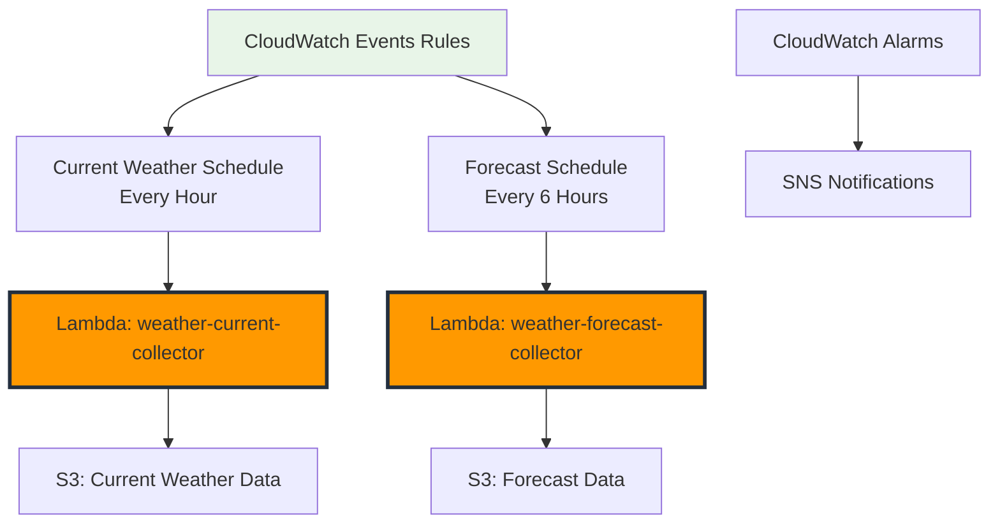

+++
title = "Automated Scheduling with CloudWatch Events"
date = 2025-01-03T08:45:00+07:00
weight = 3
+++

# Automated Scheduling with CloudWatch Events

In this section, we'll set up automated scheduling for our weather data collection using Amazon CloudWatch Events (now called Amazon EventBridge). This will ensure our Lambda functions run on a regular schedule to collect weather data consistently.

## Architecture Overview



## Step 1: Create CloudWatch Events Rules

### 1.1 Schedule for Current Weather Collection

1. **Navigate to CloudWatch Console**

   - AWS Console → CloudWatch → Events → Rules
   - Click "Create rule"

2. **Event Source Configuration**

   - **Event Source**: Schedule
   - **Schedule Expression**: `rate(1 hour)`
   - **Description**: "Trigger current weather collection every hour"

3. **Target Configuration**
   - **Target**: Lambda function
   - **Function**: `weather-current-collector`
   - **Configure input**: Constant (JSON text)

**Input JSON**:

```json
{
  "source": "cloudwatch-events",
  "detail-type": "Scheduled Event",
  "detail": {
    "collection_type": "current_weather",
    "scheduled_time": "hourly"
  }
}
```

4. **Rule Details**
   - **Name**: `weather-current-hourly`
   - **Description**: "Hourly collection of current weather data for 6 cities"
   - **State**: Enabled

### 1.2 Schedule for Weather Forecast Collection

1. **Create Second Rule**

   - **Event Source**: Schedule
   - **Schedule Expression**: `rate(6 hours)`
   - **Description**: "Trigger weather forecast collection every 6 hours"

2. **Target Configuration**
   - **Target**: Lambda function
   - **Function**: `weather-forecast-collector`

**Input JSON**:

```json
{
  "source": "cloudwatch-events",
  "detail-type": "Scheduled Event",
  "detail": {
    "collection_type": "forecast",
    "scheduled_time": "every_6_hours"
  }
}
```

3. **Rule Details**
   - **Name**: `weather-forecast-6hourly`
   - **Description**: "6-hourly collection of weather forecast data"
   - **State**: Enabled

## Step 2: Advanced Scheduling Options

### 2.1 Using Cron Expressions

For more precise scheduling, you can use cron expressions:

**Current Weather at specific times**:

```
cron(0 0,6,12,18 * * ? *)
```

This runs at 00:00, 06:00, 12:00, and 18:00 UTC daily.

**Forecast at 06:00 and 18:00 UTC**:

```
cron(0 6,18 * * ? *)
```

**Hourly during business hours (UTC+7)**:

```
cron(0 1-14 * * ? *)
```

This runs hourly from 01:00 to 14:00 UTC (08:00 to 21:00 Vietnam time).

### 2.2 Different Schedules for Different Cities

**Create city-specific rules**:

**Rule for Asian Cities (UTC+7/+8)**:

```json
{
  "source": "cloudwatch-events",
  "detail": {
    "cities": ["Ho Chi Minh City", "Hanoi", "Singapore", "Bangkok"],
    "timezone": "Asia/Ho_Chi_Minh"
  }
}
```

**Schedule**: `cron(0 1,7,13,19 * * ? *)` (Peak hours in Asia)

## Step 3: Create SNS Topic for Notifications

### 3.1 Set Up SNS Topic

1. **Navigate to SNS Console**

   - AWS Console → SNS → Topics
   - Click "Create topic"

2. **Topic Configuration**

   - **Type**: Standard
   - **Name**: `weather-collection-alerts`
   - **Display Name**: "Weather Collection Alerts"

3. **Create Subscription**
   - **Protocol**: Email
   - **Endpoint**: Your email address
   - Confirm subscription via email

### 3.2 SNS Topic Policy

```json
{
  "Version": "2012-10-17",
  "Statement": [
    {
      "Sid": "AllowCloudWatchAlarmsToPublish",
      "Effect": "Allow",
      "Principal": {
        "Service": "cloudwatch.amazonaws.com"
      },
      "Action": "SNS:Publish",
      "Resource": "arn:aws:sns:us-east-1:123456789012:weather-collection-alerts"
    }
  ]
}
```

## Step 4: Set Up Monitoring and Alarms

### 4.1 Lambda Function Alarms

**Error Rate Alarm**:

```json
{
  "AlarmName": "WeatherCollection-HighErrorRate",
  "AlarmDescription": "High error rate in weather collection functions",
  "MetricName": "Errors",
  "Namespace": "AWS/Lambda",
  "Statistic": "Sum",
  "Period": 3600,
  "EvaluationPeriods": 1,
  "Threshold": 2,
  "ComparisonOperator": "GreaterThanOrEqualToThreshold",
  "Dimensions": [
    {
      "Name": "FunctionName",
      "Value": "weather-current-collector"
    }
  ],
  "AlarmActions": [
    "arn:aws:sns:us-east-1:123456789012:weather-collection-alerts"
  ]
}
```

**Duration Alarm**:

```json
{
  "AlarmName": "WeatherCollection-LongDuration",
  "AlarmDescription": "Weather collection taking too long",
  "MetricName": "Duration",
  "Namespace": "AWS/Lambda",
  "Statistic": "Average",
  "Period": 3600,
  "EvaluationPeriods": 2,
  "Threshold": 30000,
  "ComparisonOperator": "GreaterThanThreshold",
  "Unit": "Milliseconds"
}
```

### 4.2 Custom Metrics Alarms

**Failed Collections Alarm**:

```json
{
  "AlarmName": "WeatherCollection-FailedCollections",
  "AlarmDescription": "Too many failed weather data collections",
  "MetricName": "FailedCollections",
  "Namespace": "Weather/ETL",
  "Statistic": "Sum",
  "Period": 3600,
  "EvaluationPeriods": 1,
  "Threshold": 3,
  "ComparisonOperator": "GreaterThanThreshold",
  "AlarmActions": [
    "arn:aws:sns:us-east-1:123456789012:weather-collection-alerts"
  ]
}
```

### 4.3 API Usage Monitoring

Create a custom metric to track OpenWeatherMap API usage:

**Lambda Function Addition**:

```python
def send_api_usage_metrics(api_calls_made: int):
    """Track API usage to monitor limits."""
    try:
        cloudwatch.put_metric_data(
            Namespace='Weather/APIUsage',
            MetricData=[
                {
                    'MetricName': 'APICalls',
                    'Value': api_calls_made,
                    'Unit': 'Count',
                    'Dimensions': [
                        {
                            'Name': 'Provider',
                            'Value': 'OpenWeatherMap'
                        }
                    ]
                }
            ]
        )
    except Exception as e:
        logger.error(f"Failed to send API usage metrics: {e}")
```

**API Limit Alarm**:

```json
{
  "AlarmName": "OpenWeatherMap-APILimitApproaching",
  "AlarmDescription": "Approaching OpenWeatherMap daily API limit",
  "MetricName": "APICalls",
  "Namespace": "Weather/APIUsage",
  "Statistic": "Sum",
  "Period": 86400,
  "EvaluationPeriods": 1,
  "Threshold": 800,
  "ComparisonOperator": "GreaterThanThreshold"
}
```

## Step 5: Create CloudWatch Dashboard

### 5.1 Weather Collection Dashboard

1. **Navigate to CloudWatch Dashboards**

   - AWS Console → CloudWatch → Dashboards
   - Click "Create dashboard"

2. **Dashboard Configuration**

   - **Name**: `Weather-ETL-Dashboard`

3. **Add Widgets**

**Widget 1: Lambda Invocations**

```json
{
  "type": "metric",
  "properties": {
    "metrics": [
      [
        "AWS/Lambda",
        "Invocations",
        "FunctionName",
        "weather-current-collector"
      ],
      [".", ".", ".", "weather-forecast-collector"]
    ],
    "period": 3600,
    "stat": "Sum",
    "region": "us-east-1",
    "title": "Lambda Invocations"
  }
}
```

**Widget 2: Collection Success Rate**

```json
{
  "type": "metric",
  "properties": {
    "metrics": [
      ["Weather/ETL", "SuccessfulCollections", "DataType", "CurrentWeather"],
      [".", "FailedCollections", ".", "."],
      [".", "SuccessfulCollections", ".", "Forecast"],
      [".", "FailedCollections", ".", "."]
    ],
    "period": 3600,
    "stat": "Sum",
    "region": "us-east-1",
    "title": "Collection Success vs Failures"
  }
}
```

**Widget 3: API Usage**

```json
{
  "type": "metric",
  "properties": {
    "metrics": [["Weather/APIUsage", "APICalls", "Provider", "OpenWeatherMap"]],
    "period": 86400,
    "stat": "Sum",
    "region": "us-east-1",
    "title": "Daily API Usage"
  }
}
```

## Step 6: Error Handling and Recovery

### 6.1 Dead Letter Queues

1. **Create DLQ for Current Weather**

   - AWS Console → SQS → Create queue
   - **Name**: `weather-current-collector-dlq`
   - **Type**: Standard queue

2. **Configure Lambda DLQ**
   - Lambda function → Configuration → Asynchronous invocation
   - **Dead letter queue**: `weather-current-collector-dlq`
   - **Maximum age of event**: 6 hours
   - **Retry attempts**: 2

### 6.2 DLQ Processing Function

**Create DLQ processor**: `weather-dlq-processor`

```python
import json
import boto3
import logging
from datetime import datetime

logger = logging.getLogger()
logger.setLevel(logging.INFO)

def lambda_handler(event, context):
    """Process messages from dead letter queue."""

    for record in event['Records']:
        try:
            # Parse the failed message
            message_body = json.loads(record['body'])

            logger.error(f"Processing failed message: {message_body}")

            # You can implement retry logic here
            # Or send to another system for manual review

            # Send alert to SNS
            sns = boto3.client('sns')
            sns.publish(
                TopicArn='arn:aws:sns:us-east-1:123456789012:weather-collection-alerts',
                Message=f"Weather collection failed permanently: {json.dumps(message_body)}",
                Subject="Weather Collection - Dead Letter Queue Alert"
            )

        except Exception as e:
            logger.error(f"Failed to process DLQ message: {e}")

    return {'statusCode': 200}
```

## Step 7: Cost Optimization

### 7.1 Optimize Scheduling

**Peak Hours Only** (for development):

```
cron(0 6,12,18 * * ? *)
```

Reduces from 24 to 3 collections per day.

**Business Hours Only**:

```
cron(0 8-17 * * 1-5 *)
```

Collects only during weekday business hours.

### 7.2 Batch Collection

Modify Lambda to collect multiple cities in fewer API calls:

```python
def collect_weather_batch(cities_batch: List[Dict], api_key: str):
    """Collect weather for multiple cities in one function call."""
    results = []

    for city in cities_batch:
        weather_data = fetch_current_weather(city, api_key)
        if weather_data:
            store_weather_data(weather_data, city)
            results.append({'city': city['name'], 'status': 'success'})

        # Small delay to respect rate limits
        time.sleep(0.1)

    return results
```

### 7.3 Smart Scheduling

**Weather-Dependent Scheduling**:

```python
def should_collect_forecast(current_weather: Dict) -> bool:
    """Decide if forecast collection is needed based on current conditions."""

    # Skip forecast if weather is stable
    weather_main = current_weather.get('weather', [{}])[0].get('main', '')

    if weather_main in ['Clear', 'Clouds'] and \
       current_weather.get('wind', {}).get('speed', 0) < 5:
        return False  # Skip forecast for stable weather

    return True
```

## Step 8: Testing Scheduled Executions

### 8.1 Manual Testing

**Test Current Weather Rule**:

```bash
aws events put-events \
  --entries Source=weather.test,DetailType="Manual Test",Detail='{"test": true}'
```

**Verify S3 Data**:

```bash
aws s3 ls s3://weather-data-lake-123456789012/raw/current-weather/ --recursive
```

### 8.2 Schedule Validation

**Check Rule Status**:

```bash
aws events describe-rule --name weather-current-hourly
```

**List Targets**:

```bash
aws events list-targets-by-rule --rule weather-current-hourly
```

## Troubleshooting Common Issues

### Issue 1: Lambda Not Triggered

**Check**:

- Rule state is "Enabled"
- Lambda permissions allow EventBridge
- Target configuration is correct

**Solution**:

```bash
aws lambda add-permission \
  --function-name weather-current-collector \
  --statement-id allow-eventbridge \
  --action lambda:InvokeFunction \
  --principal events.amazonaws.com \
  --source-arn arn:aws:events:us-east-1:123456789012:rule/weather-current-hourly
```

### Issue 2: High API Usage

**Monitor Daily Usage**:

```python
def check_daily_api_usage():
    """Check current API usage against limits."""

    # Query CloudWatch for daily API calls
    cloudwatch = boto3.client('cloudwatch')

    response = cloudwatch.get_metric_statistics(
        Namespace='Weather/APIUsage',
        MetricName='APICalls',
        Dimensions=[{'Name': 'Provider', 'Value': 'OpenWeatherMap'}],
        StartTime=datetime.now().replace(hour=0, minute=0, second=0),
        EndTime=datetime.now(),
        Period=86400,
        Statistics=['Sum']
    )

    if response['Datapoints']:
        daily_usage = response['Datapoints'][0]['Sum']
        if daily_usage > 800:  # 80% of 1000 limit
            # Disable collection or reduce frequency
            pass
```

## Next Steps

Perfect! You now have automated weather data collection running on a schedule. In the next section, we'll test the entire system and set up comprehensive monitoring to ensure everything works smoothly.

{}
**What You've Accomplished:**

- Automated hourly current weather collection
- 6-hourly weather forecast collection
- CloudWatch monitoring and alarms
- SNS notifications for failures
- Dead letter queue for error handling
- Cost optimization strategies
  {}

{}
**Optimization Tips:**

- Monitor CloudWatch costs as metrics can add up
- Use CloudWatch Logs Insights for troubleshooting
- Consider using EventBridge rules for more complex scheduling
  - Set up proper alerting thresholds based on your needs
    {}
