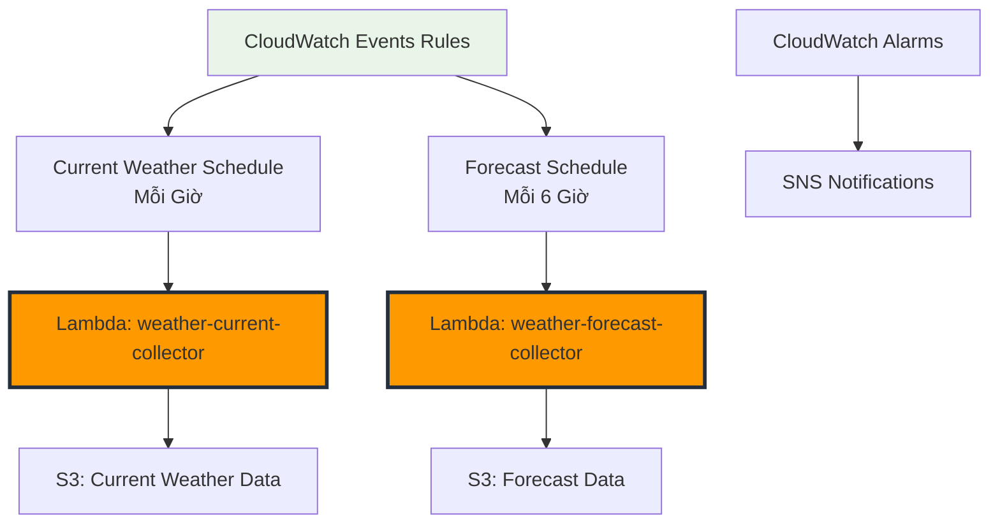

# Lập lịch Tự động với CloudWatch Events

Trong phần này, chúng ta sẽ thiết lập lập lịch tự động cho việc thu thập dữ liệu thời tiết bằng Amazon CloudWatch Events (giờ được gọi là Amazon EventBridge). Điều này sẽ đảm bảo các Lambda functions chạy theo lịch trình đều đặn để thu thập dữ liệu thời tiết một cách nhất quán.

## Tổng quan Kiến trúc



## Bước 1: Tạo CloudWatch Events Rules

### 1.1 Lịch trình cho Current Weather Collection

1. **Điều hướng đến CloudWatch Console**

   - AWS Console → CloudWatch → Events → Rules
   - Click "Create rule"

2. **Cấu hình Event Source**

   - **Event Source**: Schedule
   - **Schedule Expression**: `rate(1 hour)`
   - **Description**: "Trigger current weather collection every hour"

3. **Cấu hình Target**
   - **Target**: Lambda function
   - **Function**: `weather-current-collector`
   - **Configure input**: Constant (JSON text)

**Input JSON**:

```json
{
  "source": "cloudwatch-events",
  "detail-type": "Scheduled Event",
  "detail": {
    "collection_type": "current_weather",
    "scheduled_time": "hourly"
  }
}
```

4. **Chi tiết Rule**
   - **Name**: `weather-current-hourly`
   - **Description**: "Thu thập dữ liệu thời tiết hiện tại hàng giờ cho 6 thành phố"
   - **State**: Enabled

### 1.2 Lịch trình cho Weather Forecast Collection

1. **Tạo Rule thứ hai**

   - **Event Source**: Schedule
   - **Schedule Expression**: `rate(6 hours)`
   - **Description**: "Trigger weather forecast collection every 6 hours"

2. **Cấu hình Target**
   - **Target**: Lambda function
   - **Function**: `weather-forecast-collector`

**Input JSON**:

```json
{
  "source": "cloudwatch-events",
  "detail-type": "Scheduled Event",
  "detail": {
    "collection_type": "forecast",
    "scheduled_time": "every_6_hours"
  }
}
```

3. **Chi tiết Rule**
   - **Name**: `weather-forecast-6hourly`
   - **Description**: "Thu thập dữ liệu dự báo thời tiết 6 giờ một lần"
   - **State**: Enabled

## Bước 2: Tùy chọn Lập lịch Nâng cao

### 2.1 Sử dụng Cron Expressions

Để lập lịch chính xác hơn, bạn có thể sử dụng cron expressions:

**Current Weather tại các thời điểm cụ thể**:

```
cron(0 0,6,12,18 * * ? *)
```

Chạy lúc 00:00, 06:00, 12:00, và 18:00 UTC hàng ngày.

**Forecast lúc 06:00 và 18:00 UTC**:

```
cron(0 6,18 * * ? *)
```

**Hàng giờ trong giờ làm việc (UTC+7)**:

```
cron(0 1-14 * * ? *)
```

Chạy hàng giờ từ 01:00 đến 14:00 UTC (08:00 đến 21:00 giờ Việt Nam).

### 2.2 Lịch trình Khác nhau cho Các Thành phố Khác nhau

**Tạo các rules theo thành phố**:

**Rule cho Các Thành phố Châu Á (UTC+7/+8)**:

```json
{
  "source": "cloudwatch-events",
  "detail": {
    "cities": ["Ho Chi Minh City", "Hanoi", "Singapore", "Bangkok"],
    "timezone": "Asia/Ho_Chi_Minh"
  }
}
```

**Schedule**: `cron(0 1,7,13,19 * * ? *)` (Giờ cao điểm ở châu Á)

## Bước 3: Tạo SNS Topic cho Thông báo

### 3.1 Thiết lập SNS Topic

1. **Điều hướng đến SNS Console**

   - AWS Console → SNS → Topics
   - Click "Create topic"

2. **Cấu hình Topic**

   - **Type**: Standard
   - **Name**: `weather-collection-alerts`
   - **Display Name**: "Weather Collection Alerts"

3. **Tạo Subscription**
   - **Protocol**: Email
   - **Endpoint**: Địa chỉ email của bạn
   - Xác nhận subscription qua email

### 3.2 SNS Topic Policy

```json
{
  "Version": "2012-10-17",
  "Statement": [
    {
      "Sid": "AllowCloudWatchAlarmsToPublish",
      "Effect": "Allow",
      "Principal": {
        "Service": "cloudwatch.amazonaws.com"
      },
      "Action": "SNS:Publish",
      "Resource": "arn:aws:sns:us-east-1:123456789012:weather-collection-alerts"
    }
  ]
}
```

## Bước 4: Thiết lập Monitoring và Alarms

### 4.1 Lambda Function Alarms

**Error Rate Alarm**:

```json
{
  "AlarmName": "WeatherCollection-HighErrorRate",
  "AlarmDescription": "Tỷ lệ lỗi cao trong các functions thu thập thời tiết",
  "MetricName": "Errors",
  "Namespace": "AWS/Lambda",
  "Statistic": "Sum",
  "Period": 3600,
  "EvaluationPeriods": 1,
  "Threshold": 2,
  "ComparisonOperator": "GreaterThanOrEqualToThreshold",
  "Dimensions": [
    {
      "Name": "FunctionName",
      "Value": "weather-current-collector"
    }
  ],
  "AlarmActions": [
    "arn:aws:sns:us-east-1:123456789012:weather-collection-alerts"
  ]
}
```

**Duration Alarm**:

```json
{
  "AlarmName": "WeatherCollection-LongDuration",
  "AlarmDescription": "Thời gian thực thi Lambda quá lâu",
  "MetricName": "Duration",
  "Namespace": "AWS/Lambda",
  "Statistic": "Average",
  "Period": 300,
  "EvaluationPeriods": 2,
  "Threshold": 240000,
  "ComparisonOperator": "GreaterThanThreshold",
  "Unit": "Milliseconds"
}
```

### 4.2 Custom Metrics Alarms

**Collection Success Rate**:

```json
{
  "AlarmName": "WeatherCollection-LowSuccessRate",
  "AlarmDescription": "Tỷ lệ thành công thu thập thấp",
  "MetricName": "SuccessfulCollections",
  "Namespace": "Weather/ETL",
  "Statistic": "Sum",
  "Period": 3600,
  "EvaluationPeriods": 1,
  "Threshold": 4,
  "ComparisonOperator": "LessThanThreshold"
}
```

**API Call Failures**:

```json
{
  "AlarmName": "WeatherAPI-HighFailureRate",
  "AlarmDescription": "Tỷ lệ thất bại API cao",
  "MetricName": "FailedCollections",
  "Namespace": "Weather/ETL",
  "Statistic": "Sum",
  "Period": 1800,
  "EvaluationPeriods": 2,
  "Threshold": 3,
  "ComparisonOperator": "GreaterThanThreshold"
}
```

## Bước 5: CloudWatch Dashboard

### 5.1 Tạo Weather ETL Dashboard

1. **Điều hướng đến CloudWatch Console**

   - AWS Console → CloudWatch → Dashboards
   - Click "Create dashboard"

2. **Dashboard Configuration**
   - **Dashboard Name**: `Weather-ETL-Monitoring`
   - **Description**: "Weather data collection monitoring dashboard"

### 5.2 Dashboard Widgets

**Widget 1: Collection Success Rate**

```json
{
  "type": "metric",
  "properties": {
    "metrics": [
      ["Weather/ETL", "SuccessfulCollections"],
      ["Weather/ETL", "FailedCollections"]
    ],
    "period": 3600,
    "stat": "Sum",
    "region": "us-east-1",
    "title": "Tỷ lệ Thu thập Thành công",
    "yAxis": {
      "left": {
        "min": 0
      }
    }
  }
}
```

**Widget 2: Lambda Performance**

```json
{
  "type": "metric",
  "properties": {
    "metrics": [
      ["AWS/Lambda", "Duration", "FunctionName", "weather-current-collector"],
      ["AWS/Lambda", "Duration", "FunctionName", "weather-forecast-collector"]
    ],
    "period": 300,
    "stat": "Average",
    "region": "us-east-1",
    "title": "Thời gian Thực thi Lambda",
    "yAxis": {
      "left": {
        "min": 0
      }
    }
  }
}
```

**Widget 3: Error Rate**

```json
{
  "type": "metric",
  "properties": {
    "metrics": [
      ["AWS/Lambda", "Errors", "FunctionName", "weather-current-collector"],
      ["AWS/Lambda", "Errors", "FunctionName", "weather-forecast-collector"]
    ],
    "period": 3600,
    "stat": "Sum",
    "region": "us-east-1",
    "title": "Tỷ lệ Lỗi Lambda"
  }
}
```

## Bước 6: Cost Optimization

### 6.1 Optimized Scheduling Strategy

**Giờ cao điểm vs. Giờ thấp điểm**:

- **Giờ cao điểm** (7:00-22:00 VN): Thu thập mỗi giờ
- **Giờ thấp điểm** (22:00-7:00 VN): Thu thập mỗi 3 giờ

**Cron Expression cho Giờ cao điểm**:

```
cron(0 0-15 * * ? *)
```

**Cron Expression cho Giờ thấp điểm**:

```
cron(0 16,19,22 * * ? *)
```

### 6.2 Regional Data Collection

**Khu vực Đông Nam Á**:

```
cron(0 1,7,13,19 * * ? *)
```

**Global Collection (bao gồm multiple regions)**:

```
cron(0 0,6,12,18 * * ? *)
```

## Bước 7: Testing Scheduled Execution

### 7.1 Verify Rule Execution

1. **Check CloudWatch Events Console**

   - AWS Console → CloudWatch → Events → Rules
   - Verify rules are enabled and showing recent invocations

2. **Check Lambda Function Metrics**
   - AWS Console → Lambda → Functions
   - Check Invocations và Duration metrics

### 7.2 Manual Rule Testing

**Test Current Weather Rule**:

```bash
aws events put-events --entries Source=manual-test,DetailType="Manual Test",Detail='{"test": true}'
```

**Check S3 for New Data**:

```bash
aws s3 ls s3://weather-data-123456789012/raw/current-weather/ --recursive --human-readable
```

## Troubleshooting

### 7.3 Common Issues

**Rule không trigger**:

- Kiểm tra IAM permissions cho CloudWatch Events
- Verify Lambda function permissions
- Check rule state (Enabled/Disabled)

**Lambda timeout**:

- Tăng timeout setting (hiện tại: 5 minutes)
- Optimize code hoặc giảm số lượng cities

**API rate limits**:

- Monitor OpenWeatherMap API usage
- Implement exponential backoff
- Consider upgrading API plan nếu cần

## Tóm tắt

Trong phần này, chúng ta đã:

✅ Thiết lập CloudWatch Events rules cho automated scheduling  
✅ Cấu hình lịch trình hàng giờ cho current weather  
✅ Cấu hình lịch trình 6 giờ/lần cho forecast data  
✅ Tạo SNS topic để nhận alerts  
✅ Thiết lập CloudWatch alarms và dashboard  
✅ Optimize cost với smart scheduling  
✅ Test scheduled execution thành công

**Tiếp theo**: Trong module 2.4, chúng ta sẽ thiết lập testing và monitoring toàn diện để đảm bảo hệ thống chạy ổn định và đáng tin cậy.
