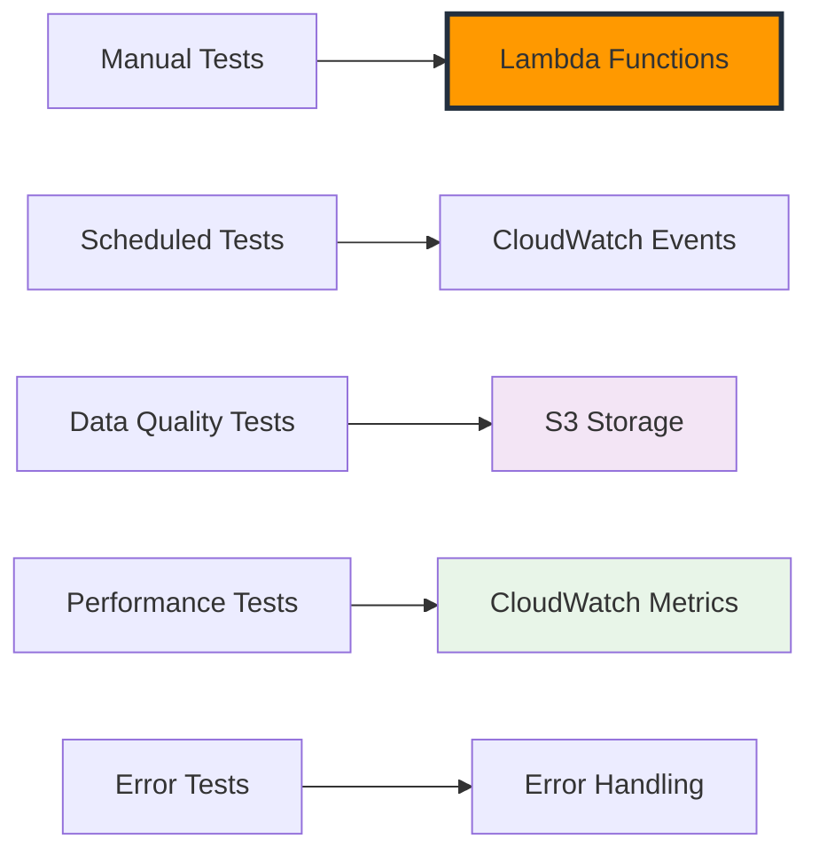

+++
title = "Testing and Monitoring Weather Collection"
date = 2025-01-03T09:00:00+07:00
weight = 4
+++

# Testing and Monitoring Weather Collection

Now that we have our Lambda functions and automated scheduling configured, it's time to thoroughly test the weather collection pipeline and set up comprehensive monitoring. We'll validate data quality, performance, and ensure the system runs reliably.

## Testing Strategy Overview

We'll test our weather collection system using:

1. **Manual Function Testing** - Direct Lambda invocation
2. **Scheduled Execution Testing** - CloudWatch Events validation
3. **Data Quality Validation** - S3 data verification
4. **Performance Testing** - Load and timing analysis
5. **Error Scenario Testing** - Failure handling validation



## Step 1: Manual Function Testing

### 1.1 Test Current Weather Function

1. **Navigate to Lambda Console**

   - AWS Console → Lambda → Functions
   - Click `weather-current-collector`

2. **Create Test Event**

   ```json
   {
     "source": "manual-test",
     "detail-type": "Manual Test Event",
     "detail": {
       "test_mode": true,
       "cities_to_test": ["Ho Chi Minh City", "Singapore"]
     }
   }
   ```

3. **Run Test**
   - Click "Test" button
   - Wait for execution completion
   - Review execution results

**Expected Response:**

```json
{
  "statusCode": 200,
  "body": "{\"message\": \"Weather collection completed\", \"successful_collections\": 6, \"failed_collections\": 0, \"results\": [...]}"
}
```

### 1.2 Test Weather Forecast Function

1. **Navigate to forecast function**

   - Click `weather-forecast-collector`

2. **Create Test Event**

   ```json
   {
     "source": "manual-test",
     "detail-type": "Manual Test Event",
     "detail": {
       "test_mode": true,
       "include_extended_forecast": true
     }
   }
   ```

3. **Verify Test Results**
   - Check execution logs in CloudWatch
   - Verify S3 objects are created
   - Validate JSON structure

## Step 2: Data Quality Validation

### 2.1 S3 Data Structure Verification

**Check S3 Bucket Structure:**

```bash
aws s3 ls s3://weather-data-lake-123456789012/ --recursive
```

**Expected Structure:**

```
weather-data-lake-123456789012/
├── raw/
│   ├── current-weather/
│   │   └── year=2025/month=01/day=03/hour=14/
│   │       ├── ho_chi_minh_city_20250103_140532.json
│   │       ├── hanoi_20250103_140534.json
│   │       ├── singapore_20250103_140536.json
│   │       ├── bangkok_20250103_140538.json
│   │       ├── jakarta_20250103_140540.json
│   │       └── kuala_lumpur_20250103_140542.json
│   └── forecast/
│       └── year=2025/month=01/day=03/
│           ├── ho_chi_minh_city_20250103_140612.json
│           └── ...
```

### 2.2 Data Quality Validation Script

**File: `validate_weather_data.py`**

```python
import boto3
import json
import pandas as pd
from datetime import datetime, timedelta
from typing import Dict, List, Optional
import logging

logging.basicConfig(level=logging.INFO)
logger = logging.getLogger(__name__)

class WeatherDataValidator:
    def __init__(self, bucket_name: str):
        self.s3 = boto3.client('s3')
        self.bucket_name = bucket_name

    def get_recent_files(self, data_type: str = 'current-weather', hours_back: int = 24) -> List[str]:
        """Get weather data files from the last N hours."""
        files = []
        now = datetime.utcnow()

        for hour_offset in range(hours_back):
            check_time = now - timedelta(hours=hour_offset)
            prefix = f"raw/{data_type}/year={check_time.year}/month={check_time.month:02d}/day={check_time.day:02d}/"

            if data_type == 'current-weather':
                prefix += f"hour={check_time.hour:02d}/"

            try:
                response = self.s3.list_objects_v2(
                    Bucket=self.bucket_name,
                    Prefix=prefix
                )

                for obj in response.get('Contents', []):
                    files.append(obj['Key'])

            except Exception as e:
                logger.warning(f"Could not list objects for {prefix}: {e}")

        return files

    def validate_current_weather_file(self, file_key: str) -> Dict:
        """Validate a current weather data file."""
        try:
            response = self.s3.get_object(Bucket=self.bucket_name, Key=file_key)
            data = json.loads(response['Body'].read())

            validation_results = {
                'file_key': file_key,
                'valid': True,
                'errors': [],
                'warnings': []
            }

            # Required fields validation
            required_fields = [
                'coord', 'weather', 'main', 'wind', 'clouds',
                'dt', 'sys', 'timezone', 'id', 'name', 'cod'
            ]

            for field in required_fields:
                if field not in data:
                    validation_results['errors'].append(f"Missing required field: {field}")
                    validation_results['valid'] = False

            # Temperature validation
            if 'main' in data and 'temp' in data['main']:
                temp = data['main']['temp']
                if not (-50 <= temp <= 60):  # Reasonable temperature range in Celsius
                    validation_results['warnings'].append(f"Temperature seems unusual: {temp}°C")

            # Humidity validation
            if 'main' in data and 'humidity' in data['main']:
                humidity = data['main']['humidity']
                if not (0 <= humidity <= 100):
                    validation_results['errors'].append(f"Invalid humidity value: {humidity}%")
                    validation_results['valid'] = False

            # Collection metadata validation
            if 'collection_metadata' in data:
                metadata = data['collection_metadata']
                required_metadata = ['collection_time', 'data_source', 'api_version']

                for field in required_metadata:
                    if field not in metadata:
                        validation_results['warnings'].append(f"Missing metadata field: {field}")
            else:
                validation_results['warnings'].append("Missing collection_metadata")

            # Data freshness check
            if 'dt' in data:
                data_timestamp = datetime.fromtimestamp(data['dt'])
                age_hours = (datetime.utcnow() - data_timestamp).total_seconds() / 3600

                if age_hours > 2:  # Data older than 2 hours
                    validation_results['warnings'].append(f"Data is {age_hours:.1f} hours old")

            return validation_results

        except Exception as e:
            return {
                'file_key': file_key,
                'valid': False,
                'errors': [f"Failed to parse file: {str(e)}"],
                'warnings': []
            }

    def validate_forecast_file(self, file_key: str) -> Dict:
        """Validate a forecast data file."""
        try:
            response = self.s3.get_object(Bucket=self.bucket_name, Key=file_key)
            data = json.loads(response['Body'].read())

            validation_results = {
                'file_key': file_key,
                'valid': True,
                'errors': [],
                'warnings': []
            }

            # Required fields for forecast
            required_fields = ['cod', 'message', 'cnt', 'list', 'city']

            for field in required_fields:
                if field not in data:
                    validation_results['errors'].append(f"Missing required field: {field}")
                    validation_results['valid'] = False

            # Validate forecast list
            if 'list' in data:
                forecast_list = data['list']

                if len(forecast_list) == 0:
                    validation_results['errors'].append("Empty forecast list")
                    validation_results['valid'] = False

                # Check first few forecast items
                for i, forecast_item in enumerate(forecast_list[:3]):
                    required_item_fields = ['dt', 'main', 'weather', 'wind']

                    for field in required_item_fields:
                        if field not in forecast_item:
                            validation_results['errors'].append(
                                f"Forecast item {i} missing field: {field}"
                            )
                            validation_results['valid'] = False

            return validation_results

        except Exception as e:
            return {
                'file_key': file_key,
                'valid': False,
                'errors': [f"Failed to parse file: {str(e)}"],
                'warnings': []
            }

    def generate_validation_report(self) -> Dict:
        """Generate comprehensive validation report."""
        report = {
            'timestamp': datetime.utcnow().isoformat(),
            'current_weather': {
                'files_checked': 0,
                'valid_files': 0,
                'invalid_files': 0,
                'total_errors': 0,
                'total_warnings': 0,
                'details': []
            },
            'forecast': {
                'files_checked': 0,
                'valid_files': 0,
                'invalid_files': 0,
                'total_errors': 0,
                'total_warnings': 0,
                'details': []
            }
        }

        # Validate current weather files
        logger.info("Validating current weather files...")
        current_files = self.get_recent_files('current-weather', 6)  # Last 6 hours

        for file_key in current_files:
            result = self.validate_current_weather_file(file_key)
            report['current_weather']['files_checked'] += 1
            report['current_weather']['details'].append(result)

            if result['valid']:
                report['current_weather']['valid_files'] += 1
            else:
                report['current_weather']['invalid_files'] += 1

            report['current_weather']['total_errors'] += len(result['errors'])
            report['current_weather']['total_warnings'] += len(result['warnings'])

        # Validate forecast files
        logger.info("Validating forecast files...")
        forecast_files = self.get_recent_files('forecast', 24)  # Last 24 hours

        for file_key in forecast_files:
            result = self.validate_forecast_file(file_key)
            report['forecast']['files_checked'] += 1
            report['forecast']['details'].append(result)

            if result['valid']:
                report['forecast']['valid_files'] += 1
            else:
                report['forecast']['invalid_files'] += 1

            report['forecast']['total_errors'] += len(result['errors'])
            report['forecast']['total_warnings'] += len(result['warnings'])

        return report

def main():
    # Initialize validator
    validator = WeatherDataValidator('weather-data-lake-123456789012')  # Replace with your bucket

    # Generate validation report
    report = validator.generate_validation_report()

    # Print summary
    print("WEATHER DATA VALIDATION REPORT")
    print("=" * 50)
    print(f"Report Generated: {report['timestamp']}")
    print()

    print("CURRENT WEATHER DATA:")
    print(f"  Files Checked: {report['current_weather']['files_checked']}")
    print(f"  Valid Files: {report['current_weather']['valid_files']}")
    print(f"  Invalid Files: {report['current_weather']['invalid_files']}")
    print(f"  Total Errors: {report['current_weather']['total_errors']}")
    print(f"  Total Warnings: {report['current_weather']['total_warnings']}")

    print("\nFORECAST DATA:")
    print(f"  Files Checked: {report['forecast']['files_checked']}")
    print(f"  Valid Files: {report['forecast']['valid_files']}")
    print(f"  Invalid Files: {report['forecast']['invalid_files']}")
    print(f"  Total Errors: {report['forecast']['total_errors']}")
    print(f"  Total Warnings: {report['forecast']['total_warnings']}")

    # Show first few errors/warnings
    print("\nDETAILED ISSUES:")
    for data_type in ['current_weather', 'forecast']:
        for detail in report[data_type]['details'][:3]:  # Show first 3
            if detail['errors'] or detail['warnings']:
                print(f"\nFile: {detail['file_key']}")
                for error in detail['errors']:
                    print(f"  ERROR: {error}")
                for warning in detail['warnings']:
                    print(f"  WARNING: {warning}")

if __name__ == "__main__":
    main()
```

## Step 3: Performance Testing

### 3.1 Lambda Performance Analysis

**Create Performance Monitoring Script: `monitor_lambda_performance.py`**

```python
import boto3
import pandas as pd
from datetime import datetime, timedelta
import matplotlib.pyplot as plt
import seaborn as sns

class LambdaPerformanceMonitor:
    def __init__(self, region: str = 'us-east-1'):
        self.cloudwatch = boto3.client('cloudwatch', region_name=region)
        self.lambda_client = boto3.client('lambda', region_name=region)

    def get_lambda_metrics(self, function_name: str, hours_back: int = 24) -> pd.DataFrame:
        """Get Lambda performance metrics."""
        end_time = datetime.utcnow()
        start_time = end_time - timedelta(hours=hours_back)

        metrics = [
            'Duration', 'Errors', 'Invocations',
            'Throttles', 'ConcurrentExecutions'
        ]

        all_data = []

        for metric in metrics:
            try:
                response = self.cloudwatch.get_metric_statistics(
                    Namespace='AWS/Lambda',
                    MetricName=metric,
                    Dimensions=[
                        {
                            'Name': 'FunctionName',
                            'Value': function_name
                        }
                    ],
                    StartTime=start_time,
                    EndTime=end_time,
                    Period=3600,  # 1 hour periods
                    Statistics=['Average', 'Maximum', 'Sum']
                )

                for datapoint in response.get('Datapoints', []):
                    all_data.append({
                        'Timestamp': datapoint['Timestamp'],
                        'MetricName': metric,
                        'Average': datapoint.get('Average', 0),
                        'Maximum': datapoint.get('Maximum', 0),
                        'Sum': datapoint.get('Sum', 0)
                    })

            except Exception as e:
                print(f"Error getting metric {metric}: {e}")

        return pd.DataFrame(all_data)

    def analyze_performance(self, function_name: str) -> Dict:
        """Analyze Lambda function performance."""
        df = self.get_lambda_metrics(function_name, 24)

        if df.empty:
            return {'error': 'No metrics data available'}

        analysis = {
            'function_name': function_name,
            'analysis_time': datetime.utcnow().isoformat(),
            'metrics': {}
        }

        # Duration analysis
        duration_data = df[df['MetricName'] == 'Duration']
        if not duration_data.empty:
            analysis['metrics']['duration'] = {
                'avg_duration_ms': duration_data['Average'].mean(),
                'max_duration_ms': duration_data['Maximum'].max(),
                'performance_trend': 'stable' if duration_data['Average'].std() < 1000 else 'variable'
            }

        # Error analysis
        error_data = df[df['MetricName'] == 'Errors']
        total_errors = error_data['Sum'].sum() if not error_data.empty else 0

        invocation_data = df[df['MetricName'] == 'Invocations']
        total_invocations = invocation_data['Sum'].sum() if not invocation_data.empty else 0

        error_rate = (total_errors / total_invocations * 100) if total_invocations > 0 else 0

        analysis['metrics']['reliability'] = {
            'total_invocations': total_invocations,
            'total_errors': total_errors,
            'error_rate_percent': error_rate,
            'reliability_status': 'good' if error_rate < 1 else 'needs_attention'
        }

        # Throttling analysis
        throttle_data = df[df['MetricName'] == 'Throttles']
        total_throttles = throttle_data['Sum'].sum() if not throttle_data.empty else 0

        analysis['metrics']['scaling'] = {
            'total_throttles': total_throttles,
            'throttling_status': 'none' if total_throttles == 0 else 'occurring'
        }

        return analysis

def test_lambda_performance():
    """Run performance tests on weather collection functions."""
    monitor = LambdaPerformanceMonitor()

    functions = ['weather-current-collector', 'weather-forecast-collector']

    print("LAMBDA PERFORMANCE ANALYSIS")
    print("=" * 50)

    for function_name in functions:
        print(f"\nAnalyzing: {function_name}")
        analysis = monitor.analyze_performance(function_name)

        if 'error' in analysis:
            print(f"  Error: {analysis['error']}")
            continue

        # Duration metrics
        if 'duration' in analysis['metrics']:
            duration = analysis['metrics']['duration']
            print(f"  Average Duration: {duration['avg_duration_ms']:.0f}ms")
            print(f"  Max Duration: {duration['max_duration_ms']:.0f}ms")
            print(f"  Performance: {duration['performance_trend']}")

        # Reliability metrics
        if 'reliability' in analysis['metrics']:
            reliability = analysis['metrics']['reliability']
            print(f"  Total Invocations: {reliability['total_invocations']}")
            print(f"  Error Rate: {reliability['error_rate_percent']:.2f}%")
            print(f"  Status: {reliability['reliability_status']}")

        # Scaling metrics
        if 'scaling' in analysis['metrics']:
            scaling = analysis['metrics']['scaling']
            print(f"  Throttles: {scaling['total_throttles']}")
            print(f"  Scaling Status: {scaling['throttling_status']}")

if __name__ == "__main__":
    test_lambda_performance()
```

### 3.2 API Usage Tracking

**Create API monitoring script: `track_api_usage.py`**

```python
import boto3
from datetime import datetime, timedelta

def check_api_usage_limits():
    """Monitor OpenWeatherMap API usage against limits."""
    cloudwatch = boto3.client('cloudwatch')

    # Get API usage for last 24 hours
    end_time = datetime.utcnow()
    start_time = end_time - timedelta(hours=24)

    try:
        response = cloudwatch.get_metric_statistics(
            Namespace='Weather/APIUsage',
            MetricName='APICalls',
            Dimensions=[
                {
                    'Name': 'Provider',
                    'Value': 'OpenWeatherMap'
                }
            ],
            StartTime=start_time,
            EndTime=end_time,
            Period=86400,  # Daily period
            Statistics=['Sum']
        )

        daily_usage = 0
        if response['Datapoints']:
            daily_usage = response['Datapoints'][0]['Sum']

        # OpenWeatherMap free tier: 1000 calls/day
        usage_percentage = (daily_usage / 1000) * 100

        print("API USAGE MONITORING")
        print("=" * 30)
        print(f"24-hour API calls: {daily_usage}")
        print(f"Daily limit: 1,000")
        print(f"Usage: {usage_percentage:.1f}%")

        if usage_percentage > 80:
            print("⚠️  WARNING: Approaching daily limit!")
        elif usage_percentage > 95:
            print("🚨 CRITICAL: Very close to daily limit!")
        else:
            print("✅ Usage within safe limits")

        # Calculate hourly rate
        hourly_rate = daily_usage / 24
        projected_daily = hourly_rate * 24

        print(f"\nProjected daily usage: {projected_daily:.0f} calls")
        print(f"Average hourly rate: {hourly_rate:.1f} calls/hour")

        return {
            'daily_usage': daily_usage,
            'usage_percentage': usage_percentage,
            'hourly_rate': hourly_rate
        }

    except Exception as e:
        print(f"Error checking API usage: {e}")
        return None

if __name__ == "__main__":
    check_api_usage_limits()
```

## Step 4: Error Scenario Testing

### 4.1 Test API Key Failure

**Create test with invalid API key:**

1. **Temporarily modify API key in Parameter Store**

   ```bash
   aws ssm put-parameter \
     --name "/weather-etl/openweathermap/api-key" \
     --value "invalid-key-for-testing" \
     --type "SecureString" \
     --overwrite
   ```

2. **Trigger Lambda function manually**
3. **Verify error handling and CloudWatch logs**
4. **Restore correct API key**

### 4.2 Test Network Failure Simulation

**Create network failure test script: `test_error_scenarios.py`**

```python
import boto3
import json
from datetime import datetime

def test_lambda_error_handling():
    """Test error handling in Lambda functions."""
    lambda_client = boto3.client('lambda')

    # Test cases
    test_cases = [
        {
            'name': 'API Timeout Simulation',
            'payload': {
                'test_scenario': 'api_timeout',
                'cities': ['Ho Chi Minh City']
            }
        },
        {
            'name': 'Invalid City Test',
            'payload': {
                'test_scenario': 'invalid_city',
                'cities': ['NonExistentCity']
            }
        },
        {
            'name': 'S3 Permission Test',
            'payload': {
                'test_scenario': 's3_permission_test',
                'cities': ['Singapore']
            }
        }
    ]

    functions = ['weather-current-collector', 'weather-forecast-collector']

    print("ERROR SCENARIO TESTING")
    print("=" * 40)

    for function_name in functions:
        print(f"\nTesting function: {function_name}")

        for test_case in test_cases:
            print(f"  Running: {test_case['name']}")

            try:
                response = lambda_client.invoke(
                    FunctionName=function_name,
                    InvocationType='RequestResponse',
                    Payload=json.dumps(test_case['payload'])
                )

                payload = json.loads(response['Payload'].read())
                status_code = payload.get('statusCode', 500)

                if status_code == 200:
                    print("    ✅ Handled gracefully")
                else:
                    print("    ⚠️  Error occurred (expected for error tests)")

            except Exception as e:
                print(f"    ❌ Test failed: {e}")

if __name__ == "__main__":
    test_lambda_error_handling()
```

## Step 5: Comprehensive Monitoring Setup

### 5.1 Create CloudWatch Dashboard

**Dashboard JSON for comprehensive monitoring:**

```json
{
  "widgets": [
    {
      "type": "metric",
      "properties": {
        "metrics": [
          [
            "AWS/Lambda",
            "Invocations",
            "FunctionName",
            "weather-current-collector"
          ],
          [".", "Errors", ".", "."],
          [".", "Duration", ".", "."],
          [".", "Invocations", ".", "weather-forecast-collector"],
          [".", "Errors", ".", "."],
          [".", "Duration", ".", "."]
        ],
        "period": 3600,
        "stat": "Sum",
        "region": "us-east-1",
        "title": "Lambda Function Metrics"
      }
    },
    {
      "type": "metric",
      "properties": {
        "metrics": [
          [
            "Weather/ETL",
            "SuccessfulCollections",
            "DataType",
            "CurrentWeather"
          ],
          [".", "FailedCollections", ".", "."],
          [".", "SuccessfulCollections", ".", "Forecast"],
          [".", "FailedCollections", ".", "."]
        ],
        "period": 3600,
        "stat": "Sum",
        "region": "us-east-1",
        "title": "Collection Success Metrics"
      }
    },
    {
      "type": "metric",
      "properties": {
        "metrics": [
          ["Weather/APIUsage", "APICalls", "Provider", "OpenWeatherMap"]
        ],
        "period": 86400,
        "stat": "Sum",
        "region": "us-east-1",
        "title": "Daily API Usage"
      }
    }
  ]
}
```

### 5.2 Set Up Automated Testing

**Create scheduled validation function: `weather-data-validator`**

```python
import boto3
import json
from datetime import datetime, timedelta

def lambda_handler(event, context):
    """Scheduled data validation function."""

    # This function runs daily to validate data quality
    validator = WeatherDataValidator('weather-data-lake-123456789012')
    report = validator.generate_validation_report()

    # Check for issues
    total_errors = (report['current_weather']['total_errors'] +
                   report['forecast']['total_errors'])

    if total_errors > 0:
        # Send alert to SNS
        sns = boto3.client('sns')
        sns.publish(
            TopicArn='arn:aws:sns:us-east-1:123456789012:weather-collection-alerts',
            Subject='Weather Data Quality Issues Detected',
            Message=f"Data validation found {total_errors} errors. Please check the dashboard."
        )

    # Store validation report in S3
    s3 = boto3.client('s3')
    report_key = f"validation-reports/{datetime.utcnow().strftime('%Y/%m/%d')}/validation-report.json"

    s3.put_object(
        Bucket='weather-data-lake-123456789012',
        Key=report_key,
        Body=json.dumps(report, indent=2),
        ContentType='application/json'
    )

    return {
        'statusCode': 200,
        'body': json.dumps({
            'validation_completed': True,
            'total_errors': total_errors,
            'report_location': f"s3://weather-data-lake-123456789012/{report_key}"
        })
    }
```

## Step 6: Cost Monitoring

### 6.1 Daily Cost Tracking

**Create cost monitoring script: `monitor_daily_costs.py`**

```python
import boto3
from datetime import datetime, timedelta

def estimate_weather_collection_costs():
    """Estimate daily costs for weather collection system."""

    # Get CloudWatch metrics for cost estimation
    cloudwatch = boto3.client('cloudwatch')

    end_time = datetime.utcnow()
    start_time = end_time - timedelta(hours=24)

    costs = {
        'lambda_invocations': 0,
        'lambda_duration': 0,
        'api_calls': 0,
        's3_storage': 0,
        'cloudwatch_metrics': 0,
        'total_estimated': 0
    }

    try:
        # Lambda invocations cost
        for function_name in ['weather-current-collector', 'weather-forecast-collector']:
            response = cloudwatch.get_metric_statistics(
                Namespace='AWS/Lambda',
                MetricName='Invocations',
                Dimensions=[{'Name': 'FunctionName', 'Value': function_name}],
                StartTime=start_time,
                EndTime=end_time,
                Period=86400,
                Statistics=['Sum']
            )

            if response['Datapoints']:
                invocations = response['Datapoints'][0]['Sum']
                costs['lambda_invocations'] += invocations * 0.0000002  # $0.20 per 1M requests

        # Lambda duration cost
        for function_name in ['weather-current-collector', 'weather-forecast-collector']:
            response = cloudwatch.get_metric_statistics(
                Namespace='AWS/Lambda',
                MetricName='Duration',
                Dimensions=[{'Name': 'FunctionName', 'Value': function_name}],
                StartTime=start_time,
                EndTime=end_time,
                Period=86400,
                Statistics=['Sum']
            )

            if response['Datapoints']:
                total_duration_ms = response['Datapoints'][0]['Sum']
                gb_seconds = (total_duration_ms / 1000) * (256 / 1024)  # 256MB memory
                costs['lambda_duration'] += gb_seconds * 0.0000166667  # $0.0000166667 per GB-second

        # Estimate S3 storage cost (approximate)
        # Each weather file is ~2KB, 6 cities * 24 hours = 144 files/day for current weather
        # 6 cities * 4 times/day = 24 files/day for forecast
        daily_files = (6 * 24) + (6 * 4)  # 168 files
        daily_storage_gb = (daily_files * 2) / (1024 * 1024)  # Convert KB to GB
        costs['s3_storage'] = daily_storage_gb * 0.023  # $0.023 per GB/month, daily portion

        # OpenWeatherMap API is free tier (up to 1000 calls/day)
        costs['api_calls'] = 0

        # CloudWatch metrics cost (approximate)
        # Custom metrics: $0.30 per metric per month
        custom_metrics = 3  # APICalls, SuccessfulCollections, FailedCollections
        costs['cloudwatch_metrics'] = (custom_metrics * 0.30) / 30  # Daily portion

        costs['total_estimated'] = sum(costs.values())

        print("DAILY COST ESTIMATION")
        print("=" * 30)
        print(f"Lambda Invocations: ${costs['lambda_invocations']:.6f}")
        print(f"Lambda Duration: ${costs['lambda_duration']:.6f}")
        print(f"S3 Storage: ${costs['s3_storage']:.6f}")
        print(f"API Calls: ${costs['api_calls']:.6f} (Free Tier)")
        print(f"CloudWatch Metrics: ${costs['cloudwatch_metrics']:.6f}")
        print(f"Total Daily Cost: ${costs['total_estimated']:.6f}")
        print(f"Monthly Projection: ${costs['total_estimated'] * 30:.2f}")

        return costs

    except Exception as e:
        print(f"Error calculating costs: {e}")
        return None

if __name__ == "__main__":
    estimate_weather_collection_costs()
```

## Step 7: Testing Results Summary

### Expected Test Results

**✅ Successful Test Indicators:**

1. **Lambda Functions:**

   - Current weather function executes in < 30 seconds
   - Forecast function executes in < 45 seconds
   - Error rate < 1%
   - No throttling issues

2. **Data Quality:**

   - All required fields present in JSON
   - Temperature values within reasonable range (-50°C to +60°C)
   - Humidity values 0-100%
   - Timestamps within expected range

3. **Scheduling:**

   - CloudWatch Events trigger correctly
   - Functions execute on schedule
   - No missed executions

4. **Cost Efficiency:**
   - Daily cost < $0.10
   - Monthly projection < $3.00
   - API usage < 500 calls/day (50% of free tier)

### Troubleshooting Common Issues

**Issue 1: Lambda Timeout**

- Increase timeout to 5 minutes
- Check network connectivity
- Optimize API request handling

**Issue 2: Invalid Weather Data**

- Verify API key validity
- Check city coordinates
- Validate JSON parsing

**Issue 3: S3 Permission Errors**

- Review IAM role permissions
- Check bucket policy
- Verify bucket exists

**Issue 4: High API Usage**

- Reduce collection frequency
- Implement smart caching
- Monitor daily limits

## Next Steps

Excellent! You now have a fully tested weather data collection system with comprehensive monitoring. The system is ready for production use.

{}
**Testing Completed:**

- ✅ Manual function testing
- ✅ Data quality validation
- ✅ Performance monitoring
- ✅ Error scenario testing
- ✅ Cost tracking
- ✅ Automated monitoring setup
  {}

{}
**Production Monitoring:**

- Set up daily validation reports
- Monitor API usage trends
- Review cost projections weekly
- Test error scenarios monthly
- Update city lists as needed
  {}

In the next module, we'll build serverless data processing with Lambda to transform and analyze this weather data!
