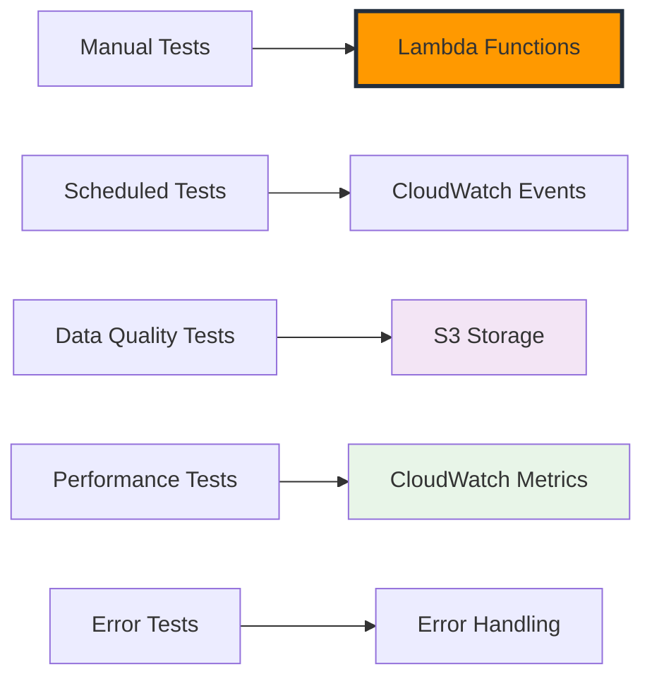

# Testing và Monitoring Thu thập Thời tiết

Bây giờ chúng ta đã có các Lambda functions và automated scheduling được cấu hình, đã đến lúc test toàn diện pipeline thu thập thời tiết và thiết lập monitoring chi tiết. Chúng ta sẽ validate data quality, performance, và đảm bảo hệ thống chạy đáng tin cậy.

## Tổng quan Testing Strategy

Chúng ta sẽ test hệ thống thu thập thời tiết bằng:

1. **Manual Function Testing** - Gọi Lambda trực tiếp
2. **Scheduled Execution Testing** - Validate CloudWatch Events
3. **Data Quality Validation** - Kiểm tra dữ liệu S3
4. **Performance Testing** - Phân tích load và timing
5. **Error Scenario Testing** - Validate xử lý lỗi



## Bước 1: Manual Function Testing

### 1.1 Test Current Weather Function

1. **Điều hướng đến Lambda Console**

   - AWS Console → Lambda → Functions
   - Click `weather-current-collector`

2. **Tạo Test Event**

   ```json
   {
     "source": "manual-test",
     "detail-type": "Manual Test Event",
     "detail": {
       "test_mode": true,
       "cities_to_test": ["Ho Chi Minh City", "Singapore"]
     }
   }
   ```

3. **Chạy Test**
   - Click nút "Test"
   - Đợi execution hoàn tất
   - Review kết quả execution

**Kết quả Mong đợi:**

```json
{
  "statusCode": 200,
  "body": "{\"message\": \"Thu thập thời tiết hoàn tất\", \"successful_collections\": 6, \"failed_collections\": 0, \"results\": [...]}"
}
```

### 1.2 Test Weather Forecast Function

1. **Điều hướng đến forecast function**

   - Click `weather-forecast-collector`

2. **Tạo Test Event**

   ```json
   {
     "source": "manual-test",
     "detail-type": "Manual Test Event",
     "detail": {
       "test_mode": true,
       "include_extended_forecast": true
     }
   }
   ```

3. **Verify Test Results**
   - Kiểm tra execution logs trong CloudWatch
   - Verify S3 objects được tạo
   - Validate cấu trúc JSON

## Bước 2: Data Quality Validation

### 2.1 S3 Data Structure Verification

**Kiểm tra S3 Bucket Structure:**

```bash
aws s3 ls s3://weather-data-lake-123456789012/ --recursive
```

**Cấu trúc Mong đợi:**

```
weather-data-lake-123456789012/
├── raw/
│   ├── current-weather/
│   │   └── year=2025/month=01/day=03/hour=14/
│   │       ├── ho_chi_minh_city_20250103_140532.json
│   │       ├── hanoi_20250103_140534.json
│   │       ├── singapore_20250103_140536.json
│   │       ├── bangkok_20250103_140538.json
│   │       ├── jakarta_20250103_140540.json
│   │       └── kuala_lumpur_20250103_140542.json
│   └── forecast/
│       └── year=2025/month=01/day=03/
│           ├── ho_chi_minh_city_20250103_140612.json
│           └── ...
```

### 2.2 Data Quality Validation Script

**File: `validate_weather_data.py`**

```python
import boto3
import json
import pandas as pd
from datetime import datetime, timedelta
from typing import Dict, List, Optional
import logging

logging.basicConfig(level=logging.INFO)
logger = logging.getLogger(__name__)

class WeatherDataValidator:
    def __init__(self, bucket_name: str):
        self.s3 = boto3.client('s3')
        self.bucket_name = bucket_name

    def get_recent_files(self, data_type: str = 'current-weather', hours_back: int = 24) -> List[str]:
        """Lấy các file dữ liệu thời tiết từ N giờ trước."""
        files = []
        now = datetime.utcnow()

        for hour_offset in range(hours_back):
            check_time = now - timedelta(hours=hour_offset)
            prefix = f"raw/{data_type}/year={check_time.year}/month={check_time.month:02d}/day={check_time.day:02d}/"

            if data_type == 'current-weather':
                prefix += f"hour={check_time.hour:02d}/"

            try:
                response = self.s3.list_objects_v2(
                    Bucket=self.bucket_name,
                    Prefix=prefix
                )

                for obj in response.get('Contents', []):
                    files.append(obj['Key'])

            except Exception as e:
                logger.warning(f"Không thể list objects cho {prefix}: {e}")

        return files

    def validate_current_weather_file(self, file_key: str) -> Dict:
        """Validate một file dữ liệu thời tiết hiện tại."""
        try:
            response = self.s3.get_object(Bucket=self.bucket_name, Key=file_key)
            data = json.loads(response['Body'].read())

            validation_results = {
                'file_key': file_key,
                'valid': True,
                'errors': [],
                'warnings': []
            }

            # Required fields validation
            required_fields = [
                'coord', 'weather', 'main', 'wind', 'clouds',
                'dt', 'sys', 'timezone', 'id', 'name', 'cod'
            ]

            for field in required_fields:
                if field not in data:
                    validation_results['errors'].append(f"Thiếu field bắt buộc: {field}")
                    validation_results['valid'] = False

            # Temperature validation
            if 'main' in data and 'temp' in data['main']:
                temp = data['main']['temp']
                if not (-50 <= temp <= 60):  # Khoảng nhiệt độ hợp lý (Celsius)
                    validation_results['warnings'].append(f"Nhiệt độ có vẻ bất thường: {temp}°C")

            # Humidity validation
            if 'main' in data and 'humidity' in data['main']:
                humidity = data['main']['humidity']
                if not (0 <= humidity <= 100):
                    validation_results['errors'].append(f"Độ ẩm không hợp lệ: {humidity}%")
                    validation_results['valid'] = False

            # Metadata validation
            if 'collection_timestamp' not in data:
                validation_results['warnings'].append("Thiếu collection_timestamp")

            if 'city_metadata' not in data:
                validation_results['warnings'].append("Thiếu city_metadata")

            return validation_results

        except Exception as e:
            return {
                'file_key': file_key,
                'valid': False,
                'errors': [f"Lỗi đọc file: {str(e)}"],
                'warnings': []
            }

    def run_validation_report(self) -> Dict:
        """Chạy báo cáo validation toàn diện."""
        report = {
            'timestamp': datetime.utcnow().isoformat(),
            'current_weather': {
                'total_files': 0,
                'valid_files': 0,
                'invalid_files': 0,
                'warnings': 0,
                'details': []
            },
            'forecast': {
                'total_files': 0,
                'valid_files': 0,
                'invalid_files': 0,
                'warnings': 0,
                'details': []
            }
        }

        # Validate current weather files
        current_files = self.get_recent_files('current-weather', 24)
        report['current_weather']['total_files'] = len(current_files)

        for file_key in current_files:
            validation = self.validate_current_weather_file(file_key)
            report['current_weather']['details'].append(validation)

            if validation['valid']:
                report['current_weather']['valid_files'] += 1
            else:
                report['current_weather']['invalid_files'] += 1

            if validation['warnings']:
                report['current_weather']['warnings'] += len(validation['warnings'])

        # Validate forecast files
        forecast_files = self.get_recent_files('forecast', 24)
        report['forecast']['total_files'] = len(forecast_files)

        logger.info(f"Validation hoàn tất: {report['current_weather']['valid_files']}/{report['current_weather']['total_files']} current weather files hợp lệ")

        return report

# Sử dụng validator
if __name__ == "__main__":
    validator = WeatherDataValidator('weather-data-lake-123456789012')
    report = validator.run_validation_report()
    print(json.dumps(report, indent=2, ensure_ascii=False))
```

## Bước 3: Performance Testing

### 3.1 Load Testing Script

**File: `load_test.py`**

```python
import boto3
import json
import time
import concurrent.futures
from datetime import datetime
import logging

logger = logging.getLogger(__name__)

class LoadTester:
    def __init__(self):
        self.lambda_client = boto3.client('lambda')
        self.cloudwatch = boto3.client('cloudwatch')

    def invoke_lambda_function(self, function_name: str, payload: Dict) -> Dict:
        """Gọi Lambda function và đo thời gian response."""
        start_time = time.time()

        try:
            response = self.lambda_client.invoke(
                FunctionName=function_name,
                InvocationType='RequestResponse',
                Payload=json.dumps(payload)
            )

            end_time = time.time()
            duration = (end_time - start_time) * 1000  # milliseconds

            return {
                'success': True,
                'duration_ms': duration,
                'status_code': response['StatusCode'],
                'function_name': function_name
            }

        except Exception as e:
            end_time = time.time()
            duration = (end_time - start_time) * 1000

            return {
                'success': False,
                'duration_ms': duration,
                'error': str(e),
                'function_name': function_name
            }

    def run_concurrent_test(self, function_name: str, concurrent_calls: int = 5) -> List[Dict]:
        """Chạy nhiều lambda calls đồng thời."""
        results = []
        payload = {
            'source': 'load-test',
            'detail-type': 'Load Test Event',
            'detail': {'test_id': f'load-test-{int(time.time())}'}
        }

        with concurrent.futures.ThreadPoolExecutor(max_workers=concurrent_calls) as executor:
            futures = [
                executor.submit(self.invoke_lambda_function, function_name, payload)
                for _ in range(concurrent_calls)
            ]

            for future in concurrent.futures.as_completed(futures):
                results.append(future.result())

        return results

    def analyze_results(self, results: List[Dict]) -> Dict:
        """Phân tích kết quả load test."""
        successful_calls = [r for r in results if r['success']]
        failed_calls = [r for r in results if not r['success']]

        durations = [r['duration_ms'] for r in successful_calls]

        analysis = {
            'total_calls': len(results),
            'successful_calls': len(successful_calls),
            'failed_calls': len(failed_calls),
            'success_rate': len(successful_calls) / len(results) * 100,
            'avg_duration_ms': sum(durations) / len(durations) if durations else 0,
            'min_duration_ms': min(durations) if durations else 0,
            'max_duration_ms': max(durations) if durations else 0,
            'errors': [r['error'] for r in failed_calls]
        }

        return analysis

# Chạy load test
if __name__ == "__main__":
    tester = LoadTester()

    print("🚀 Bắt đầu load test cho weather-current-collector...")
    results = tester.run_concurrent_test('weather-current-collector', 3)
    analysis = tester.analyze_results(results)

    print(f"📊 Kết quả load test:")
    print(f"   Tổng calls: {analysis['total_calls']}")
    print(f"   Thành công: {analysis['successful_calls']}")
    print(f"   Thất bại: {analysis['failed_calls']}")
    print(f"   Success rate: {analysis['success_rate']:.1f}%")
    print(f"   Avg duration: {analysis['avg_duration_ms']:.0f}ms")
    print(f"   Min duration: {analysis['min_duration_ms']:.0f}ms")
    print(f"   Max duration: {analysis['max_duration_ms']:.0f}ms")
```

## Bước 4: Error Scenario Testing

### 4.1 API Key Error Test

**Test với API key không hợp lệ:**

```python
# Test script để kiểm tra error handling khi API key sai
import boto3

ssm = boto3.client('ssm')

# Backup API key hiện tại
original_key = ssm.get_parameter(
    Name='/weather-etl/openweathermap/api-key',
    WithDecryption=True
)['Parameter']['Value']

# Set API key không hợp lệ
ssm.put_parameter(
    Name='/weather-etl/openweathermap/api-key',
    Value='invalid-key-12345',
    Type='SecureString',
    Overwrite=True
)

# Test Lambda function
lambda_client = boto3.client('lambda')
response = lambda_client.invoke(
    FunctionName='weather-current-collector',
    InvocationType='RequestResponse',
    Payload='{"source": "error-test"}'
)

print("Response với API key không hợp lệ:", json.loads(response['Payload'].read()))

# Restore original API key
ssm.put_parameter(
    Name='/weather-etl/openweathermap/api-key',
    Value=original_key,
    Type='SecureString',
    Overwrite=True
)
```

### 4.2 Network Timeout Test

**Test network timeout scenario:**

```python
# Modify Lambda function để simulate network timeout
# Thêm vào Lambda function code:

def fetch_current_weather_with_timeout(city: Dict, api_key: str) -> Optional[Dict]:
    """Test function với timeout ngắn."""
    base_url = "https://api.openweathermap.org/data/2.5/weather"

    params = {
        'lat': city['lat'],
        'lon': city['lon'],
        'appid': api_key,
        'units': 'metric'
    }

    try:
        # Timeout rất ngắn để force error
        response = requests.get(base_url, params=params, timeout=0.1)
        response.raise_for_status()
        return response.json()

    except requests.exceptions.Timeout:
        logger.error(f"Timeout cho {city['name']}")
        return None
    except Exception as e:
        logger.error(f"Lỗi khác cho {city['name']}: {e}")
        return None
```

## Bước 5: Monitoring Dashboard Setup

### 5.1 CloudWatch Dashboard JSON

**Complete dashboard configuration:**

```json
{
  "widgets": [
    {
      "type": "metric",
      "properties": {
        "metrics": [
          ["Weather/ETL", "SuccessfulCollections"],
          ["Weather/ETL", "FailedCollections"]
        ],
        "period": 3600,
        "stat": "Sum",
        "region": "us-east-1",
        "title": "Thu thập Thành công vs Thất bại",
        "yAxis": {
          "left": {
            "min": 0
          }
        }
      }
    },
    {
      "type": "metric",
      "properties": {
        "metrics": [
          [
            "AWS/Lambda",
            "Duration",
            "FunctionName",
            "weather-current-collector"
          ],
          [
            "AWS/Lambda",
            "Duration",
            "FunctionName",
            "weather-forecast-collector"
          ]
        ],
        "period": 300,
        "stat": "Average",
        "region": "us-east-1",
        "title": "Lambda Duration"
      }
    },
    {
      "type": "log",
      "properties": {
        "query": "SOURCE '/aws/lambda/weather-current-collector'\n| fields @timestamp, @message\n| filter @message like /ERROR/\n| sort @timestamp desc\n| limit 20",
        "region": "us-east-1",
        "title": "Recent Errors",
        "view": "table"
      }
    }
  ]
}
```

## Bước 6: Automated Testing Pipeline

### 6.1 Daily Health Check Lambda

**File: `health_check_lambda.py`**

```python
import json
import boto3
from datetime import datetime, timedelta
import logging

logger = logging.getLogger()
logger.setLevel(logging.INFO)

def lambda_handler(event, context):
    """Daily health check cho weather collection system."""

    # Khởi tạo clients
    s3 = boto3.client('s3')
    sns = boto3.client('sns')
    cloudwatch = boto3.client('cloudwatch')

    bucket_name = 'weather-data-lake-123456789012'
    sns_topic = 'arn:aws:sns:us-east-1:123456789012:weather-collection-alerts'

    health_status = {
        'timestamp': datetime.utcnow().isoformat(),
        'checks': [],
        'overall_status': 'HEALTHY',
        'issues': []
    }

    # Check 1: S3 data freshness
    try:
        now = datetime.utcnow()
        yesterday = now - timedelta(days=1)

        prefix = f"raw/current-weather/year={yesterday.year}/month={yesterday.month:02d}/day={yesterday.day:02d}/"

        response = s3.list_objects_v2(
            Bucket=bucket_name,
            Prefix=prefix
        )

        file_count = len(response.get('Contents', []))
        expected_files = 6 * 24  # 6 cities * 24 hours

        if file_count < expected_files * 0.8:  # Allow 20% tolerance
            health_status['overall_status'] = 'UNHEALTHY'
            health_status['issues'].append(f"Thiếu dữ liệu: {file_count}/{expected_files} files")

        health_status['checks'].append({
            'name': 'S3 Data Freshness',
            'status': 'PASS' if file_count >= expected_files * 0.8 else 'FAIL',
            'details': f"{file_count} files cho ngày {yesterday.date()}"
        })

    except Exception as e:
        health_status['overall_status'] = 'UNHEALTHY'
        health_status['issues'].append(f"S3 check failed: {str(e)}")

    # Check 2: Lambda errors in last 24h
    try:
        end_time = datetime.utcnow()
        start_time = end_time - timedelta(hours=24)

        response = cloudwatch.get_metric_statistics(
            Namespace='AWS/Lambda',
            MetricName='Errors',
            Dimensions=[
                {'Name': 'FunctionName', 'Value': 'weather-current-collector'}
            ],
            StartTime=start_time,
            EndTime=end_time,
            Period=3600,
            Statistics=['Sum']
        )

        total_errors = sum([point['Sum'] for point in response['Datapoints']])

        if total_errors > 5:  # Threshold
            health_status['overall_status'] = 'UNHEALTHY'
            health_status['issues'].append(f"Quá nhiều Lambda errors: {total_errors}")

        health_status['checks'].append({
            'name': 'Lambda Error Rate',
            'status': 'PASS' if total_errors <= 5 else 'FAIL',
            'details': f"{total_errors} errors trong 24h"
        })

    except Exception as e:
        health_status['overall_status'] = 'UNHEALTHY'
        health_status['issues'].append(f"CloudWatch check failed: {str(e)}")

    # Gửi alert nếu có vấn đề
    if health_status['overall_status'] == 'UNHEALTHY':
        message = f"Weather ETL Health Check FAILED\n\nIssues:\n" + "\n".join(health_status['issues'])

        sns.publish(
            TopicArn=sns_topic,
            Message=message,
            Subject="⚠️ Weather ETL Health Check Alert"
        )

    logger.info(f"Health check completed: {health_status['overall_status']}")

    return {
        'statusCode': 200,
        'body': json.dumps(health_status, ensure_ascii=False)
    }
```

### 6.2 Schedule Health Check

**CloudWatch Events Rule cho daily health check:**

```json
{
  "Name": "weather-etl-daily-health-check",
  "ScheduleExpression": "cron(0 8 * * ? *)",
  "State": "ENABLED",
  "Description": "Daily health check lúc 8:00 UTC (15:00 VN)",
  "Targets": [
    {
      "Id": "1",
      "Arn": "arn:aws:lambda:us-east-1:123456789012:function:weather-health-check",
      "Input": "{\"source\": \"daily-health-check\"}"
    }
  ]
}
```

## Tóm tắt

Trong phần này, chúng ta đã:

✅ Thiết lập comprehensive testing strategy  
✅ Tạo manual và automated tests cho Lambda functions  
✅ Implement data quality validation  
✅ Chạy performance và load testing  
✅ Test error scenarios và error handling  
✅ Thiết lập CloudWatch monitoring dashboard  
✅ Tạo automated daily health checks  
✅ Cấu hình alerts cho issues

**Kết quả**: Hệ thống weather collection giờ đã có monitoring và testing toàn diện, đảm bảo chạy ổn định và đáng tin cậy.

**Tiếp theo**: Trong Module 3, chúng ta sẽ xây dựng data processing và transformation pipeline để xử lý dữ liệu thời tiết thô này thành format phù hợp cho analysis.
