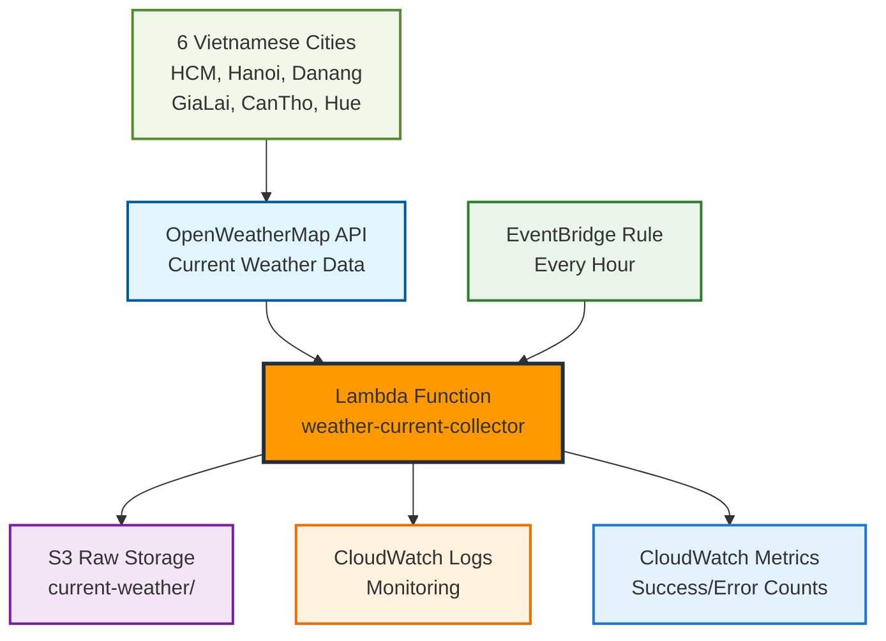

In this section, we will learn how to set up automated weather data collection using the OpenWeatherMap API and AWS Lambda. This is the foundation of our weather analytics ETL pipeline, where we will build a reliable serverless data collection system.

### [2.1 OpenWeatherMap Setup](2.1-openweathermap-setup/)

**API and Credentials Setup**

Set up an OpenWeatherMap account, get an API key, and configure Systems Manager Parameter Store to securely store credentials. You will learn how to manage API keys and test connectivity.

### [2.2 Lambda Weather Collector](2.2-lambda-weather-collector/)

**Building Data Collection Functions**

Create Lambda functions to collect current and forecast weather data from the OpenWeatherMap API. This includes IAM roles, S3 bucket setup, and function code with error handling.

### [2.3 Automated Scheduling](2.3-automated-scheduling/)

**Automated Scheduling with CloudWatch Events**

Set up CloudWatch Events to run Lambda functions on an automated schedule. Configure monitoring, alarms, and notifications to ensure the system runs smoothly.

### [2.4 Testing and Monitoring](2.4-testing-monitoring/)

**Comprehensive Testing and Monitoring**

Establish a testing strategy including manual testing, data quality validation, performance testing, and automated health checks. Create a dashboard to monitor the system.

## Architecture Overview

## Data Types Collected

Collect current weather data for **6 Vietnamese cities/provinces**: Ha Noi, Ho Chi Minh City, Da NangGia Lai, Can Tho, Hue

**Data Collected**:

- Temperature (°C, °F), humidity, pressure
- Wind speed, wind direction, cloud cover
- Weather description, weather condition
- Metadata: timestamp, location, collection info

## Collection Schedule

**Current Weather**: Every hour (24 times/day × 6 cities = 144 data points/day)

## Cost Estimation

| Service            | Usage                 | Cost             |
| ------------------ | --------------------- | ---------------- |
| OpenWeatherMap API | 144 calls/day         | **Free**         |
| Lambda Executions  | 720 invocations/month | **Free Tier**    |
| S3 Storage         | 500 MB data           | **Free Tier**    |
| CloudWatch Logs    | 2 GB logs             | $1.00            |
| **Total**          |                       | **~$1.00/month** |

{}
OpenWeatherMap provides 1,000 free API calls per day, which is sufficient for this workshop.
{}

## Expected Outcomes

After completing this module, you will have:

- A 24/7 operational serverless weather data collection system
- Structured weather data stored in S3
- A complete monitoring and alerting system
- Knowledge of AWS Lambda, CloudWatch Events, and S3 integration

## Getting Started

Ready to build a weather data collection system? Start with **[2.1 OpenWeatherMap Setup](2.1-openweathermap-setup/)** to set up your API and credentials.
