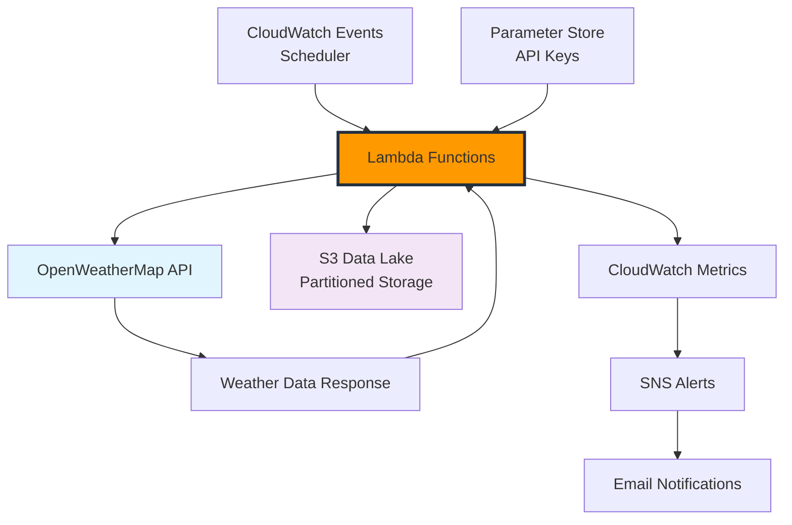

+++
title = "Weather Data Collection with Lambda"
date = 2025-01-03T08:30:00+07:00
weight = 2
chapter = true
pre = "<b>2. </b>"
+++

# Weather Data Collection with Lambda

In this module, you'll build an automated weather data collection system using AWS Lambda functions and the OpenWeatherMap API. This serverless approach provides a scalable, cost-effective solution for gathering weather data from multiple cities on a scheduled basis.

## Module Learning Objectives

By the end of this module, you will:

- Set up OpenWeatherMap API access and understand rate limits
- Create Lambda functions to collect current weather and forecast data
- Implement automated scheduling using CloudWatch Events
- Store weather data in S3 with proper partitioning
- Set up monitoring and error handling
- Test the complete data collection pipeline

## Architecture Overview

## What You'll Build

### Data Collection Components

- **Lambda Functions**: Serverless data collectors for current weather and forecasts
- **CloudWatch Events**: Automated scheduling (hourly for current weather, 6-hourly for forecasts)
- **S3 Storage**: Organized data lake with year/month/day/hour partitioning
- **Parameter Store**: Secure API key management

### Monitoring and Alerting

- **CloudWatch Metrics**: Custom metrics for collection success/failure rates
- **CloudWatch Alarms**: Automated alerts for system issues
- **SNS Notifications**: Email alerts for failures and API limit warnings

### Data Sources

- **Current Weather**: Real-time conditions for 6 Southeast Asian cities
- **5-Day Forecasts**: Weather predictions with 3-hour intervals
- **API Metadata**: Collection timestamps and data quality indicators

## Target Cities

The workshop collects weather data for these cities:

| City             | Country   | Coordinates       | Timezone |
| ---------------- | --------- | ----------------- | -------- |
| Ho Chi Minh City | Vietnam   | 10.8231, 106.6297 | UTC+7    |
| Hanoi            | Vietnam   | 21.0285, 105.8542 | UTC+7    |
| Singapore        | Singapore | 1.3521, 103.8198  | UTC+8    |
| Bangkok          | Thailand  | 13.7563, 100.5018 | UTC+7    |
| Jakarta          | Indonesia | -6.2088, 106.8456 | UTC+7    |
| Kuala Lumpur     | Malaysia  | 3.1390, 101.6869  | UTC+8    |

## Expected Data Volume

### Daily Collection Estimates

- **Current Weather**: 6 cities × 24 hours = 144 files/day (~288 KB)
- **Weather Forecasts**: 6 cities × 4 collections = 24 files/day (~480 KB)
- **Total Daily Storage**: ~768 KB (~23 MB/month)

### API Usage

- **Current Weather**: 144 API calls/day
- **Forecasts**: 24 API calls/day
- **Total Daily API Calls**: 168 (well within 1,000 free tier limit)

## Cost Breakdown

### Estimated Monthly Costs

- **Lambda Invocations**: ~$0.01 (168 daily invocations)
- **Lambda Duration**: ~$0.15 (average 5-second executions)
- **S3 Storage**: ~$0.01 (23 MB monthly storage)
- **CloudWatch Metrics**: ~$0.90 (custom metrics)
- **API Calls**: $0.00 (free tier)

**Total Module Cost**: ~$1.07/month

## Module Structure

This module is divided into four sections:

### 2.1 OpenWeatherMap Setup

- Create OpenWeatherMap account
- Obtain API key and understand limits
- Test API endpoints
- Store credentials securely

### 2.2 Building Lambda Weather Collector

- Create IAM roles and policies
- Develop Lambda functions for data collection
- Implement error handling and retry logic
- Configure environment variables

### 2.3 Automated Scheduling

- Set up CloudWatch Events rules
- Configure different schedules for different data types
- Implement monitoring and alerting
- Create SNS topics for notifications

### 2.4 Testing and Monitoring

- Test Lambda functions manually
- Validate data quality and structure
- Set up comprehensive monitoring
- Perform load and error testing

## Key Technologies Used

### AWS Services

- **AWS Lambda**: Serverless compute for data collection
- **Amazon S3**: Scalable object storage for data lake
- **Amazon CloudWatch**: Monitoring, logging, and scheduling
- **Amazon SNS**: Notification service for alerts
- **AWS Systems Manager**: Parameter Store for secure configuration

### Development Tools

- **Python 3.11**: Primary programming language
- **Boto3**: AWS SDK for Python
- **Requests**: HTTP library for API calls
- **JSON**: Data format for weather information

### External Services

- **OpenWeatherMap API**: Weather data provider
- **REST APIs**: HTTP-based data exchange

## Best Practices Implemented

### Security

- IAM roles with least privilege access
- Encrypted storage for API keys
- VPC endpoints for internal AWS communication
- No hardcoded credentials in code

### Reliability

- Comprehensive error handling and retry logic
- Dead letter queues for failed executions
- Health checks and monitoring
- Graceful degradation on partial failures

### Scalability

- Serverless architecture with auto-scaling
- Partitioned data storage for efficient querying
- Batch processing for multiple cities
- Rate limiting compliance with API providers

### Cost Optimization

- Efficient Lambda memory allocation
- S3 lifecycle policies for data archival
- CloudWatch log retention management
- API usage monitoring and optimization

## Prerequisites for This Module

Before starting, ensure you have:

- [ ] AWS account with Lambda, S3, CloudWatch access
- [ ] AWS CLI configured with appropriate permissions
- [ ] OpenWeatherMap account (free registration)
- [ ] Basic Python programming knowledge
- [ ] Understanding of JSON data structures

## Success Criteria

By the end of this module, you should have:

- [ ] Automated weather data collection running every hour
- [ ] Weather forecast collection running every 6 hours
- [ ] Properly structured data stored in S3
- [ ] Monitoring dashboard showing collection metrics
- [ ] Error alerting system via email notifications
- [ ] API usage tracking staying within free tier limits

Ready to start collecting weather data? Let's begin with setting up your OpenWeatherMap API access!

{}
**Module Duration**: Approximately 90 minutes

- Section 2.1: 20 minutes (API setup)
- Section 2.2: 35 minutes (Lambda development)
- Section 2.3: 25 minutes (Scheduling setup)
- Section 2.4: 10 minutes (Testing)
  {}

{}
**Important**: Keep track of your OpenWeatherMap API key and AWS resource names as you'll need them in subsequent modules.
{}
