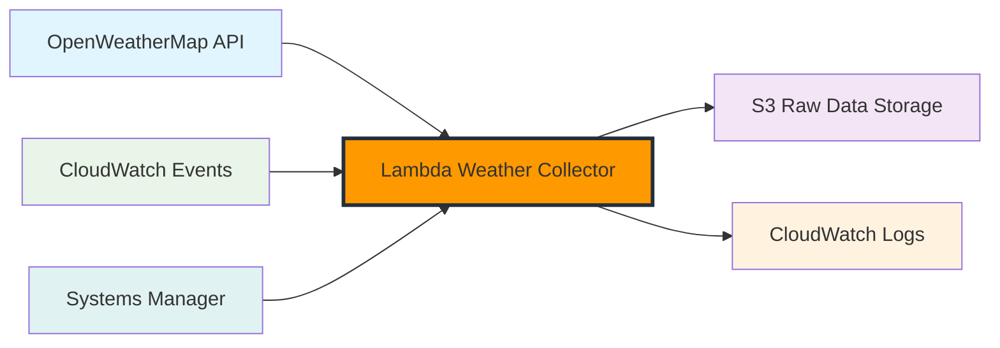
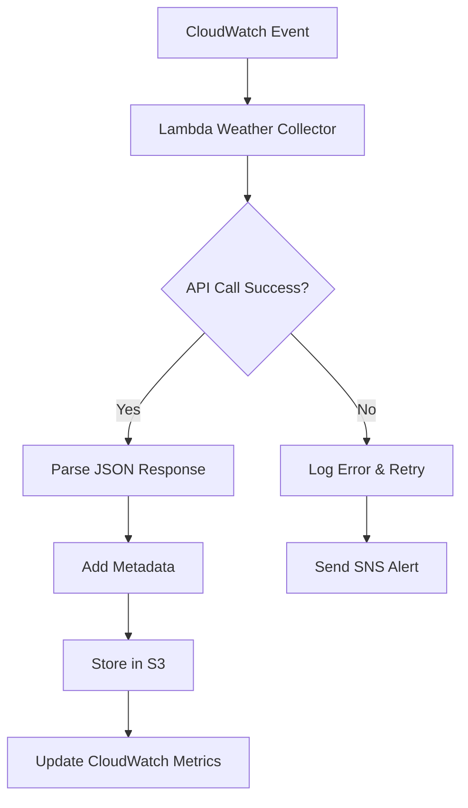

# Thiết lập Thu thập Dữ liệu với OpenWeatherMap API


## Tổng quan

Trong module này, bạn sẽ học cách thiết lập thu thập dữ liệu thời tiết tự động bằng OpenWeatherMap API và AWS Lambda. Đây là nền tảng của pipeline ETL phân tích thời tiết.

## Những gì bạn sẽ xây dựng

Khi hoàn thành module này, bạn sẽ có:

- Tài khoản OpenWeatherMap API với API key
- Lambda function để thu thập dữ liệu thời tiết hiện tại
- Lambda function để thu thập dự báo thời tiết
- Lập lịch tự động bằng CloudWatch Events
- Xử lý lỗi và giám sát cho việc thu thập dữ liệu

## Mục tiêu học tập

- **Hiểu** cấu trúc và endpoints của OpenWeatherMap API
- **Tạo** và cấu hình API credentials một cách bảo mật
- **Xây dựng** Lambda functions để thu thập dữ liệu thời tiết
- **Lập lịch** các job thu thập dữ liệu tự động
- **Triển khai** xử lý lỗi và giám sát

## Điều kiện tiên quyết

- Tài khoản AWS với quyền quản trị
- Hiểu biết cơ bản về định dạng dữ liệu JSON
- Quen thuộc với các khái niệm AWS Lambda

## Cấu trúc Module



## Kiến trúc



## Loại Dữ liệu Thời tiết

Thu thập dữ liệu thời tiết sẽ tập trung vào:

1. **Thời tiết Hiện tại**: Điều kiện thời gian thực cho nhiều thành phố
2. **Dự báo 5 Ngày**: Dự đoán thời tiết mỗi 3 giờ
3. **Cảnh báo Thời tiết**: Thông báo thời tiết khắc nghiệt
4. **Chất lượng Không khí**: Chỉ số ô nhiễm và chất lượng không khí

## Thành phố Mục tiêu

Chúng ta sẽ thu thập dữ liệu thời tiết cho các thành phố lớn ở Đông Nam Á:

- **Thành phố Hồ Chí Minh, Việt Nam** (Chính)
- **Hà Nội, Việt Nam**
- **Singapore**
- **Bangkok, Thái Lan**
- **Jakarta, Indonesia**
- **Kuala Lumpur, Malaysia**

## Lịch trình Thu thập Dữ liệu

**Thời tiết Hiện tại**: Mỗi giờ (24 lần/ngày)
**Dự báo Thời tiết**: Mỗi 6 giờ (4 lần/ngày)
**Chất lượng Không khí**: Mỗi 2 giờ (12 lần/ngày)

## Khối lượng Dữ liệu Dự kiến

Trong workshop này, chúng ta sẽ thu thập:

- **Thời tiết Hiện tại**: ~144 records/ngày (6 thành phố × 24 giờ)
- **Dữ liệu Dự báo**: ~24 bộ dự báo/ngày (6 thành phố × 4 lần)
- **Khối lượng Hàng ngày**: ~2,000 điểm dữ liệu thời tiết
- **Kích thước Record**: 2-8 KB mỗi record thời tiết

## Ước tính Chi phí

Chi phí hàng tháng cho module này (trong Free Tier):

| Dịch vụ            | Sử dụng                | Chi phí          |
| ------------------ | ---------------------- | ---------------- |
| OpenWeatherMap API | 1,000 calls/ngày       | Free Tier        |
| Lambda Executions  | 4,000 invocations      | Free Tier        |
| S3 Storage         | 1 GB dữ liệu thời tiết | Free Tier        |
| CloudWatch Logs    | 5 GB logs              | $2.50            |
| **Tổng**           |                        | **~$2.50/tháng** |

{}
OpenWeatherMap cung cấp 1,000 lời gọi API miễn phí mỗi ngày, hoàn hảo cho nhu cầu workshop của chúng ta.
{}

{}
**Ước tính thời gian**: Module này sẽ mất khoảng 90-120 phút để hoàn thành, bao gồm thiết lập API và testing.
{}

## Dữ liệu Thời tiết Mẫu

Đây là ví dụ về dữ liệu thời tiết chúng ta sẽ thu thập:

### Response Thời tiết Hiện tại

```json
{
  "coord": {
    "lon": 106.6297,
    "lat": 10.8231
  },
  "weather": [
    {
      "id": 803,
      "main": "Clouds",
      "description": "broken clouds",
      "icon": "04d"
    }
  ],
  "main": {
    "temp": 305.15,
    "feels_like": 309.65,
    "temp_min": 305.15,
    "temp_max": 305.15,
    "pressure": 1013,
    "humidity": 74
  },
  "wind": {
    "speed": 3.2,
    "deg": 220
  },
  "clouds": {
    "all": 75
  },
  "dt": 1642248000,
  "sys": {
    "country": "VN",
    "sunrise": 1642203600,
    "sunset": 1642245600
  },
  "timezone": 25200,
  "id": 1566083,
  "name": "Ho Chi Minh City"
}
```

### Response Dự báo 5 Ngày

```json
{
  "list": [
    {
      "dt": 1642248000,
      "main": {
        "temp": 298.55,
        "feels_like": 299.25,
        "temp_min": 298.55,
        "temp_max": 302.44,
        "pressure": 1015,
        "humidity": 64
      },
      "weather": [
        {
          "main": "Rain",
          "description": "light rain",
          "icon": "10d"
        }
      ],
      "wind": {
        "speed": 4.1,
        "deg": 250
      },
      "pop": 0.32,
      "dt_txt": "2025-01-15 09:00:00"
    }
  ]
}
```

## API Endpoints Chúng ta sẽ Sử dụng

**Thời tiết Hiện tại**: `https://api.openweathermap.org/data/2.5/weather`

- Điều kiện thời tiết thời gian thực
- Nhiệt độ, độ ẩm, áp suất, gió
- Mô tả thời tiết và biểu tượng

**Dự báo 5 Ngày**: `https://api.openweathermap.org/data/2.5/forecast`

- Dự đoán thời tiết mỗi 3 giờ
- Dữ liệu dự báo 5 ngày
- Xác suất mưa

**Chất lượng Không khí**: `https://api.openweathermap.org/data/2.5/air_pollution`

- Chỉ số chất lượng không khí (AQI)
- Nồng độ chất ô nhiễm
- Khuyến nghị sức khỏe

**Geocoding**: `https://api.openweathermap.org/geo/1.0/direct`

- Chuyển đổi tên thành phố thành tọa độ
- Reverse geocoding cho địa điểm
- Hỗ trợ đa ngôn ngữ

## Luồng Xử lý Dữ liệu



## Cân nhắc Bảo mật

**Quản lý API Key**:

- Lưu trữ API keys trong AWS Systems Manager Parameter Store
- Sử dụng IAM roles cho Lambda execution
- Mã hóa các tham số nhạy cảm

**Bảo mật Mạng**:

- Lambda functions trong private subnets (tùy chọn)
- VPC endpoints cho AWS services
- Security groups cho network access

**Bảo vệ Dữ liệu**:

- Bật mã hóa S3 bucket
- Mã hóa CloudWatch Logs
- Giao tiếp API bảo mật (HTTPS)

## Chiến lược Xử lý Lỗi

**API Failures**:

- Exponential backoff với jitter
- Số lần retry tối đa (3x)
- Dead letter queue cho failed requests

**Xác thực Dữ liệu**:

- Xác thực JSON schema
- Kiểm tra các trường bắt buộc
- Cảnh báo chất lượng dữ liệu

**Giám sát**:

- CloudWatch custom metrics
- Theo dõi thời gian phản hồi API
- Giám sát tỷ lệ lỗi

## Bắt đầu thôi!

Sẵn sàng xây dựng hệ thống thu thập dữ liệu thời tiết? Hãy bắt đầu bằng việc thiết lập tài khoản OpenWeatherMap API và hiểu cấu trúc API trong phần tiếp theo.

{}
Đảm bảo bạn có địa chỉ email hợp lệ để tạo tài khoản OpenWeatherMap, vì cần xác thực API key.
{}
