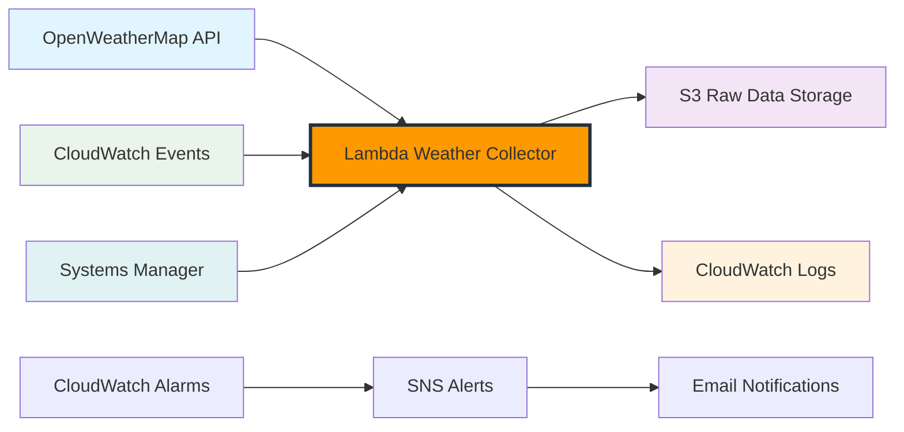

Trong module này, bạn sẽ học cách thiết lập thu thập dữ liệu thời tiết tự động bằng OpenWeatherMap API và AWS Lambda. Đây là nền tảng của pipeline ETL phân tích thời tiết, nơi chúng ta sẽ xây dựng hệ thống thu thập dữ liệu serverless đáng tin cậy.

## Những gì bạn sẽ xây dựng

Khi hoàn thành module này, bạn sẽ có:

- ✅ Tài khoản OpenWeatherMap API với API key được bảo mật
- ✅ Lambda functions thu thập dữ liệu thời tiết hiện tại và dự báo
- ✅ Lập lịch tự động bằng CloudWatch Events
- ✅ Monitoring và testing toàn diện
- ✅ Error handling và alerting system

## Các Phần trong Module này

Module này được chia thành 4 phần chính:

### [2.1 OpenWeatherMap Setup](2.1-openweathermap-setup/)

**Thiết lập API và Credentials**

Thiết lập tài khoản OpenWeatherMap, lấy API key, và cấu hình Systems Manager Parameter Store để lưu trữ credentials một cách bảo mật. Bạn sẽ học cách quản lý API keys và test connectivity.

📖 **Bạn sẽ học**: Đăng ký API, bảo mật credentials, test API endpoints  
⏱️ **Thời gian**: 15-20 phút

### [2.2 Lambda Weather Collector](2.2-lambda-weather-collector/)

**Xây dựng Functions Thu thập Dữ liệu**

Tạo các Lambda functions để thu thập dữ liệu thời tiết hiện tại và dự báo từ OpenWeatherMap API. Bao gồm IAM roles, S3 bucket setup, và function code với error handling.

📖 **Bạn sẽ học**: Lambda development, S3 integration, error handling  
⏱️ **Thời gian**: 45-60 phút

### [2.3 Automated Scheduling](2.3-automated-scheduling/)

**Lập lịch Tự động với CloudWatch Events**

Thiết lập CloudWatch Events để chạy các Lambda functions theo lịch trình tự động. Cấu hình monitoring, alarms, và notifications để đảm bảo hệ thống chạy ổn định.

📖 **Bạn sẽ học**: CloudWatch Events, scheduling patterns, monitoring setup  
⏱️ **Thời gian**: 30-40 phút

### [2.4 Testing và Monitoring](2.4-testing-monitoring/)

**Testing và Monitoring Toàn diện**

Thiết lập testing strategy bao gồm manual testing, data quality validation, performance testing, và automated health checks. Tạo dashboard để monitor hệ thống.

📖 **Bạn sẽ học**: Testing strategies, data validation, performance monitoring  
⏱️ **Thời gian**: 30-40 phút

## Kiến trúc Tổng quan

## Loại Dữ liệu Thu thập

Thu thập dữ liệu thời tiết sẽ tập trung vào:

1. **Thời tiết Hiện tại**: Điều kiện thời gian thực cho 6 thành phố SEA
2. **Dự báo 5 Ngày**: Dự đoán thời tiết mỗi 3 giờ
3. **Metadata**: Timestamp, location, collection info

## Thành phố Mục tiêu

Chúng ta sẽ thu thập dữ liệu thời tiết cho các thành phố lớn ở Đông Nam Á:

- **Thành phố Hồ Chí Minh, Việt Nam** (Chính)
- **Hà Nội, Việt Nam**
- **Singapore**
- **Bangkok, Thái Lan**
- **Jakarta, Indonesia**
- **Kuala Lumpur, Malaysia**

## Lịch trình Thu thập

**Thời tiết Hiện tại**: Mỗi giờ (24 lần/ngày)  
**Dự báo Thời tiết**: Mỗi 6 giờ (4 lần/ngày)

## Ước tính Chi phí

Chi phí hàng tháng cho module này:

| Dịch vụ            | Sử dụng                | Chi phí          |
| ------------------ | ---------------------- | ---------------- |
| OpenWeatherMap API | 1,000 calls/ngày       | **Free**         |
| Lambda Executions  | 4,000 invocations      | **Free Tier**    |
| S3 Storage         | 1 GB dữ liệu thời tiết | **Free Tier**    |
| CloudWatch Logs    | 5 GB logs              | $2.50            |
| **Tổng**           |                        | **~$2.50/tháng** |

{}
OpenWeatherMap cung cấp 1,000 lời gọi API miễn phí mỗi ngày, đủ cho workshop này.
{}

{}
**Ước tính thời gian hoàn thành**: 2-2.5 giờ cho toàn bộ module
{}

## Kết quả Mong đợi

Sau khi hoàn thành module này, bạn sẽ có:

- Hệ thống thu thập dữ liệu thời tiết serverless hoạt động 24/7
- Dữ liệu thời tiết được lưu trữ có cấu trúc trong S3
- Monitoring và alerting system đầy đủ
- Kiến thức về AWS Lambda, CloudWatch Events, và S3 integration

## Bắt đầu

Sẵn sàng xây dựng hệ thống thu thập dữ liệu thời tiết? Bắt đầu với **[2.1 OpenWeatherMap Setup](2.1-openweathermap-setup/)** để thiết lập API và credentials.
