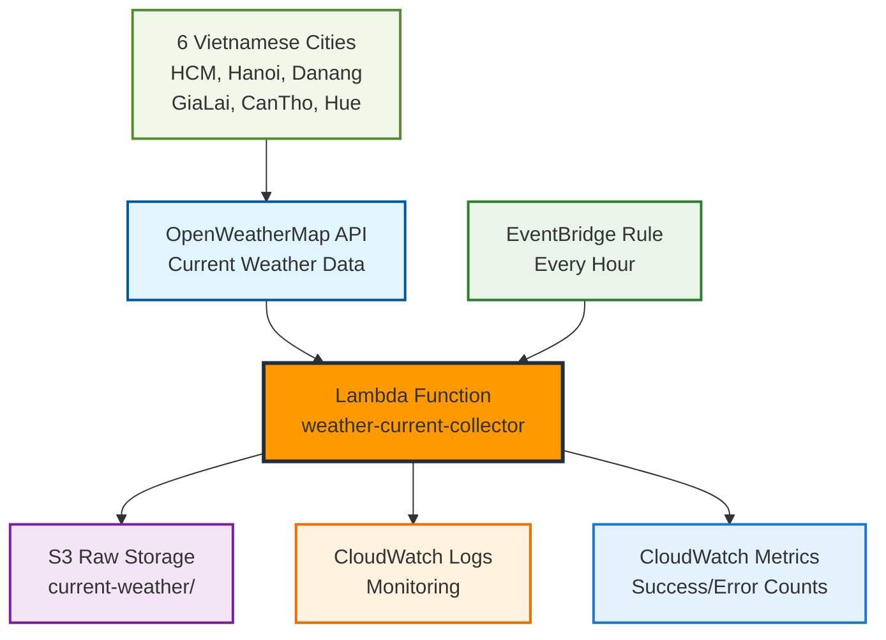

Trong phần này, ta sẽ học cách thiết lập thu thập dữ liệu thời tiết tự động bằng OpenWeatherMap API và AWS Lambda. Đây là nền tảng của pipeline ETL phân tích thời tiết, nơi chúng ta sẽ xây dựng hệ thống thu thập dữ liệu serverless đáng tin cậy.

### [2.1 OpenWeatherMap Setup](2.1-openweathermap-setup/)

**Thiết lập API và Credentials**

Thiết lập tài khoản OpenWeatherMap, lấy API key, và cấu hình Systems Manager Parameter Store để lưu trữ credentials một cách bảo mật. Bạn sẽ học cách quản lý API keys và test connectivity.

### [2.2 Lambda Weather Collector](2.2-lambda-weather-collector/)

**Xây dựng Functions Thu thập Dữ liệu**

Tạo các Lambda functions để thu thập dữ liệu thời tiết hiện tại và dự báo từ OpenWeatherMap API. Bao gồm IAM roles, S3 bucket setup, và function code với error handling.

### [2.3 Automated Scheduling](2.3-automated-scheduling/)

**Lập lịch Tự động với CloudWatch Events**

Thiết lập CloudWatch Events để chạy các Lambda functions theo lịch trình tự động. Cấu hình monitoring, alarms, và notifications để đảm bảo hệ thống chạy ổn định.

### [2.4 Testing và Monitoring](2.4-testing-monitoring/)

**Testing và Monitoring Toàn diện**

Thiết lập testing strategy bao gồm manual testing, data quality validation, performance testing, và automated health checks. Tạo dashboard để monitor hệ thống.

## Kiến trúc Tổng quan

## Loại Dữ liệu Thu thập

Thu thập dữ liệu thời tiết hiện tại cho **6 tỉnh thành Việt Nam**:

1. **🏙️ Thành phố chính**: Hà Nội, Hồ Chí Minh, Đà Nẵng
2. **🌾 Khu vực nông nghiệp**: Gia Lai, Cần Thơ
3. **🏛️ Di sản văn hóa**: Huế

**📊 Dữ liệu thu thập**:

- Nhiệt độ (°C, °F), độ ẩm, áp suất
- Tốc độ gió, hướng gió, mây che phủ
- Mô tả thời tiết, weather condition
- Metadata: timestamp, location, collection info

## Lịch trình Thu thập

⏰ **Thời tiết Hiện tại**: Mỗi giờ (24 lần/ngày × 6 thành phố = 144 data points/ngày)

## Ước tính Chi phí

| Dịch vụ            | Sử dụng               | Chi phí          |
| ------------------ | --------------------- | ---------------- |
| OpenWeatherMap API | 144 calls/ngày        | **Free**         |
| Lambda Executions  | 720 invocations/tháng | **Free Tier**    |
| S3 Storage         | 500 MB dữ liệu        | **Free Tier**    |
| CloudWatch Logs    | 2 GB logs             | $1.00            |
| **Tổng**           |                       | **~$1.00/tháng** |

{}
OpenWeatherMap cung cấp 1,000 lời gọi API miễn phí mỗi ngày, đủ cho workshop này.
{}

## Kết quả Mong đợi

Sau khi hoàn thành module này, bạn sẽ có:

- Hệ thống thu thập dữ liệu thời tiết serverless hoạt động 24/7
- Dữ liệu thời tiết được lưu trữ có cấu trúc trong S3
- Monitoring và alerting system đầy đủ
- Kiến thức về AWS Lambda, CloudWatch Events, và S3 integration

## Bắt đầu

Sẵn sàng xây dựng hệ thống thu thập dữ liệu thời tiết? Bắt đầu với **[2.1 OpenWeatherMap Setup](2.1-openweathermap-setup/)** để thiết lập API và credentials.
