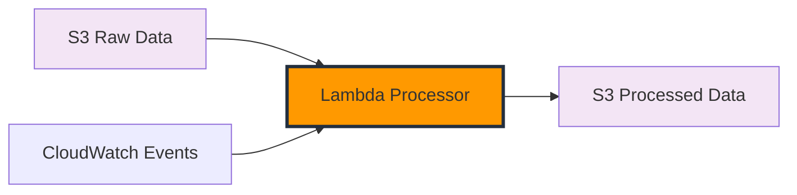

+++
title = "Data Processing and Transformation"
date = 2025-01-03T09:30:00+07:00
weight = 3
chapter = true
pre = "<b>3. </b>"
+++

# Data Processing and Transformation

In this module, you'll build a Lambda function to process and transform the raw weather data collected from OpenWeatherMap API into a more analytics-friendly format. This transformation step is essential in any ETL pipeline to prepare data for efficient analysis.

## Module Overview

Raw weather data from APIs often contains complex nested structures, inconsistent formats, and extraneous information. In this module, we'll transform this raw data into a clean, structured format optimized for analytics.

## What You'll Build



## Key Transformation Steps

Our Lambda processor will perform these key transformations:

1. **Data Flattening**: Convert nested JSON structures to flat records
2. **Unit Conversion**: Convert temperature from Kelvin to Celsius and Fahrenheit
3. **Data Enrichment**: Add derived fields like heat index and comfort level
4. **Format Standardization**: Ensure consistent field names and data types
5. **Data Validation**: Filter out invalid or incomplete records

## Lambda Processor Function

You'll create a Python Lambda function that:

1. Retrieves raw weather data from the S3 bucket
2. Applies transformation logic
3. Stores processed results in a separate S3 location
4. Handles errors gracefully

### Sample Code Structure

```python
import json
import boto3
import datetime

s3_client = boto3.client('s3')

def lambda_handler(event, context):
    # Get raw data from S3
    raw_bucket = 'weather-data-raw'
    processed_bucket = 'weather-data-processed'

    # Process each file in the event
    for record in event['Records']:
        # Get the file key
        key = record['s3']['object']['key']

        # Get the raw data
        response = s3_client.get_object(Bucket=raw_bucket, Key=key)
        raw_data = json.loads(response['Body'].read().decode('utf-8'))

        # Transform the data
        processed_data = transform_weather_data(raw_data)

        # Save to processed bucket
        processed_key = key.replace('raw', 'processed')
        s3_client.put_object(
            Bucket=processed_bucket,
            Key=processed_key,
            Body=json.dumps(processed_data),
            ContentType='application/json'
        )

    return {
        'statusCode': 200,
        'body': f'Processed {len(event["Records"])} files'
    }

def transform_weather_data(raw_data):
    # Implement transformation logic here
    # ...
```

## Data Transformation Examples

### Raw OpenWeatherMap Data

```json
{
  "coord": { "lon": 106.6297, "lat": 10.8231 },
  "weather": [
    {
      "id": 803,
      "main": "Clouds",
      "description": "broken clouds",
      "icon": "04d"
    }
  ],
  "main": {
    "temp": 305.15,
    "feels_like": 309.65,
    "temp_min": 305.15,
    "temp_max": 305.15,
    "pressure": 1013,
    "humidity": 74
  },
  "wind": { "speed": 3.2, "deg": 220 },
  "clouds": { "all": 75 },
  "dt": 1642248000,
  "sys": {
    "country": "VN",
    "sunrise": 1642203600,
    "sunset": 1642245600
  },
  "timezone": 25200,
  "id": 1566083,
  "name": "Ho Chi Minh City"
}
```

### Transformed Data

```json
{
  "timestamp": "2025-01-15T09:00:00Z",
  "city_name": "Ho Chi Minh City",
  "country": "VN",
  "latitude": 10.8231,
  "longitude": 106.6297,
  "temperature_celsius": 32.0,
  "temperature_fahrenheit": 89.6,
  "feels_like_celsius": 36.5,
  "humidity_percent": 74,
  "pressure_hpa": 1013,
  "weather_main": "Clouds",
  "weather_description": "broken clouds",
  "wind_speed_ms": 3.2,
  "wind_direction_deg": 220,
  "cloud_coverage_percent": 75,
  "heat_index": 38.2,
  "comfort_level": "uncomfortable",
  "data_collection_date": "2025-01-15"
}
```

## Implementation Steps

1. **Create Lambda Function**: Set up a new Lambda for data processing
2. **Configure S3 Trigger**: Set up event notifications from raw data bucket
3. **Implement Transformation Logic**: Write code to transform weather data
4. **Set Up Error Handling**: Add robust error handling and logging
5. **Test the Function**: Verify transformation with test data

## Benefits of Data Transformation

- **Improved Query Performance**: Flat structures are easier to query
- **Reduced Storage Costs**: Optimized data formats use less storage
- **Enhanced Analytics**: Derived fields enable deeper insights
- **Better Data Quality**: Validation ensures reliable data

## Next Steps

After completing this module, you'll have a fully functional data transformation pipeline that prepares your weather data for analysis. In the next module, we'll use Amazon Athena to query and analyze this processed data.

{}
Data transformation is where you can add your domain-specific knowledge. Consider what additional weather metrics might be useful for your specific analysis needs.
{}
