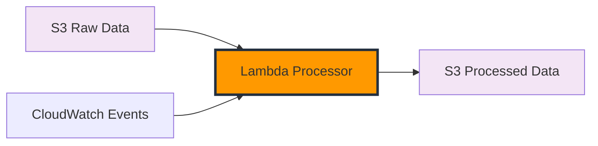

# Xử lý và Biến đổi Dữ liệu

Trong module này, bạn sẽ xây dựng một hàm Lambda để xử lý và biến đổi dữ liệu thời tiết thô được thu thập từ OpenWeatherMap API thành định dạng thân thiện hơn với phân tích. Bước biến đổi này là cần thiết trong bất kỳ pipeline ETL nào để chuẩn bị dữ liệu cho việc phân tích hiệu quả.

## Tổng quan Module

Dữ liệu thời tiết thô từ API thường chứa cấu trúc lồng nhau phức tạp, định dạng không nhất quán và thông tin không cần thiết. Trong module này, chúng ta sẽ biến đổi dữ liệu thô này thành định dạng có cấu trúc, sạch sẽ được tối ưu hóa cho phân tích.

## Những gì bạn sẽ xây dựng



## Các bước biến đổi chính

Lambda processor của chúng ta sẽ thực hiện các biến đổi chính sau:

1. **Làm phẳng dữ liệu**: Chuyển đổi cấu trúc JSON lồng nhau thành bản ghi phẳng
2. **Chuyển đổi đơn vị**: Chuyển đổi nhiệt độ từ Kelvin sang Celsius và Fahrenheit
3. **Làm giàu dữ liệu**: Thêm các trường dẫn xuất như chỉ số nhiệt và mức độ thoải mái
4. **Chuẩn hóa định dạng**: Đảm bảo tên trường và kiểu dữ liệu nhất quán
5. **Xác thực dữ liệu**: Lọc ra các bản ghi không hợp lệ hoặc không đầy đủ

## Hàm Lambda Processor

Bạn sẽ tạo một hàm Lambda Python thực hiện:

1. Lấy dữ liệu thời tiết thô từ bucket S3
2. Áp dụng logic biến đổi
3. Lưu trữ kết quả đã xử lý trong một vị trí S3 riêng biệt
4. Xử lý lỗi một cách nhẹ nhàng

### Cấu trúc mã mẫu

```python
import json
import boto3
import datetime

s3_client = boto3.client('s3')

def lambda_handler(event, context):
    # Lấy dữ liệu thô từ S3
    raw_bucket = 'weather-data-raw'
    processed_bucket = 'weather-data-processed'

    # Xử lý từng file trong event
    for record in event['Records']:
        # Lấy key của file
        key = record['s3']['object']['key']

        # Lấy dữ liệu thô
        response = s3_client.get_object(Bucket=raw_bucket, Key=key)
        raw_data = json.loads(response['Body'].read().decode('utf-8'))

        # Biến đổi dữ liệu
        processed_data = transform_weather_data(raw_data)

        # Lưu vào bucket đã xử lý
        processed_key = key.replace('raw', 'processed')
        s3_client.put_object(
            Bucket=processed_bucket,
            Key=processed_key,
            Body=json.dumps(processed_data),
            ContentType='application/json'
        )

    return {
        'statusCode': 200,
        'body': f'Đã xử lý {len(event["Records"])} files'
    }

def transform_weather_data(raw_data):
    # Triển khai logic biến đổi ở đây
    # ...
```

## Ví dụ biến đổi dữ liệu

### Dữ liệu OpenWeatherMap thô

```json
{
  "coord": { "lon": 106.6297, "lat": 10.8231 },
  "weather": [
    {
      "id": 803,
      "main": "Clouds",
      "description": "broken clouds",
      "icon": "04d"
    }
  ],
  "main": {
    "temp": 305.15,
    "feels_like": 309.65,
    "temp_min": 305.15,
    "temp_max": 305.15,
    "pressure": 1013,
    "humidity": 74
  },
  "wind": { "speed": 3.2, "deg": 220 },
  "clouds": { "all": 75 },
  "dt": 1642248000,
  "sys": {
    "country": "VN",
    "sunrise": 1642203600,
    "sunset": 1642245600
  },
  "timezone": 25200,
  "id": 1566083,
  "name": "Ho Chi Minh City"
}
```

### Dữ liệu đã biến đổi

```json
{
  "timestamp": "2025-01-15T09:00:00Z",
  "city_name": "Ho Chi Minh City",
  "country": "VN",
  "latitude": 10.8231,
  "longitude": 106.6297,
  "temperature_celsius": 32.0,
  "temperature_fahrenheit": 89.6,
  "feels_like_celsius": 36.5,
  "humidity_percent": 74,
  "pressure_hpa": 1013,
  "weather_main": "Clouds",
  "weather_description": "broken clouds",
  "wind_speed_ms": 3.2,
  "wind_direction_deg": 220,
  "cloud_coverage_percent": 75,
  "heat_index": 38.2,
  "comfort_level": "uncomfortable",
  "data_collection_date": "2025-01-15"
}
```

## Các bước triển khai

1. **Tạo hàm Lambda**: Thiết lập Lambda mới cho xử lý dữ liệu
2. **Cấu hình S3 Trigger**: Thiết lập thông báo sự kiện từ bucket dữ liệu thô
3. **Triển khai logic biến đổi**: Viết mã để biến đổi dữ liệu thời tiết
4. **Thiết lập xử lý lỗi**: Thêm xử lý lỗi và ghi log mạnh mẽ
5. **Kiểm tra hàm**: Xác minh quá trình biến đổi với dữ liệu thử nghiệm

## Lợi ích của biến đổi dữ liệu

- **Cải thiện hiệu suất truy vấn**: Cấu trúc phẳng dễ truy vấn hơn
- **Giảm chi phí lưu trữ**: Định dạng dữ liệu tối ưu sử dụng ít dung lượng hơn
- **Nâng cao phân tích**: Các trường dẫn xuất cho phép hiểu sâu hơn
- **Chất lượng dữ liệu tốt hơn**: Xác thực đảm bảo dữ liệu đáng tin cậy

## Các bước tiếp theo

Sau khi hoàn thành module này, bạn sẽ có một pipeline biến đổi dữ liệu hoạt động đầy đủ để chuẩn bị dữ liệu thời tiết của bạn cho phân tích. Trong module tiếp theo, chúng ta sẽ sử dụng Amazon Athena để truy vấn và phân tích dữ liệu đã xử lý này.

{}
Biến đổi dữ liệu là nơi bạn có thể thêm kiến thức chuyên ngành của mình. Hãy xem xét các chỉ số thời tiết bổ sung nào có thể hữu ích cho nhu cầu phân tích cụ thể của bạn.
{}
