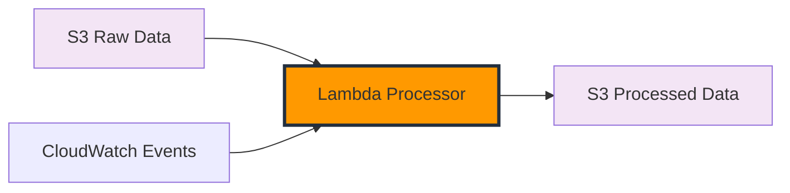

# Xử lý và Biến đổi Dữ liệu

Trong module này, bạn sẽ xây dựng một hàm Lambda để xử lý và biến đổi dữ liệu thời tiết thô được thu thập từ OpenWeatherMap API thành định dạng thân thiện hơn với phân tích. Bước biến đổi này là cần thiết trong bất kỳ pipeline ETL nào để chuẩn bị dữ liệu cho việc phân tích hiệu quả.

## Tổng quan Module

Dữ liệu thời tiết thô từ API thường chứa cấu trúc lồng nhau phức tạp, định dạng không nhất quán và thông tin không cần thiết. Trong module này, chúng ta sẽ biến đổi dữ liệu thô này thành định dạng có cấu trúc, sạch sẽ được tối ưu hóa cho phân tích.

**Thời gian:** 45-60 phút  
**Chi phí:** ~$0.50

## Những gì bạn sẽ xây dựng



## Điều kiện tiên quyết

- Đã hoàn thành Module 2: Thu thập Dữ liệu Thời tiết
- Dữ liệu thời tiết thô đã được thu thập trong S3
- AWS CLI đã được cấu hình

## Bước 1: Tạo Hàm Lambda Xử lý Dữ liệu

### 1.1 Tạo Thư mục Hàm Lambda

Tạo thư mục mới cho hàm Lambda của bạn:

```bash
mkdir weather-processor
cd weather-processor
```

### 1.2 Tạo Hàm Lambda Hoàn chỉnh

Tạo file `lambda_function.py` với mã sau:

```python
import json
import boto3
import datetime
import logging
from decimal import Decimal
import os

# Cấu hình logging
logger = logging.getLogger()
logger.setLevel(logging.INFO)

# Khởi tạo AWS clients
s3_client = boto3.client('s3')

def lambda_handler(event, context):
    """
    Lambda handler chính cho xử lý dữ liệu thời tiết
    """
    try:
        processed_bucket = os.environ['PROCESSED_BUCKET']
        processed_count = 0

        # Xử lý từng S3 event record
        for record in event['Records']:
            try:
                # Trích xuất bucket và key từ event
                source_bucket = record['s3']['bucket']['name']
                source_key = record['s3']['object']['key']

                logger.info(f"Đang xử lý file: {source_key} từ bucket: {source_bucket}")

                # Lấy dữ liệu thời tiết thô từ S3
                response = s3_client.get_object(Bucket=source_bucket, Key=source_key)
                raw_data = json.loads(response['Body'].read().decode('utf-8'))

                # Biến đổi dữ liệu thời tiết
                processed_data = transform_weather_data(raw_data)

                # Tạo key cho file đã xử lý
                processed_key = source_key.replace('raw/', 'processed/').replace('.json', '_processed.json')

                # Lưu dữ liệu đã xử lý vào S3
                s3_client.put_object(
                    Bucket=processed_bucket,
                    Key=processed_key,
                    Body=json.dumps(processed_data, indent=2, default=decimal_default),
                    ContentType='application/json'
                )

                processed_count += 1
                logger.info(f"Đã xử lý và lưu thành công: {processed_key}")

            except Exception as e:
                logger.error(f"Lỗi xử lý record {source_key}: {str(e)}")
                continue

        return {
            'statusCode': 200,
            'body': json.dumps({
                'message': f'Đã xử lý thành công {processed_count} files',
                'processedCount': processed_count
            })
        }

    except Exception as e:
        logger.error(f"Lỗi thực thi Lambda: {str(e)}")
        return {
            'statusCode': 500,
            'body': json.dumps({
                'error': str(e)
            })
        }

def transform_weather_data(raw_data):
    """
    Biến đổi dữ liệu OpenWeatherMap thô thành định dạng thân thiện với phân tích
    """
    try:
        # Trích xuất timestamp
        timestamp = datetime.datetime.fromtimestamp(raw_data['dt']).isoformat() + 'Z'
        collection_date = datetime.datetime.fromtimestamp(raw_data['dt']).strftime('%Y-%m-%d')

        # Trích xuất thông tin vị trí và thời tiết cơ bản
        processed_data = {
            'timestamp': timestamp,
            'city_name': raw_data.get('name', 'Unknown'),
            'country': raw_data.get('sys', {}).get('country', 'Unknown'),
            'latitude': raw_data.get('coord', {}).get('lat'),
            'longitude': raw_data.get('coord', {}).get('lon'),
            'data_collection_date': collection_date
        }

        # Chuyển đổi nhiệt độ
        temp_kelvin = raw_data.get('main', {}).get('temp')
        if temp_kelvin:
            processed_data['temperature_kelvin'] = temp_kelvin
            processed_data['temperature_celsius'] = round(temp_kelvin - 273.15, 2)
            processed_data['temperature_fahrenheit'] = round((temp_kelvin - 273.15) * 9/5 + 32, 2)

        # Nhiệt độ cảm nhận
        feels_like_kelvin = raw_data.get('main', {}).get('feels_like')
        if feels_like_kelvin:
            processed_data['feels_like_celsius'] = round(feels_like_kelvin - 273.15, 2)
            processed_data['feels_like_fahrenheit'] = round((feels_like_kelvin - 273.15) * 9/5 + 32, 2)

        # Các thông số thời tiết khác
        processed_data.update({
            'humidity_percent': raw_data.get('main', {}).get('humidity'),
            'pressure_hpa': raw_data.get('main', {}).get('pressure'),
            'visibility_meters': raw_data.get('visibility'),
            'uv_index': raw_data.get('uvi')  # Nếu có
        })

        # Mô tả thời tiết
        weather_list = raw_data.get('weather', [])
        if weather_list:
            weather = weather_list[0]
            processed_data.update({
                'weather_id': weather.get('id'),
                'weather_main': weather.get('main'),
                'weather_description': weather.get('description'),
                'weather_icon': weather.get('icon')
            })

        # Thông tin gió
        wind_data = raw_data.get('wind', {})
        processed_data.update({
            'wind_speed_ms': wind_data.get('speed'),
            'wind_direction_deg': wind_data.get('deg'),
            'wind_gust_ms': wind_data.get('gust')
        })

        # Chuyển đổi tốc độ gió sang km/h và mph
        if wind_data.get('speed'):
            processed_data['wind_speed_kmh'] = round(wind_data['speed'] * 3.6, 2)
            processed_data['wind_speed_mph'] = round(wind_data['speed'] * 2.237, 2)

        # Độ che phủ mây
        processed_data['cloud_coverage_percent'] = raw_data.get('clouds', {}).get('all')

        # Lượng mưa (nếu có)
        rain_data = raw_data.get('rain', {})
        if rain_data:
            processed_data['rain_1h_mm'] = rain_data.get('1h')
            processed_data['rain_3h_mm'] = rain_data.get('3h')

        snow_data = raw_data.get('snow', {})
        if snow_data:
            processed_data['snow_1h_mm'] = snow_data.get('1h')
            processed_data['snow_3h_mm'] = snow_data.get('3h')

        # Thêm các trường dẫn xuất
        processed_data.update(calculate_derived_fields(processed_data))

        return processed_data

    except Exception as e:
        logger.error(f"Lỗi biến đổi dữ liệu thời tiết: {str(e)}")
        raise

def calculate_derived_fields(data):
    """
    Tính toán các chỉ số thời tiết dẫn xuất
    """
    derived = {}

    try:
        # Tính chỉ số nhiệt (đơn giản hóa)
        temp_f = data.get('temperature_fahrenheit')
        humidity = data.get('humidity_percent')

        if temp_f and humidity:
            if temp_f >= 80:  # Chỉ số nhiệt chỉ có ý nghĩa trên 80°F
                # Công thức chỉ số nhiệt đơn giản
                heat_index_f = (
                    -42.379 +
                    2.04901523 * temp_f +
                    10.14333127 * humidity -
                    0.22475541 * temp_f * humidity -
                    6.83783e-3 * temp_f**2 -
                    5.481717e-2 * humidity**2 +
                    1.22874e-3 * temp_f**2 * humidity +
                    8.5282e-4 * temp_f * humidity**2 -
                    1.99e-6 * temp_f**2 * humidity**2
                )
                derived['heat_index_fahrenheit'] = round(heat_index_f, 2)
                derived['heat_index_celsius'] = round((heat_index_f - 32) * 5/9, 2)

        # Mức độ thoải mái dựa trên nhiệt độ và độ ẩm
        temp_c = data.get('temperature_celsius')
        if temp_c and humidity:
            if temp_c < 10:
                comfort = 'lạnh'
            elif temp_c < 18:
                comfort = 'mát'
            elif temp_c <= 24 and humidity <= 60:
                comfort = 'thoải_mái'
            elif temp_c <= 30 and humidity <= 70:
                comfort = 'ấm'
            else:
                comfort = 'nóng'
            derived['comfort_level'] = comfort

        # Tình trạng gió
        wind_speed_kmh = data.get('wind_speed_kmh')
        if wind_speed_kmh:
            if wind_speed_kmh < 5:
                wind_condition = 'tĩnh_lặng'
            elif wind_speed_kmh < 20:
                wind_condition = 'nhẹ'
            elif wind_speed_kmh < 40:
                wind_condition = 'vừa'
            elif wind_speed_kmh < 60:
                wind_condition = 'mạnh'
            else:
                wind_condition = 'rất_mạnh'
            derived['wind_condition'] = wind_condition

        # Mức độ nghiêm trọng thời tiết
        weather_main = data.get('weather_main', '').lower()
        if weather_main:
            if weather_main in ['thunderstorm', 'tornado']:
                severity = 'nghiêm_trọng'
            elif weather_main in ['rain', 'snow', 'drizzle']:
                severity = 'vừa'
            elif weather_main in ['mist', 'fog', 'haze']:
                severity = 'nhẹ'
            else:
                severity = 'bình_thường'
            derived['weather_severity'] = severity

        return derived

    except Exception as e:
        logger.error(f"Lỗi tính toán các trường dẫn xuất: {str(e)}")
        return {}

def decimal_default(obj):
    """
    JSON serializer cho các đối tượng không thể serialize mặc định
    """
    if isinstance(obj, Decimal):
        return float(obj)
    raise TypeError
```

### 1.3 Tạo File Requirements

Tạo file `requirements.txt`:

```
boto3==1.34.0
```

## Bước 2: Tạo S3 Bucket cho Dữ liệu Đã Xử lý

```bash
# Tạo bucket cho dữ liệu đã xử lý
aws s3 mb s3://your-weather-processed-bucket-name

# Bật versioning
aws s3api put-bucket-versioning \
  --bucket your-weather-processed-bucket-name \
  --versioning-configuration Status=Enabled
```

## Bước 3: Đóng gói và Triển khai Hàm Lambda

### 3.1 Tạo Gói Triển khai

```bash
# Cài đặt dependencies
pip install -r requirements.txt -t .

# Tạo gói triển khai
zip -r weather-processor.zip .
```

### 3.2 Tạo IAM Role cho Lambda

Tạo file `trust-policy.json`:

```json
{
  "Version": "2012-10-17",
  "Statement": [
    {
      "Effect": "Allow",
      "Principal": {
        "Service": "lambda.amazonaws.com"
      },
      "Action": "sts:AssumeRole"
    }
  ]
}
```

Tạo file `lambda-policy.json`:

```json
{
  "Version": "2012-10-17",
  "Statement": [
    {
      "Effect": "Allow",
      "Action": [
        "logs:CreateLogGroup",
        "logs:CreateLogStream",
        "logs:PutLogEvents"
      ],
      "Resource": "arn:aws:logs:*:*:*"
    },
    {
      "Effect": "Allow",
      "Action": ["s3:GetObject", "s3:PutObject"],
      "Resource": [
        "arn:aws:s3:::your-weather-raw-bucket/*",
        "arn:aws:s3:::your-weather-processed-bucket/*"
      ]
    }
  ]
}
```

Tạo IAM role:

```bash
# Tạo role
aws iam create-role \
  --role-name WeatherProcessorRole \
  --assume-role-policy-document file://trust-policy.json

# Gắn policy
aws iam put-role-policy \
  --role-name WeatherProcessorRole \
  --policy-name WeatherProcessorPolicy \
  --policy-document file://lambda-policy.json
```

### 3.3 Triển khai Hàm Lambda

```bash
# Tạo hàm Lambda
aws lambda create-function \
  --function-name weather-data-processor \
  --runtime python3.9 \
  --role arn:aws:iam::YOUR-ACCOUNT-ID:role/WeatherProcessorRole \
  --handler lambda_function.lambda_handler \
  --zip-file fileb://weather-processor.zip \
  --timeout 60 \
  --memory-size 256 \
  --environment Variables='{
    "PROCESSED_BUCKET":"your-weather-processed-bucket-name"
  }'
```

## Bước 4: Thiết lập S3 Event Trigger

Cấu hình S3 để kích hoạt hàm Lambda khi có file mới được upload:

### 4.1 Thêm Quyền Lambda cho S3

```bash
aws lambda add-permission \
  --function-name weather-data-processor \
  --principal s3.amazonaws.com \
  --statement-id s3-trigger \
  --action lambda:InvokeFunction \
  --source-arn arn:aws:s3:::your-weather-raw-bucket
```

### 4.2 Tạo S3 Event Notification

Tạo file `notification-config.json`:

```json
{
  "LambdaConfigurations": [
    {
      "Id": "weather-processor-trigger",
      "LambdaFunctionArn": "arn:aws:lambda:REGION:ACCOUNT-ID:function:weather-data-processor",
      "Events": ["s3:ObjectCreated:*"],
      "Filter": {
        "Key": {
          "FilterRules": [
            {
              "Name": "prefix",
              "Value": "raw/"
            },
            {
              "Name": "suffix",
              "Value": ".json"
            }
          ]
        }
      }
    }
  ]
}
```

Áp dụng cấu hình:

```bash
aws s3api put-bucket-notification-configuration \
  --bucket your-weather-raw-bucket \
  --notification-configuration file://notification-config.json
```

## Bước 5: Kiểm tra Xử lý Dữ liệu

### 5.1 Kiểm tra Thủ công

Kiểm tra với file dữ liệu thời tiết mẫu:

```bash
# Upload file test để kích hoạt xử lý
aws s3 cp test-weather-data.json s3://your-weather-raw-bucket/raw/test-weather-data.json
```

### 5.2 Kiểm tra CloudWatch Logs

```bash
# Xem logs của Lambda
aws logs describe-log-groups --log-group-name-prefix /aws/lambda/weather-data-processor
```

### 5.3 Xác minh Dữ liệu Đã Xử lý

```bash
# Liệt kê các file đã xử lý
aws s3 ls s3://your-weather-processed-bucket/processed/

# Tải và kiểm tra dữ liệu đã xử lý
aws s3 cp s3://your-weather-processed-bucket/processed/test-weather-data_processed.json .
cat test-weather-data_processed.json | jq .
```

## Ví dụ biến đổi dữ liệu

### Dữ liệu OpenWeatherMap thô

```json
{
  "coord": { "lon": 106.6297, "lat": 10.8231 },
  "weather": [
    {
      "id": 803,
      "main": "Clouds",
      "description": "broken clouds",
      "icon": "04d"
    }
  ],
  "main": {
    "temp": 305.15,
    "feels_like": 309.65,
    "temp_min": 305.15,
    "temp_max": 305.15,
    "pressure": 1013,
    "humidity": 74
  },
  "wind": { "speed": 3.2, "deg": 220 },
  "clouds": { "all": 75 },
  "dt": 1642248000,
  "sys": {
    "country": "VN",
    "sunrise": 1642203600,
    "sunset": 1642245600
  },
  "timezone": 25200,
  "id": 1566083,
  "name": "Ho Chi Minh City"
}
```

### Dữ liệu đã biến đổi

```json
{
  "timestamp": "2025-01-15T09:00:00Z",
  "city_name": "Ho Chi Minh City",
  "country": "VN",
  "latitude": 10.8231,
  "longitude": 106.6297,
  "temperature_celsius": 32.0,
  "temperature_fahrenheit": 89.6,
  "feels_like_celsius": 36.5,
  "feels_like_fahrenheit": 97.7,
  "humidity_percent": 74,
  "pressure_hpa": 1013,
  "weather_main": "Clouds",
  "weather_description": "broken clouds",
  "wind_speed_ms": 3.2,
  "wind_speed_kmh": 11.52,
  "wind_speed_mph": 7.16,
  "wind_direction_deg": 220,
  "cloud_coverage_percent": 75,
  "heat_index_celsius": 38.2,
  "heat_index_fahrenheit": 100.8,
  "comfort_level": "nóng",
  "wind_condition": "nhẹ",
  "weather_severity": "bình_thường",
  "data_collection_date": "2025-01-15"
}
```

## Giám sát và Khắc phục Sự cố

### CloudWatch Metrics

Giám sát các chỉ số quan trọng:

- Số lần gọi Lambda
- Lỗi và thời gian thực thi
- Metrics của S3 bucket

### Các Vấn đề Thường gặp

1. **Lỗi Quyền**: Đảm bảo Lambda có quyền S3 thích hợp
2. **Vấn đề Bộ nhớ**: Tăng bộ nhớ Lambda nếu xử lý file lớn
3. **Timeout**: Điều chỉnh timeout Lambda cho các biến đổi phức tạp

## Lợi ích của biến đổi dữ liệu

- **Cải thiện hiệu suất truy vấn**: Cấu trúc phẳng dễ truy vấn hơn
- **Giảm chi phí lưu trữ**: Định dạng dữ liệu tối ưu sử dụng ít dung lượng hơn
- **Nâng cao phân tích**: Các trường dẫn xuất cho phép hiểu sâu hơn
- **Chất lượng dữ liệu tốt hơn**: Xác thực đảm bảo dữ liệu đáng tin cậy

## Các bước tiếp theo

Sau khi hoàn thành module này, bạn sẽ có một pipeline biến đổi dữ liệu hoạt động đầy đủ để chuẩn bị dữ liệu thời tiết của bạn cho phân tích. Trong module tiếp theo, chúng ta sẽ sử dụng Amazon Athena để truy vấn và phân tích dữ liệu đã xử lý này.

{}
Biến đổi dữ liệu là nơi bạn có thể thêm kiến thức chuyên ngành của mình. Hãy xem xét các chỉ số thời tiết bổ sung nào có thể hữu ích cho nhu cầu phân tích cụ thể của bạn.
{}

{}
Nhớ thay thế các giá trị placeholder (YOUR-ACCOUNT-ID, REGION, tên bucket) bằng thông tin AWS account thực tế của bạn.
{}
