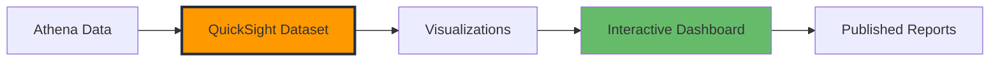

# Trực quan hóa Dữ liệu với Amazon QuickSight

Bây giờ khi bạn đã có dữ liệu thời tiết được lưu trữ và có thể truy vấn thông qua Athena, đã đến lúc tạo các trực quan hóa hấp dẫn! Trong module này, bạn sẽ sử dụng Amazon QuickSight để xây dựng dashboard tương tác giúp dữ liệu thời tiết của bạn trở nên sinh động.

## Tổng quan Module

Amazon QuickSight là dịch vụ business intelligence (BI) của AWS giúp dễ dàng tạo và xuất bản các dashboard tương tác. Bạn sẽ kết nối QuickSight với nguồn dữ liệu Athena và tạo các trực quan hóa tiết lộ các mẫu và thông tin chi tiết từ dữ liệu thời tiết.

**Thời gian:** 45-60 phút  
**Chi phí:** ~$3-4 (sử dụng dùng thử miễn phí)

## Những gì bạn sẽ Xây dựng



## Điều kiện tiên quyết

- Đã hoàn thành Module 4: Phân tích Dữ liệu với Athena
- Dữ liệu thời tiết có sẵn trong bảng Athena
- Tài khoản AWS với quyền QuickSight

## Bước 1: Thiết lập Amazon QuickSight

### 1.1 Đăng ký QuickSight

1. Điều hướng đến **Amazon QuickSight console**
2. Nhấp **Sign up for QuickSight**
3. Chọn **Standard Edition** (bao gồm dùng thử miễn phí 30 ngày)
4. Nhập thông tin tài khoản:
   - **Account name**: `weather-analytics-[ten-ban]`
   - **Notification email**: Địa chỉ email của bạn
5. Nhấp **Finish**

### 1.2 Cấu hình Quyền QuickSight

1. Trong QuickSight, nhấp **biểu tượng profile** (góc phải trên)
2. Chọn **Manage QuickSight**
3. Chọn **Security & permissions**
4. Nhấp **Add or remove**
5. Kích hoạt các dịch vụ sau:
   - ✅ **Amazon Athena**
   - ✅ **Amazon S3**
6. Cho S3, nhấp **Select S3 buckets**
7. Chọn bucket dữ liệu thời tiết:
   - `your-weather-processed-bucket`
   - `your-athena-query-results-bucket`
8. Nhấp **Update**

## Bước 2: Tạo Data Source và Dataset

### 2.1 Kết nối với Athena

1. Trong trang chủ QuickSight, nhấp **Datasets**
2. Nhấp **New dataset**
3. Chọn **Athena** làm data source
4. Cấu hình kết nối:
   - **Data source name**: `Weather-Data-Athena`
   - **Athena workgroup**: `primary` (mặc định)
5. Nhấp **Create data source**

### 2.2 Tạo Dataset từ Weather Table

1. Chọn database: `weather_analytics`
2. Chọn table: `current_weather`
3. Chọn **Directly query your data**
4. Nhấp **Visualize**

{}
Nếu dataset của bạn nhỏ (< 1GB), bạn có thể chọn "Import to SPICE" để có hiệu suất tốt hơn. SPICE là engine tính toán trong bộ nhớ của QuickSight.
{}

## Bước 3: Tạo Trực quan hóa Thời tiết

### 3.1 Biểu đồ Đường Xu hướng Nhiệt độ

1. **Tạo phân tích mới**:

   - Nhấp **+ Add** → **Add visual**
   - Chọn **Line chart**

2. **Cấu hình biểu đồ**:

   - **X-axis**: Kéo `data_collection_date` vào X-axis
   - **Value**: Kéo `temperature_celsius` vào Value
   - **Color**: Kéo `city_name` vào Color

3. **Tùy chỉnh biểu đồ**:
   - Nhấp **visual** → **Format visual**
   - **Title**: "Xu hướng Nhiệt độ theo Thành phố"
   - **Y-axis label**: "Nhiệt độ (°C)"
   - **Legend**: Đặt ở dưới cùng

### 3.2 Biểu đồ Tròn Điều kiện Thời tiết

1. **Thêm visual mới**:

   - Nhấp **+ Add** → **Add visual**
   - Chọn **Pie chart**

2. **Cấu hình biểu đồ**:

   - **Group/Color**: Kéo `weather_main` vào Group/Color
   - **Value**: Kéo `city_name` vào Value
   - **Aggregate**: Đổi thành **Count**

3. **Tùy chỉnh**:
   - **Title**: "Phân bố Điều kiện Thời tiết"
   - **Legend**: Hiển thị phần trăm

### 3.3 Biểu đồ Cột So sánh Nhiệt độ Thành phố

1. **Thêm visual mới**:

   - Chọn **Vertical bar chart**

2. **Cấu hình**:

   - **X-axis**: Kéo `city_name` vào X-axis
   - **Value**: Kéo `temperature_celsius` vào Value
   - **Aggregate**: Đổi thành **Average**

3. **Tùy chỉnh**:
   - **Title**: "Nhiệt độ Trung bình theo Thành phố"
   - **Y-axis label**: "Nhiệt độ Trung bình (°C)"
   - Sắp xếp theo giá trị (giảm dần)

### 3.4 Biểu đồ Phân tán Độ ẩm vs Nhiệt độ

1. **Thêm visual mới**:

   - Chọn **Scatter plot**

2. **Cấu hình**:

   - **X-axis**: Kéo `temperature_celsius` vào X-axis
   - **Y-axis**: Kéo `humidity_percent` vào Y-axis
   - **Color**: Kéo `comfort_level` vào Color
   - **Size**: Kéo `pressure_hpa` vào Size

3. **Tùy chỉnh**:
   - **Title**: "Tương quan Độ ẩm và Nhiệt độ"
   - **X-axis label**: "Nhiệt độ (°C)"
   - **Y-axis label**: "Độ ẩm (%)"

### 3.5 Chỉ số Hiệu suất Chính (KPIs)

Tạo các ô KPI cho dữ liệu thời tiết mới nhất:

#### KPI Nhiệt độ Hiện tại

1. **Thêm visual mới** → **KPI**
2. **Cấu hình**:
   - **Value**: `temperature_celsius`
   - **Aggregate**: **Average**
3. **Filter**: Thêm filter cho ngày mới nhất
4. **Title**: "Nhiệt độ Trung bình Hiện tại"

#### KPI Tốc độ Gió

1. **Thêm KPI visual**
2. **Cấu hình**:
   - **Value**: `wind_speed_kmh`
   - **Aggregate**: **Average**
3. **Title**: "Tốc độ Gió Trung bình Hiện tại"

#### KPI Độ ẩm

1. **Thêm KPI visual**
2. **Cấu hình**:
   - **Value**: `humidity_percent`
   - **Aggregate**: **Average**
3. **Title**: "Độ ẩm Trung bình Hiện tại"

## Bước 4: Xây dựng Dashboard Toàn diện

### 4.1 Tổ chức Bố cục Dashboard

1. **Thay đổi kích thước và sắp xếp visuals**:

   - Đặt KPIs ở trên cùng theo hàng ngang
   - Biểu đồ xu hướng nhiệt độ ở khu vực chính
   - Biểu đồ tròn và biểu đồ cột cạnh nhau bên dưới
   - Biểu đồ phân tán ở dưới cùng

2. **Thêm tiêu đề dashboard**:
   - Nhấp **+ Add** → **Add title**
   - Text: "Dashboard Phân tích Thời tiết"
   - Style: Lớn, căn giữa

### 4.2 Thêm Bộ lọc Tương tác

1. **Thêm bộ lọc ngày**:

   - Nhấp **Filter** pane (bên trái)
   - Nhấp **Create one** → Chọn `data_collection_date`
   - Filter type: **Date range**
   - Default: 7 ngày gần nhất

2. **Thêm bộ lọc thành phố**:

   - Tạo filter cho `city_name`
   - Filter type: **Multi-select dropdown**
   - Hiển thị tất cả thành phố theo mặc định

3. **Thêm bộ lọc điều kiện thời tiết**:
   - Tạo filter cho `weather_main`
   - Filter type: **Multi-select dropdown**

### 4.3 Áp dụng Styling Dashboard

1. **Chọn color theme**:

   - Nhấp **Themes** (menu trên)
   - Chọn **Midnight** hoặc **Classic**

2. **Tùy chỉnh màu sắc**:

   - Cho biểu đồ nhiệt độ: Sử dụng gradient xanh-đỏ
   - Cho điều kiện thời tiết: Sử dụng màu riêng biệt cho mỗi điều kiện

3. **Thêm text mô tả**:
   - Nhấp **+ Add** → **Add text box**
   - Thêm insights hoặc hướng dẫn cho người dùng dashboard

## Bước 5: Trực quan hóa Nâng cao

### 5.1 Tạo Heat Map cho Nhiệt độ theo Thời gian

1. **Thêm visual mới** → **Heat map**
2. **Cấu hình**:
   - **Rows**: `city_name`
   - **Columns**: `data_collection_date`
   - **Values**: `temperature_celsius` (Average)
3. **Tùy chỉnh**:
   - **Title**: "Heat Map Nhiệt độ theo Thành phố và Ngày"
   - **Color scale**: Xanh (lạnh) đến Đỏ (nóng)

### 5.2 Biểu đồ Hướng Gió (Sử dụng Calculated Fields)

1. **Tạo calculated field**:

   - Nhấp **+ Add** → **Add calculated field**
   - **Name**: `wind_direction_category`
   - **Formula**:

   ```
   ifelse(
     wind_direction_deg >= 337.5 OR wind_direction_deg < 22.5, "N",
     wind_direction_deg >= 22.5 AND wind_direction_deg < 67.5, "NE",
     wind_direction_deg >= 67.5 AND wind_direction_deg < 112.5, "E",
     wind_direction_deg >= 112.5 AND wind_direction_deg < 157.5, "SE",
     wind_direction_deg >= 157.5 AND wind_direction_deg < 202.5, "S",
     wind_direction_deg >= 202.5 AND wind_direction_deg < 247.5, "SW",
     wind_direction_deg >= 247.5 AND wind_direction_deg < 292.5, "W",
     "NW"
   )
   ```

2. **Tạo biểu đồ hướng gió**:
   - **Visual type**: Donut chart
   - **Group**: `wind_direction_category`
   - **Value**: Count of records
   - **Title**: "Phân bố Hướng Gió"

### 5.3 Gauge Mức độ Nghiêm trọng Thời tiết

1. **Tạo calculated field**:

   - **Name**: `severity_score`
   - **Formula**:

   ```
   ifelse(
     weather_severity = "nghiêm_trọng", 4,
     weather_severity = "vừa", 3,
     weather_severity = "nhẹ", 2,
     1
   )
   ```

2. **Thêm gauge visual**:
   - **Value**: `severity_score` (Average)
   - **Title**: "Chỉ số Mức độ Nghiêm trọng Thời tiết"
   - **Range**: 1-4

## Bước 6: Xuất bản và Chia sẻ Dashboard

### 6.1 Xuất bản Dashboard

1. Nhấp **Share** (góc phải trên)
2. Nhấp **Publish dashboard**
3. **Dashboard name**: "Dashboard Phân tích Thời tiết"
4. **Description**: "Trực quan hóa dữ liệu thời tiết tương tác hiển thị xu hướng nhiệt độ, mẫu thời tiết và so sánh thành phố"
5. Nhấp **Publish dashboard**

### 6.2 Thiết lập Quyền Chia sẻ

1. Trong dashboard đã xuất bản, nhấp **Share**
2. **Add users or groups**:
   - Nhập địa chỉ email của người dùng để chia sẻ
   - Đặt quyền: **Viewer** hoặc **Co-owner**
3. Nhấp **Share**

### 6.3 Tạo Dashboard Công khai (Tùy chọn)

1. Nhấp **Share** → **Manage dashboard access**
2. Kích hoạt **Make dashboard public**
3. Sao chép URL công khai để chia sẻ bên ngoài

{}
Chỉ công khai dashboard nếu dữ liệu thời tiết của bạn không chứa thông tin nhạy cảm.
{}

## Bước 7: Thiết lập Làm mới Dữ liệu Tự động

### 7.1 Cấu hình Làm mới Dataset

1. Đi đến **Datasets**
2. Chọn weather dataset của bạn
3. Nhấp **Refresh** → **Schedule refresh**
4. **Cấu hình lịch**:
   - **Frequency**: Daily
   - **Time**: Sáng sớm (ví dụ: 6 AM)
   - **Time zone**: Múi giờ địa phương của bạn
5. **Lưu lịch**

### 7.2 Giám sát Trạng thái Làm mới

1. Kiểm tra lịch sử làm mới trong **Dataset settings**
2. Thiết lập **thông báo** cho làm mới thất bại
3. Giám sát chỉ báo độ tươi của dữ liệu trong dashboard

## Bước 8: Tối ưu hóa Dashboard và Best Practices

### 8.1 Tối ưu hóa Hiệu suất

1. **Sử dụng SPICE cho hiệu suất tốt hơn**:

   - Import dữ liệu vào SPICE nếu dataset < 10GB
   - Lập lịch làm mới SPICE thường xuyên

2. **Tối ưu hóa truy vấn**:

   - Sử dụng filter để giảm việc quét dữ liệu
   - Tạo bảng tóm tắt trong Athena cho dataset lớn

3. **Giới hạn độ phức tạp visual**:
   - Tối đa 15-20 điểm dữ liệu mỗi biểu đồ
   - Sử dụng drill-down cho view chi tiết

### 8.2 Best Practices Trải nghiệm Người dùng

1. **Thứ bậc visual rõ ràng**:

   - Các metric quan trọng nhất ở trên
   - Các visual liên quan được nhóm lại
   - Màu sắc nhất quán

2. **Các yếu tố tương tác**:

   - Cung cấp hướng dẫn filter rõ ràng
   - Sử dụng phạm vi ngày nhất quán
   - Kích hoạt cross-filtering giữa các visual

3. **Tính responsive di động**:
   - Kiểm tra dashboard trên thiết bị di động
   - Điều chỉnh layout cho màn hình nhỏ hơn
   - Ưu tiên metric chính cho view di động

## Khắc phục Các Vấn đề Thường gặp

### Vấn đề 1: Lỗi "Insufficient permissions"

- **Giải pháp**: Kiểm tra quyền IAM của QuickSight cho truy cập Athena và S3
- Xác minh quyền bucket trong cài đặt bảo mật QuickSight

### Vấn đề 2: Dữ liệu Không Làm mới

- **Giải pháp**: Kiểm tra quyền truy vấn Athena
- Xác minh trạng thái kết nối data source
- Xem lại error logs của làm mới

### Vấn đề 3: Hiệu suất Dashboard Chậm

- **Giải pháp**: Import dữ liệu vào SPICE
- Tối ưu hóa truy vấn Athena với filtering phù hợp
- Giảm số lượng visual mỗi dashboard

## Phân tích Chi phí

**Chi phí QuickSight cho module này:**

- **Standard Edition**: $9/tháng mỗi author (dùng thử miễn phí 30 ngày)
- **SPICE storage**: $0.25/GB/tháng
- **Enterprise Edition**: $18/tháng mỗi author (tính năng nâng cao)

**Tổng chi phí ước tính**: $0-4 trong thời gian dùng thử miễn phí

## Best Practices Bảo mật

1. **Kiểm soát Truy cập**:

   - Sử dụng IAM roles cho quyền dịch vụ
   - Triển khai row-level security nếu cần
   - Audit thường xuyên quyền truy cập người dùng

2. **Bảo vệ Dữ liệu**:
   - Kích hoạt mã hóa trong transit và at rest
   - Sử dụng VPC endpoints cho kết nối riêng tư
   - Giám sát patterns truy cập dữ liệu

## Các bước tiếp theo

Sau khi hoàn thành module này, bạn sẽ có:

- ✅ Dashboard thời tiết tương tác với nhiều trực quan hóa
- ✅ Làm mới dữ liệu tự động từ ETL pipeline
- ✅ Insights có thể chia sẻ cho phân tích thời tiết
- ✅ Hiểu biết về best practices của QuickSight

**Sắp tới trong Module 6**: Học cách dọn dẹp đúng cách các tài nguyên AWS và khám phá các cải tiến nâng cao cho nền tảng phân tích thời tiết của bạn.

{}
Lưu dashboard của bạn dưới dạng template để nhanh chóng tạo dashboard tương tự cho các dataset hoặc thời gian khác nhau.
{}

{}
QuickSight cung cấp insights được hỗ trợ ML. Hãy thử tính năng **ML Insights** để tự động khám phá anomalies và trends trong dữ liệu thời tiết của bạn.
{}

{}
Nhớ hủy đăng ký QuickSight sau workshop nếu bạn không có kế hoạch tiếp tục sử dụng để tránh các khoản phí liên tục.
{}
