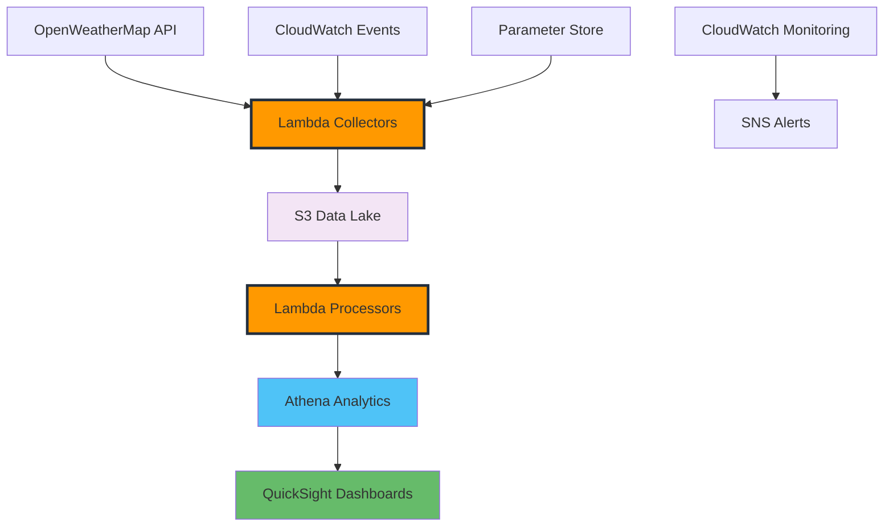

+++
title = "Hệ thống ETL Dữ liệu Thời tiết với AWS"
date = 2025-01-03T08:00:00+07:00
weight = 5
chapter = false
+++

# Workshop Hệ thống ETL Dữ liệu Thời tiết

Chào mừng bạn đến với **Workshop Hệ thống ETL Dữ liệu Thời tiết**! Trong workshop thực hành này, bạn sẽ xây dựng một hệ thống pipeline dữ liệu serverless hoàn chỉnh sử dụng các dịch vụ AWS để thu thập, xử lý và phân tích dữ liệu thời tiết.

## Tổng quan Workshop

Workshop này trình bày cách xây dựng một pipeline ETL (Extract, Transform, Load) production-ready sử dụng công nghệ serverless của AWS. Bạn sẽ học cách:

- **Thu thập** dữ liệu thời tiết từ OpenWeatherMap API sử dụng AWS Lambda
- **Lưu trữ** dữ liệu trong S3 data lake có khả năng mở rộng với phân vùng hợp lý
- **Xử lý** và chuyển đổi dữ liệu sử dụng serverless functions
- **Phân tích** dữ liệu sử dụng Amazon Athena với SQL queries
- **Trực quan hóa** insights thông qua Amazon QuickSight dashboards
- **Giám sát** và cảnh báo về hiệu suất hệ thống và điều kiện thời tiết

## Các Module Workshop

### 1. [Giới thiệu & Thiết kế Kiến trúc](1-introduction/)

Tìm hiểu về kiến trúc workshop, các dịch vụ AWS được sử dụng, và patterns thiết kế để xây dựng pipeline ETL serverless.

### 2. [Thu thập Dữ liệu Thời tiết với Lambda](2-data-collection-openweathermap/)

Thiết lập tích hợp OpenWeatherMap API và xây dựng Lambda functions để tự động thu thập dữ liệu thời tiết từ nhiều thành phố.

### 3. [Xử lý và Chuyển đổi Dữ liệu](3-serverless-processing-lambda/)

Xây dựng serverless data processing functions để làm sạch, chuyển đổi và cấu trúc dữ liệu thời tiết cho analytics.

### 4. [Thiết lập S3 Data Lake](4-data-storage-solutions/)

Thiết kế và triển khai S3-based data lake có khả năng mở rộng với phân vùng, lifecycle management và bảo mật hợp lý.

### 5. [Phân tích với Amazon Athena](5-analytics-visualization/)

Query và phân tích dữ liệu thời tiết sử dụng Amazon Athena với SQL queries tối ưu và performance tuning.

### 6. [Trực quan hóa Thời tiết với QuickSight](6-monitoring-optimization/)

Tạo interactive dashboards và visualizations sử dụng Amazon QuickSight để chuyển đổi dữ liệu thành actionable insights.

### 7. [Giám sát và Cảnh báo Thời tiết](7-testing-validation/)

Triển khai giám sát toàn diện, cảnh báo và automated incident response cho weather pipeline của bạn.

### 8. [Dọn dẹp và Bước tiếp theo](8-cleanup-next-steps/)

Dọn dẹp resources, khám phá các tính năng nâng cao và tìm hiểu về cân nhắc triển khai production.

## Những gì bạn sẽ xây dựng

Khi kết thúc workshop này, bạn sẽ triển khai một weather data pipeline hoàn chỉnh có khả năng:

- **Tự động thu thập** dữ liệu thời tiết mỗi giờ từ 6 thành phố Đông Nam Á
- **Xử lý và lưu trữ** dữ liệu trong cấu trúc S3 data lake được tối ưu
- **Cung cấp khả năng SQL analytics** thông qua Amazon Athena
- **Cung cấp interactive dashboards** để giám sát và phân tích thời tiết
- **Giám sát system health** với automated alerts và recovery

## Yêu cầu tiên quyết

Để hoàn thành workshop này, bạn cần:

- **AWS Account** với quyền truy cập administrative
- **OpenWeatherMap Account** (có free tier)
- **Kiến thức cơ bản** về các dịch vụ AWS (Lambda, S3, CloudWatch)
- **Kinh nghiệm lập trình** với Python
- **Hiểu biết** về định dạng dữ liệu JSON và SQL queries

## Tổng quan Kiến trúc

Workshop xây dựng một kiến trúc serverless, event-driven:

## Lợi ích chính

Phương pháp serverless này cung cấp:

- **Hiệu quả Chi phí**: Chỉ trả cho những gì bạn sử dụng với serverless computing
- **Khả năng Mở rộng**: Tự động scale với data volume và processing needs
- **Độ Tin cậy**: Fault tolerance tích hợp và automated recovery
- **Tính Bảo trì**: Yêu cầu quản lý infrastructure tối thiểu
- **Bảo mật**: AWS managed security với fine-grained access controls

## Ước tính Chi phí

Workshop được thiết kế cost-effective sử dụng AWS free tier:

- **Chi phí Hàng tháng Ước tính**: ~$12 USD
- **Thành phần Chi phí Chính**: QuickSight ($9), CloudWatch metrics ($2-3)
- **Data Processing**: Chi phí tối thiểu với Lambda và S3 free tier
- **Cleanup Có sẵn**: Hướng dẫn cleanup resources hoàn chỉnh được cung cấp

## Đối tượng Mục tiêu

Workshop này lý tưởng cho:

- **Data Engineers** quan tâm đến serverless ETL patterns
- **Solutions Architects** thiết kế data analytics solutions
- **Developers** xây dựng data-driven applications
- **Business Analysts** làm việc với weather và IoT data
- **Students** học cloud-based data engineering

## Kết quả Học tập

Sau khi hoàn thành, bạn sẽ hiểu:

- **Serverless ETL Patterns**: Nguyên tắc thiết kế cho event-driven data pipelines
- **AWS Service Integration**: Cách Lambda, S3, Athena và QuickSight hoạt động cùng nhau
- **Data Lake Architecture**: Best practices để tổ chức và lưu trữ dữ liệu
- **Real-time Processing**: Xây dựng data collection và transformation responsive
- **Analytics and Visualization**: Tạo insights từ raw data
- **Production Operations**: Giám sát, cảnh báo và duy trì data pipelines

## Cam kết Thời gian

- **Tổng Thời gian Workshop**: 4-6 giờ
- **Thời lượng Module**: 30-90 phút mỗi module
- **Tập trung Hands-on**: Triển khai thực tế với hướng dẫn từng bước
- **Self-paced Learning**: Hoàn thành theo tốc độ của bạn với hướng dẫn chi tiết

## Bắt đầu

Sẵn sàng xây dựng weather data pipeline của bạn? Bắt đầu với Module 1 để hiểu kiến trúc và nguyên tắc thiết kế, sau đó tiến hành qua từng module để xây dựng một giải pháp hoàn chỉnh, production-ready.

{}
**Mẹo Workshop**: Chuẩn bị một notebook để ghi lại tên resources, ARNs và các giá trị cấu hình khi bạn tiến hành qua các modules.
{}

{}
**Sử dụng Free Tier**: Workshop này được thiết kế để tối đa hóa việc sử dụng AWS free tier. Giám sát usage của bạn thông qua AWS Billing Dashboard.
{}

Hãy bắt đầu xây dựng! ☁️ 🌤️
